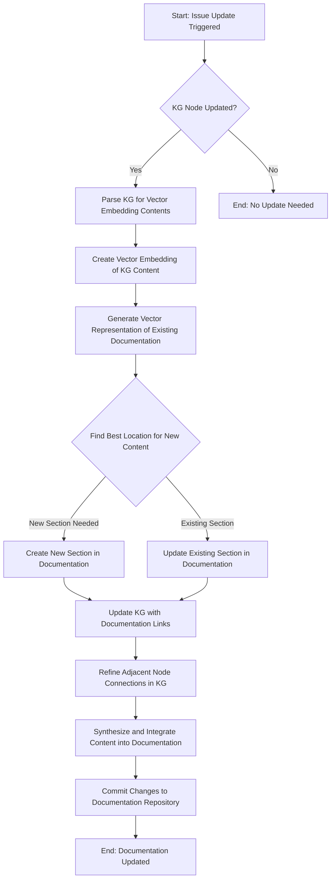

To go beyond, we will be using Generative AI to create and expand the system with automations to assist in helping to organize and simplify the complexity of Generative AI into valuable  and insigntful information. 

There are several layers that will be part of the build plan. They may be considered as follows: 

## Goals

1. Manual, and automated effective use of GenAI to [improve and refine](#improve-and-refine-content) content, and code, already present. 
1. Automatic triggering of GenAI to [incorporate new](#incorporate-new-content) content coming from external inputs. 
1. Automated [content searches] for information inputs based on appropriate information feeds. 
1. Responsive [Chatty AI Oracle](#ai-oracle)
1. Agentic AI Oracle with varying degrees of veracity. 

## Methods
1. Use AI to create as many components of this as possible. 
    - Copilot and GPT4 for manual-enabled coding.
    - Explore autocoding solutions already on market
    - Build with autocoding solutions already on market.
        - Share evaluations in Blogs
    

## Needs

- To Automatically specific content fix content already present: 
    - [x] Basic by file
    - [ ] High quality by file --> Prompt optimizations
    - [ ] A crawler
- [Incorporate new content](#incorporate-new-content) 
    - [ ] (In progress) Establish Indexing and measured effective retrieval
    - [ ] To Identify content locations to file
    - [ ] Create Needle in Hastic test for information retrieval systems. 
- To local host a Chatbot [AI oracle](#ai-oracle) on the repository and references
    - [ ] Command Line
    - [ ] (In progress) Basic GUI [Chatty oracle](#chatty-oracle)
    - [ ] Advanced GUI (with chat history)
    - [ ] Advanced GUI with Voice
- To local host an Collaborative Agentic Interface. 
    -  With tool and command line interfaces.
- Auto improvement of Code
    - Focus on using Agent interface to look at code improvement.
    - Use to in-place optimize and test for improvements.
    - To self-referentially improve based new awareness and understanding
- To enable multiple different LLMS
- To enable multiple different Vector databases. 
- To external host
    - modified chat service: https://github.com/sebastiengilbert73/chat_service https://towardsdatascience.com/build-a-locally-running-voice-assistant-2f2ead904fe9
    - With permissions Agent can combine variants, using line numbers and whatnot. 

## Incorporate new content

It will be time consuming to add new content. That is why having an automated system will be necessary to incorporate new content in a thoughtful an accurate manner. 

Here is an example workflow that we might follow: 

## AI Oracle
We will explore RAG and fine-tuning of chat models models, as well as cognitive topologies architectures. 

### Chatty Oracle

We will first look at using RAG to enable lookup of the components within the database. This will rely on understanding gained from building our [self improvement](#self-improvement) architectures. 

## Components

### Evaluations 
Automatic prompt and chain optimization systems.
- LLM-enabled 

### Chains
#### Summarization 
Develop a basic summarization tool to create summaries of submitted documents.
Manually integrate these summaries into the appropriate locations in the documentation.

### Agents
- Enabled with lang-graph / CrewAI, single-point agent chains will be a focus, but more advanced agents will be considered 

### GUI
- A user interface that allows for basic Repo Q/A

### Vector Database
* Needed for GUI to provide data

### Database
For indexing

### Knowledge Graph
* To parse the database --> use embedchain or something similar

This can mirror waht is done in downloads/tomasonjo/llm-movieagent to initialize a graph. 
Run through all of the data using an LLM, to create the data that can be ingested by a database? Or do it in bulk. (Both) 
- Create Semantic layer of heirarchichal concepts and map to documentaiton. 

### GitHub Action** to trigger on issue creation by an approved user.
The Action should check if the submitted document/concept is already in the documentation tree using a simple keyword-based search.
If the concept is not present, the Action should tag the issue for further processing.

- [ ] NOTE: This is done with 

## Brainstorms 
### Visualization Improvements

We can make this easier to read

- [ ] Improve landing page and header bar to be more modern. 
- [ ] Build interactive graph representation of this site that includes summary information. Check [this out](https://towardsdatascience.com/making-network-graphs-interactive-with-python-and-pyvis-b754c22c270) and the [examples](../Using/examples/index.md)
- [ ] https://melaniewalsh.github.io/Intro-Cultural-Analytics/06-Network-Analysis/02-Making-Network-Viz-with-Bokeh.html
- [ ] build with https://docusaurus.io/
- [ ] Integrate example python notebooks and build with https://github.com/outerbounds/nbdoc

- [mkdocs charts](https://github.com/timvink/mkdocs-charts-plugin)

### Business  

