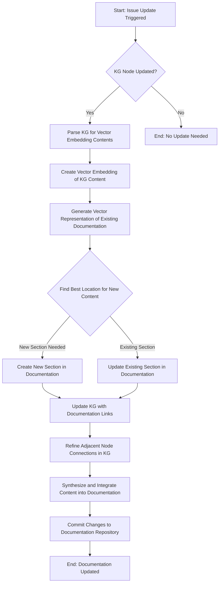

To go beyond, we will be using Generative AI to create and expand the system with automations to assist in helping to organize and simplify the complexity of Generative AI into valuable  and insigntful information. 

There are several layers that will be part of the build plan. They may be considered as follows: 

## Goals

1. Manual, and automated use of GenAI to [improve and refine](#improve-and-refine-content) content already present. 
1. Automatic triggering of GenAI to [incorporate new](#incorporate-new-content) content coming from external inputs. 
1. Automated [content searches] for information inputs based on appropriate information feeds. 
1. Responsive [Chatty AI Oracle](#ai-oracle)
1. Agentic AI Oracle with varying degrees of veracity. 

### Improve and refine content

## What do I need
1. To Automatically add or fix content already present: a crawler
    1. with LLM calls: to make it more impactufl:
        * How?
          - Best model. 
             - How? Pay. 
           - Better prompt optimizations. 
             - How? Experiment. 
             - Back/forth agent with ability to help. 
                - Agent can combine variants, using line numbers and whatnot. 
                    - modified chat service: https://github.com/sebastiengilbert73/chat_service https://towardsdatascience.com/build-a-locally-running-voice-assistant-2f2ead904fe9

                    It responds' these are your options: 

                    WAS ON RIGHT PATH, JusT NEED MODIFY GUI for CHAT INTERFACE AND INTERACTIONS

                    - Eg: Combine left first part and second part. 
                          Add rule: Make it more. 
                          VOICE COMMAND
                          Show rules: 
                    - Loop: What it has remembered. Allow it to 'self adapt' and propose new rules. 
                    - I NEED TO CACHE RESULTS. Caching key values for e
            Better LLMs directly with fine tuning

### Incorporate new content

It will be time consuming to add new content. That is why having an automated system will be necessary to incorporate new content in a thoughtful an accurate manner. 

Here is an example workflow that we might follow: 

## AI Oracle
We will explore RAG and fine-tuning of chat models models, as well as other cognitive topologies architectures. 

### Chatty Oracle

We will first look at using [rag](../Understand/agents/rag.md) to enable lookup of the components within the database. This will rely on understanding gained from building our [self improvement](#self-improvement) architectures. 

## Phases 

### Phase 1: MVP Development
GitHub Actions for Issue Submission and Initial Evaluation

**Caching of External Sources**
Set up a simple caching mechanism for external sources like GitHub repositories, PDFs, and blogs.
Manually link these sources to relevant parts of the knowledge graph.

Status:
- [x] Download to local files path `genai/kg/doc_graph_generation.py` and downloader.py
- [x] Simple SQL mapping database. 

**Basic Knowledge Graph (KG) Construction**: 

**Develop a basic summarization tool** to create summaries of submitted documents.
Manually integrate these summaries into the appropriate locations in the documentation.

 **Develop a GitHub Action** to trigger on issue creation by an approved user.
The Action should check if the submitted document/concept is already in the documentation tree using a simple keyword-based search.
If the concept is not present, the Action should tag the issue for further processing.

- [ ] NOTE: This is partially done, but automation relys on more prompt-tuning 

### Phase 2: Enhanced Functionality and Automation
Advanced KG Development with Automated Placement

**Enhance the KG** with a more comprehensive schema that includes internal concepts and external primary sources.
Automate the identification of appropriate locations for new concepts in the documentation tree based on the KG.
Improved Summarization and Integration

**Upgrade the summarization tool** to more accurately represent complex documents.
Automate the integration of these summaries into the documentation using GitHub Actions.
Full Automation of External Source Caching

**Fully automate the process** of caching and linking external sources to the KG.

### Phase 3: Community Engagement and Expansion
Community Feedback Mechanism

Implement a system for community feedback on the documentation and knowledge graph.
Use this feedback to iteratively improve the system.
Release Plan and External Communication

Prepare a release plan with clear milestones aligned with the above phases.
For each major release:
Write a blog post detailing the new features and improvements.
Engage with tech communities and platforms (like Hacker News, Reddit’s r/MachineLearning) to share updates.
Consider reaching out to tech-focused media outlets like TechCrunch for broader exposure.
Open-Source Community Building

Actively encourage open-source contributions by providing clear contribution guidelines and engaging with contributors through GitHub issues and pull requests.
Continuous Improvement and Scaling

Continuously refine the system based on user feedback and technological advancements.
Plan for scaling both the knowledge graph and the GitHub Actions workflows as the project grows.
Blog Announcement and Communication Strategy
Initial Announcement: Introduce the project's goals, the MVP concept, and a call for early adopters and contributors.
Post-Phase 1 Release: Highlight the initial capabilities, share success stories or use cases, and outline future enhancements.
Subsequent Releases: Update the community on new features, improvements, and invite feedback.
Regular Updates: Maintain a cadence of regular updates, including technical insights, challenges faced, and resolutions.

### Initial Announcement
Functional MVP (Minimum Viable Product):

Core Features: Have the basic but functional features of your project implemented. This includes the initial GitHub Actions setup for issue submission and evaluation, a rudimentary version of the Knowledge Graph (KG), and a basic implementation of document summarization and integration.
Documentation: Detailed documentation of the existing features, setup instructions, and how to contribute. This is crucial as it not only serves as a guide for users and contributors but also demonstrates your ability to manage and present a complex project.
Demonstrated Use Case:

Working Example: Include at least one working example in your repository that clearly demonstrates the project's current capabilities. This could be a case study or a practical demonstration of the system processing and integrating a document.
Visuals and Explanations: Accompany this with visuals (like flowcharts or screenshots) and thorough explanations. This will help in communicating the project's functionality and your technical acumen.
Project Roadmap:

Clear Roadmap: Outline a clear and detailed roadmap for future development. This should include planned features, enhancements, and areas where community contributions are encouraged.
Milestones: Set realistic milestones that show a structured approach to development and indicate opportunities for community involvement.
Community Engagement Plan:

Contribution Guidelines: Establish clear guidelines for contributions, including coding standards, pull request processes, and issue reporting.
Communication Channels: Set up channels for community engagement, such as a project discussion forum, a dedicated Slack or Discord channel, or a mailing list.
Personal Reflection:

Your Role and Contributions: Clearly articulate your role in the project and your contributions. This is important to highlight your individual skills and leadership in the project's development.
Learning and Challenges: Share your learning experience and challenges faced during the initial development phase. This openness adds to your credibility and reflects your problem-solving skills.
Timing for Announcement
Strategic Timing: Consider announcing your project at a time when it is most likely to get noticed. This could be aligned with major tech events, AI conferences, or relevant community events.
Prepare for Feedback: Be ready to receive and respond to feedback upon announcement. Engaging with the initial audience is crucial for building a community and can also lead to valuable insights and improvements.

Using Github to organize our understanding of a fluid field is a notable challenge. Because of the acessibility of mkdocs-material it makes it easy to make nice-looking documentaiton, though sometimes without the niceties that could accompany other software systems. 

Eventually we may shift to other systems (like docusaurus). Before that though, we will be wanting to integrate state-of-the-art updates to understanding while we build our auto-building system. 

## Components

### Orchestration

### Knowledge Graph
1. To parse the database --> use embedchain or something similar

This can mirror waht is done in downloads/tomasonjo/llm-movieagent to initialize a graph. 
Run through all of the data using an LLM, to create the data that can be ingested by a database? Or do it in bulk. (Both) 
Command-line add to database. Add to database from a directory... Add to database based on updates since last. 
Neo4j Semantic layer??? 

## Generative Building

- [x] Enable simple jupyter-notebook calls to improve documents.
    - [ ] Ensure all links are preserved.
    - [ ] Enable multiple LLM integration, for instance with Llama on OSX. 

## Visualization

We can make this easier to read

- [ ] Improve landing page and header bar to be more modern. 
- [ ] Build interactive graph representation of this site that includes summary information. Check [this out](https://towardsdatascience.com/making-network-graphs-interactive-with-python-and-pyvis-b754c22c270) and the [examples](../Use/examples/index.md)
- [ ] https://melaniewalsh.github.io/Intro-Cultural-Analytics/06-Network-Analysis/02-Making-Network-Viz-with-Bokeh.html
- [ ] build with https://docusaurus.io/
- [ ] Integrate example python notebooks and build with https://github.com/outerbounds/nbdoc

- [mkdocs charts](https://github.com/timvink/mkdocs-charts-plugin)

## Business
- [ Check out AiE.foundation](https://www.aie.foundation/#projects) for help as ManaGen grow
s