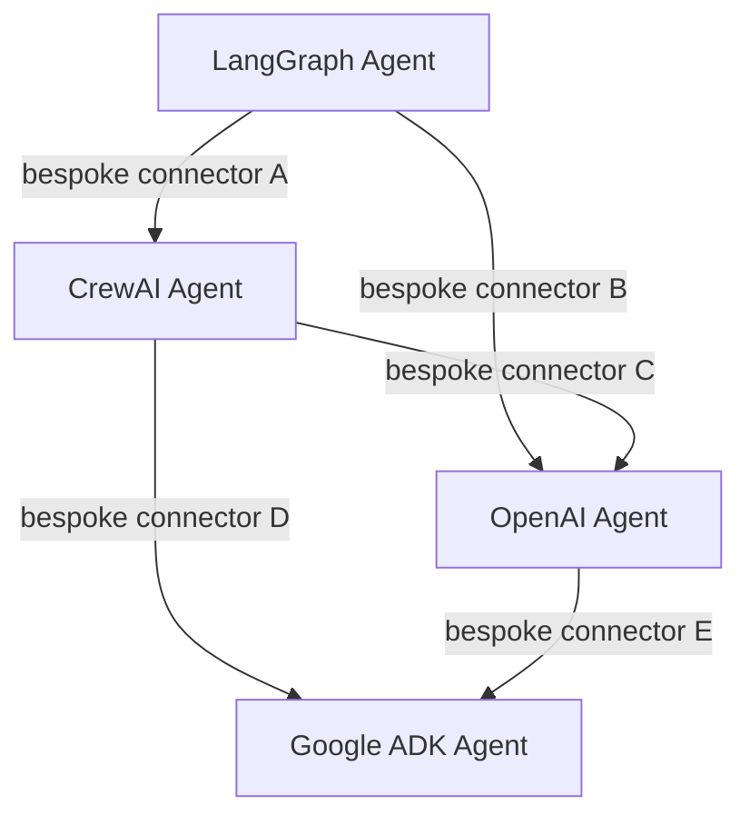
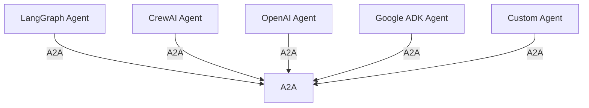
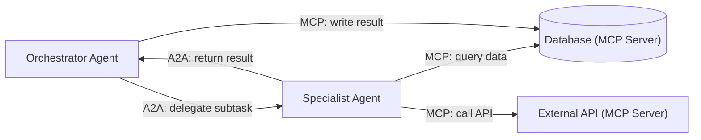

# Agent2Agent (A2A) Protocol

As multi-agent systems move into production, a structural problem becomes unavoidable: agents built with different frameworks cannot talk to each other without custom plumbing. A LangGraph agent has no standard way to hand a task to a CrewAI agent. An OpenAI Agents SDK workflow cannot delegate to a Google ADK agent without bespoke integration code. Each new pairing requires a one-off connector that must be maintained, tested, and updated as the frameworks evolve.

The **Agent2Agent (A2A) protocol** is the industry's answer to this problem — a standardised communication layer that lets agents coordinate regardless of which framework or vendor built them.

---

## Origin and Governance

A2A was originated by Google and released as an open specification. In **December 2025**, Google donated A2A to the **Agentic AI Foundation (AAIF)**, a directed fund under the Linux Foundation, alongside Anthropic's MCP.

The AAIF was co-founded by Anthropic, Block, Google, and OpenAI specifically to provide neutral governance for the protocols that form the foundation of agentic AI infrastructure. By donating A2A and MCP to the same foundation, the industry created a coherent, jointly-governed protocol pair: MCP for tool access, A2A for agent coordination.

- **Specification and reference implementations**: [https://github.com/a2aproject/A2A](https://github.com/a2aproject/A2A)
- **Governance**: Linux Foundation / Agentic AI Foundation (AAIF)

---

## What Problem A2A Solves

Without A2A, multi-framework agent systems look like this:

Every pair of frameworks requires its own integration. A system with five frameworks requires up to ten custom connectors. Each connector encodes assumptions about serialisation, authentication, task state, and error handling that diverge between teams.

With A2A:

Any agent that implements the A2A spec can communicate with any other A2A-compatible agent. The integration surface collapses from O(n²) bespoke connectors to a single protocol implementation per agent.

---

## How A2A Works

A2A defines a standard HTTP-based communication layer between agents. An agent that wants to accept tasks from other agents exposes an **A2A endpoint** — a standard API surface described in an **Agent Card**, an OpenAPI-compatible document that describes the agent's capabilities, input/output schemas, and authentication requirements.

**Core concepts:**

- **Agent Card** — a machine-readable description of an agent's identity and capabilities. Agents advertise what they can do, what inputs they accept, and what outputs they produce. Discovery works by fetching an Agent Card from a known endpoint.
- **Task delegation** — the calling agent sends a structured task request to the A2A endpoint of the target agent. The request includes the task payload and any relevant context.
- **Push and pull messaging** — A2A v0.2 supports both patterns. Pull: the caller polls for results. Push: the callee sends results back to a callback endpoint when complete.
- **Stateless interactions** — individual A2A calls are stateless at the protocol level. State management is the responsibility of the agents themselves (or their underlying frameworks).
- **OpenAPI-based standardised authentication** — A2A v0.2 uses standard OpenAPI security schemes for authentication between agents, enabling compatibility with existing enterprise identity infrastructure.

---

## A2A v0.2 Feature Summary

| Feature | Detail |
|---------|--------|
| Interaction model | Stateless HTTP calls |
| Agent discovery | Agent Cards (OpenAPI-based) |
| Authentication | OpenAPI security schemes (Bearer, OAuth2, API Key) |
| Messaging patterns | Push and pull |
| Payload format | JSON with typed schemas |
| Specification format | OpenAPI 3.x |

---

## A2A vs MCP: Complementary Protocols

A2A and MCP are frequently discussed together because they were donated to the AAIF simultaneously and are designed to work as a pair. They solve different problems:

| | **MCP (Model Context Protocol)** | **A2A (Agent2Agent Protocol)** |
|--|----------------------------------|-------------------------------|
| **What it connects** | LLM ↔ tools, databases, APIs | Agent ↔ agent (across frameworks) |
| **Direction** | Model reaches out to external tools | Agents communicate with each other |
| **Primary use** | Tool access: execute a query, call an API, read a file | Task delegation: assign work to a specialist agent |
| **Analogy** | An agent's hands — what it can do | An agent's voice — who it can talk to |
| **Governed by** | AAIF (Linux Foundation) | AAIF (Linux Foundation) |
| **Originated by** | Anthropic (Nov 2024) | Google |

In a production multi-agent system, both protocols typically appear:

MCP handles what each agent can do. A2A handles how agents coordinate.

!!! note "Not competing standards"
    A2A and MCP are not alternatives to each other. Systems that need both cross-framework agent coordination and tool access — which is most production multi-agent systems — implement both protocols. The AAIF's joint governance of both protocols is an explicit signal that they are intended to coexist.

---

## Practical Use Cases

**1. Cross-vendor agent pipelines**  
An enterprise has a CrewAI research crew, a LangGraph document processing workflow, and a custom Python agent that interfaces with a proprietary internal system. With A2A, these can form a single pipeline without any framework-specific glue code.

**2. Specialist agent marketplaces**  
Organisations can publish specialist agents (legal review, financial analysis, code security audit) as A2A endpoints. Any A2A-compatible orchestrator can discover and delegate to them via Agent Cards, without needing access to the agent's implementation.

**3. Human-in-the-loop across systems**  
An orchestrator running in one framework can delegate a task to an agent in a second framework, which itself pauses for human approval before returning results. The approval workflow lives inside the specialist agent; the orchestrator just waits for the A2A response.

**4. Incremental multi-framework adoption**  
A team already using LangGraph can add CrewAI specialists for specific domains without migrating their existing graph-based workflows. The A2A boundary isolates the two systems.

---

## Framework Support

A2A adoption among major frameworks is growing. Google ADK ships with native A2A support as a design goal. Amazon Strands explicitly lists framework interoperability — including via A2A — as a key feature. LangGraph, CrewAI, and the OpenAI Agents SDK are all positioned to support A2A as adoption expands under AAIF governance.

!!! tip "A2A reduces framework lock-in"
    If your agent components communicate via A2A, you retain the ability to replace individual agents (or entire sub-workflows) with agents from different frameworks without rebuilding the communication layer. This is the protocol's most practical enterprise benefit.

---

## Related Pages

- [Model Context Protocol (MCP)](./mcp-protocol.md) — A2A's complementary protocol for tool access
- [Agentic AI Orchestration Frameworks](./frameworks.md) — framework comparison and how A2A fits each
- [Multi-Agent Systems](./systems/index.md) — architectural patterns for agent networks
- [Agent Infrastructure](./building_agents/agent_infrastructure.md) — production infrastructure considerations
- [A2A GitHub Repository](https://github.com/a2aproject/A2A) — specification and reference implementations
