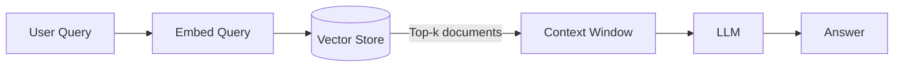
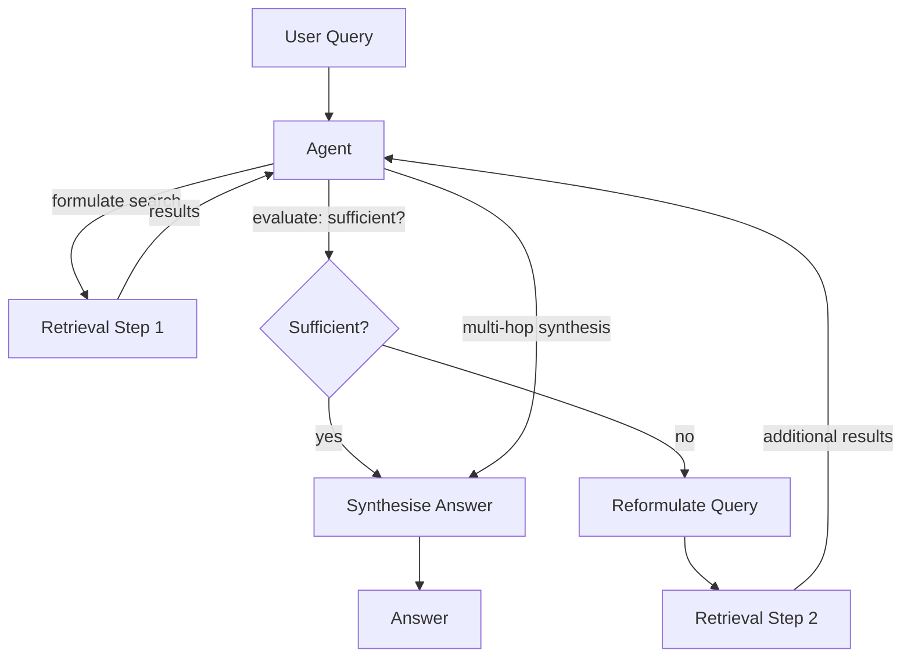
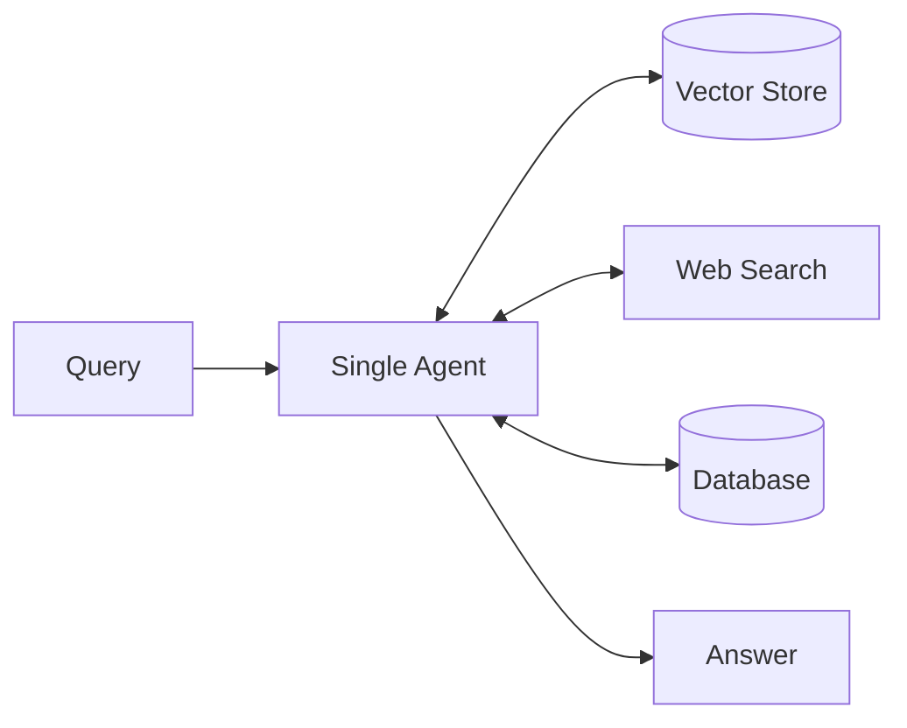
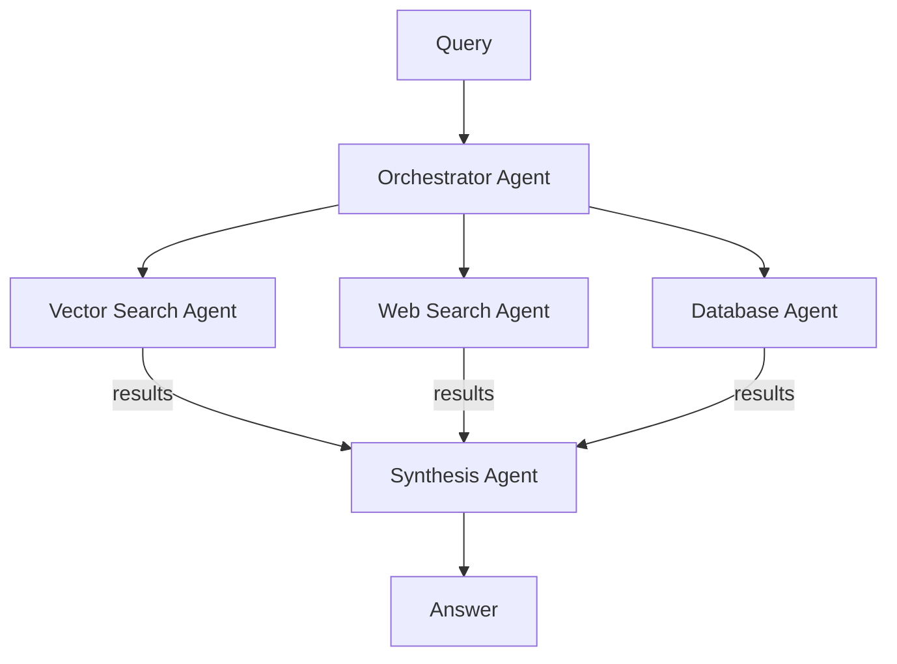
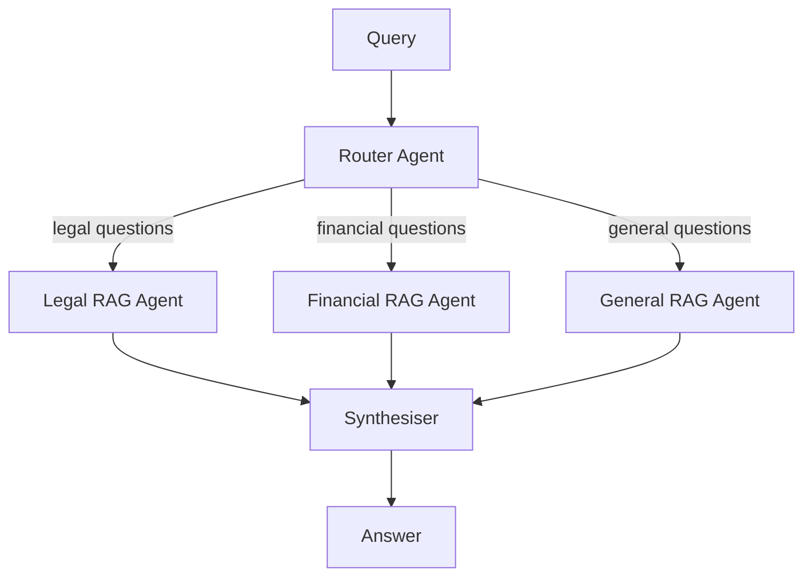

# Agentic RAG

Standard Retrieval-Augmented Generation (RAG) is a one-shot pipeline: retrieve the top-k documents, stuff them into context, generate a response. It works well for narrow, well-scoped questions. It fails when the right retrieval strategy isn't obvious upfront, when answering requires evidence from multiple documents, or when initial results are poor and the model has no way to recover.

**Agentic RAG** solves this by placing an autonomous agent in control of the retrieval process. Instead of a fixed pipeline, the agent decides *what* to retrieve, *when* to retrieve more, and *how* to synthesise across multiple retrieval steps. The result is a system that can answer complex, multi-hop questions with significantly higher accuracy — at the cost of additional latency and compute.

This page covers the architecture, patterns, comparison with standard RAG, tooling, and guidance on when each approach is appropriate. For background on agent memory systems that often work alongside agentic retrieval, see [Agent Memory](components/memory.md).

---

## Standard RAG vs Agentic RAG

### How Standard RAG Works



The query is embedded once, the top-k most similar chunks are retrieved, and the LLM generates a response based on whatever was returned. The pipeline is deterministic and fast. The failure mode is equally deterministic: if the initial retrieval misses key information, the model has no recourse — it either hallucinates or admits ignorance.

### How Agentic RAG Works



The agent controls the loop. It can:

- **Reformulate** the query when initial results are off-target
- **Chain retrievals** — use information found in step 1 to construct a more precise query for step 2
- **Call different tools** — switch between a vector store, a web search API, and a SQL database within the same retrieval loop
- **Self-evaluate** — assess whether the evidence actually answers the question and retrieve more if not

---

## Comparison Table

| Aspect | Standard RAG | Agentic RAG |
|--------|-------------|-------------|
| Query | Fixed, one-shot | Iterative, reformulated |
| Retrieval | Single pass | Multi-hop, conditional |
| Evidence | Top-k documents | Synthesised across sources |
| Failure mode | Bad first retrieval poisons answer | Can recover via re-retrieval |
| Latency | Low (one retrieval + one LLM call) | Higher (multiple LLM calls) |
| Cost | Lower | Higher |
| Transparency | Simple to trace | Requires step logging |
| Best for | Simple factual queries | Complex multi-step research |

---

## Core Agentic RAG Patterns

These patterns are drawn from the Agentic RAG Survey (arxiv 2501.09136, January 2025), which provides the most comprehensive mapping of agentic patterns applied to retrieval published to date.

### 1. Iterative Query Reformulation

The agent inspects the initial retrieved documents and rewrites the query to be more precise. If the first retrieval returned documents about "neural network training" but the question is specifically about "gradient vanishing in transformer training," the agent reformulates to narrow the scope.

This is the simplest agentic enhancement and often yields the largest accuracy gains for ambiguous or broad questions.

### 2. Multi-Hop Evidence Synthesis

Some questions cannot be answered from a single document — they require chaining evidence across multiple sources.

Example: *"Which companies acquired by Google in 2022 subsequently had their products discontinued?"*

This requires:
1. Retrieve: Google 2022 acquisitions
2. For each acquisition, retrieve: product status
3. Synthesise: which products were discontinued

A standard RAG system would need a single document containing all of this information. An agentic system builds the answer incrementally.

### 3. Tool Use Within the Retrieval Loop

The agent is not limited to a single retrieval mechanism. Within one reasoning loop it can:

- Query a **vector store** for semantic similarity
- Call a **web search API** for recent information
- Query a **SQL database** for structured facts
- Call a **code execution tool** to verify numerical claims

This is particularly powerful when answering questions that mix historical knowledge (vector store), current events (web search), and precise data (database).

### 4. Self-Evaluation and Selective Retrieval

Before finalising an answer, the agent evaluates its own evidence:

- "Does this evidence actually answer the question?"
- "Are there conflicting claims that need resolution?"
- "Is there a gap in the evidence that requires another retrieval?"

If the answer is no/yes/yes, it retrieves again. This self-evaluation loop is what distinguishes agentic RAG from simple multi-query RAG — the agent has genuine decision-making over the retrieval strategy, not just parallel query expansion.

---

## Architectures

### Single-Agent RAG

One agent manages the complete retrieval-synthesis loop. Simpler to implement and debug. Works well for tasks that fit within a reasonable context window and don't require specialised retrieval strategies.



**Best for:** Medium-complexity questions, teams starting with agentic RAG, latency-sensitive applications where spawning multiple agents is too slow.

### Multi-Agent RAG

Specialised retrieval agents handle different data sources or domains. A synthesis agent combines their outputs. This architecture scales better and allows each retrieval agent to be optimised for its specific source.



**Best for:** Enterprise knowledge bases that span multiple data sources, tasks where retrieval agents can run in parallel, teams with the infrastructure to manage multiple agent processes.

### Hierarchical RAG

A router agent classifies the incoming question and directs it to domain-specific retrieval agents. Each domain agent handles the full retrieval loop for its area. A top-level synthesiser combines results when multiple domains are relevant.



**Best for:** Large organisations with distinct knowledge domains (legal, HR, engineering, finance), when domain-specific retrieval models or fine-tuned embeddings are worth the investment, when routing logic needs to be auditable.

---

## When to Use Agentic RAG

### Use Agentic RAG when:

- The question **requires evidence from multiple documents** that no single chunk can answer
- The **right retrieval strategy is not obvious upfront** — you cannot know whether the answer lives in the vector store, web, or database until you see initial results
- **Initial retrieval quality is inconsistent** — iterative reformulation provides a recovery mechanism
- The task is a **research workflow** where latency tolerance is higher and accuracy is paramount
- You need to **synthesise across conflicting sources** and surface the conflict to the user

### Stick with Standard RAG when:

- Questions are **narrow and factual** — "what is the return policy?" — where top-k retrieval reliably finds the answer
- **Latency is critical** — agentic loops add 2–5x the LLM calls of standard RAG
- **Cost must be minimised** — multiple retrieval steps and self-evaluation calls add up at scale
- The knowledge base is **small and well-indexed** — standard retrieval is already high-precision
- You are building a **customer support FAQ** or similar where questions are predictable

---

## Research Foundation

### Agentic RAG Survey (arxiv 2501.09136)

Published January 2025, this is the most comprehensive survey of agentic patterns applied to retrieval. Key contributions:

- Taxonomy of agentic RAG architectures (single-agent, multi-agent, hierarchical)
- Empirical comparison of iterative reformulation strategies
- Analysis of failure modes specific to agentic retrieval (compounding errors across hops, context window overflow in long chains)
- Benchmark results across QA datasets requiring multi-hop reasoning

**Finding:** Multi-hop agentic RAG consistently outperforms standard RAG on complex reasoning benchmarks (HotpotQA, MuSiQue, 2WikiMultiHopQA) by 15–40% depending on the dataset, at 3–6x the inference cost.

### A-Mem: Dynamic Memory for Agents (arxiv 2502.12110)

Published February 2025, A-Mem introduces dynamic memory connections — the agent creates and updates associative links between memory entries rather than treating them as static indexed documents. The result is a memory system that resembles how human associative memory works: accessing one memory surfaces related memories automatically.

This is directly relevant to agentic RAG: the retrieval substrate can be made adaptive, where the agent's past queries and retrieved documents strengthen connections between related concepts, improving future retrievals on similar topics.

See [Agent Memory](components/memory.md) for a broader treatment of memory architectures.

---

## Tooling and Implementations

### LlamaIndex

LlamaIndex has the most mature built-in support for agentic retrieval. Key components:

- `RouterQueryEngine` — routes queries to different indices based on question type
- `SubQuestionQueryEngine` — decomposes complex questions into sub-questions, retrieves for each, synthesises
- `ReactAgent` with retrieval tools — full agentic loop with configurable retrieval tools
- `QueryPipeline` — composable pipeline API for custom agentic retrieval graphs

LlamaIndex is the fastest path to a working agentic RAG system if you are starting from scratch.

### LangGraph

LangGraph provides a graph-based execution model well-suited to custom agentic RAG architectures. You define nodes (retrieval, evaluation, synthesis) and edges (conditional routing based on evaluation output). More flexible than LlamaIndex's built-in components, but requires more implementation work.

Recommended when you need fine-grained control over the retrieval loop, custom self-evaluation logic, or integration with existing LangChain components.

### DSPy

DSPy takes a different approach: instead of hand-crafting prompts for each step, DSPy **optimises** the prompts and the retrieval strategy together based on labelled examples. For agentic RAG, DSPy's `Retrieve` module and `ChainOfThought` compositions can be optimised end-to-end.

Best for teams with labelled QA datasets who want to maximise accuracy through automatic prompt optimisation rather than manual engineering.

### AWS Bedrock Knowledge Bases

AWS Bedrock provides a managed RAG service with agentic features available via the Agents for Bedrock API:

- Managed vector storage (OpenSearch Serverless or Aurora Postgres)
- Automatic chunking and embedding
- Agentic query routing across multiple knowledge bases
- Integration with Bedrock Agents for full agentic RAG without infrastructure management

Best for AWS-native teams who want managed infrastructure and are not building custom retrieval logic.

### Letta (formerly MemGPT)

Letta is a memory system for agents that integrates **archival search** with agentic retrieval. The agent manages a structured memory store with semantic search over past interactions, documents, and extracted facts. Retrieval from archival memory is a first-class tool in the agent's loop — the agent decides when to search its own memory as part of reasoning.

This makes Letta particularly useful for agentic RAG scenarios where the retrieval corpus grows dynamically as the agent accumulates knowledge across sessions.

---

## Building an Agentic RAG System

### Step 1: Define the retrieval tools

Decide what data sources the agent can query. Each source becomes a tool in the agent's tool set:

```python
tools = [
    VectorSearchTool(index=product_docs_index),
    WebSearchTool(api_key=SEARCH_API_KEY),
    SQLQueryTool(connection=db_conn, schema=SCHEMA),
]
```

### Step 2: Define the self-evaluation criterion

What does "sufficient evidence" mean for your use case? Common criteria:

- All sub-questions in the original query are addressed
- No conflicting claims remain unresolved
- Evidence is dated within an acceptable recency window
- Confidence score from the model exceeds a threshold

Make this criterion explicit in the agent's system prompt.

### Step 3: Set a retrieval budget

Unbounded retrieval loops are dangerous — an agent that never finds sufficient evidence will loop until it hits the context limit or token budget. Set a maximum number of retrieval steps (typically 3–7 depending on complexity) and fall back to a best-available answer if the budget is exhausted.

### Step 4: Log every retrieval step

For debugging and for compliance, capture:

- The query sent at each step
- The tool called and the results returned
- The agent's self-evaluation at each step
- The final synthesis and its source attribution

This is equivalent to the action logging requirement for computer use agents — for agentic RAG, the "actions" are queries and retrievals rather than mouse clicks.

### Step 5: Evaluate on your actual data

Agentic RAG adds complexity. Verify it actually helps before deploying:

- Sample 50–100 representative questions from your users
- Measure answer accuracy (human eval or LLM-as-judge) for standard RAG and agentic RAG
- Measure latency and cost for each
- Deploy agentic RAG only on the subset of questions where it demonstrably improves accuracy

---

## Related Pages

- [Agent Memory](components/memory.md) — memory architectures that complement agentic retrieval
- [Agent Frameworks](frameworks.md) — LangGraph, LlamaIndex, and other orchestration layers
- [MCP Protocol](mcp-protocol.md) — connecting retrieval tools to agents via MCP
- [Building Agents](building_agents/) — practical guides for constructing agentic workflows
