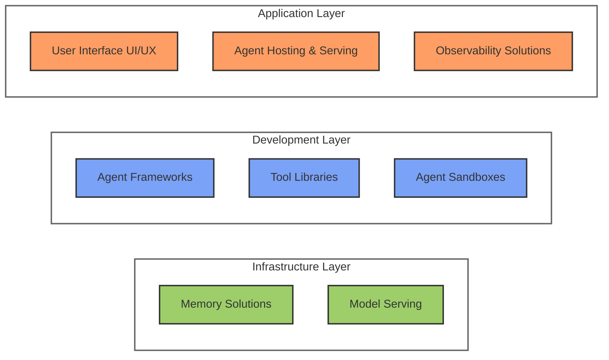

## The Stack

The modern AI agent stack can be broken down into several key layers, each addressing specific challenges in agent development. These include:

- [Infrastructure Layer](#infrastructure-layer)
- [Development Layer](#development-layer)
- [Application Layer](#application-layer)

with some nice examples of successful [Vertical AI Agent Solutions](#vertical-ai-agent-solutions).

### Infrastructure Layer

#### Model Serving Solutions

These platforms provide various solutions for deploying and serving AI models, from local deployment to cloud-based infrastructure, with different performance and scaling capabilities.

| Platform | Description |
|----------|-------------|
| [vLLM](https://github.com/vllm-project/vllm) | High-performance inference engine for LLM serving |
| [Ollama](https://ollama.ai/) | Run and serve open-source LLMs locally |
| [LM Studio](https://lmstudio.ai/) | Desktop application for running and serving local LLMs |
| [Together AI](https://www.together.ai/) | Platform for deploying and serving large language models |
| [Fireworks AI](https://fireworks.ai/) | Infrastructure for serving and fine-tuning LLMs |
| [Groq](https://groq.com/) | High-performance LLM inference and serving platform |
| [OpenAI](https://openai.com/) | API platform for serving GPT and other AI models |
| [Anthropic](https://www.anthropic.com/) | Platform for serving Claude and other AI models |
| [Mistral AI](https://mistral.ai/) | Platform for serving efficient and powerful language models |
| [Google Gemini](https://deepmind.google/technologies/gemini/) | Google's platform for serving multimodal AI models |

LLM Serving Considerations:

- Performance and scaling capabilities
- Cost and resource optimization
- Security and compliance features

#### Agent Memory Solutions

Agent memory is based off of [vector databases](../components/vector_databases.md), but can be made easier with platform solutions for managing agent memory, enabling long-term context retention and efficient memory management for AI applications.

| Platform | Description |
|----------|-------------|
| [Letta](https://github.com/letta-ai/letta) | System for extending LLM context windows with infinite memory via memory management |
| [Zep](https://www.getzep.com/) | Long-term memory store for LLM applications and agents |
| [LangMem](https://python.langchain.com/docs/how_to/chatbots_memory/) | LangChain's memory management system for conversational agents |
| [Mem0](https://github.com/mem0ai/mem0) | Memory management and persistence solution for AI assistants and agents |

Memory architecture considerations:

- Persistence strategies
- Context window optimization
- Memory retrieval mechanisms
- Integration with vector stores

### Development Layer

#### Agent Frameworks

These frameworks provide different approaches and tools for building AI agents, from simple single-agent systems to complex multi-agent orchestrations. Each has its own strengths and specialized use cases.

| Framework | Description |
|-----------|-------------|
| [LangGraph](https://github.com/langchain-ai/langgraph) | LangChain's framework for building structured agents using computational graphs |
| [Letta](https://letta.com/) | Framework for building and deploying AI agents with built-in orchestration |
| [Open Hands](https://github.com/All-Hands-AI/OpenHands) | Collaborative AI systems |
| [AutoGen](https://microsoft.github.io/autogen/) | Microsoft's framework for building multi-agent systems with automated agent orchestration |
| [LlamaIndex](https://www.llamaindex.ai/) | Framework for building RAG-enabled agents and LLM applications |
| [CrewAI](https://github.com/joaomdmoura/crewAI) | Framework for orchestrating role-playing autonomous AI agents |
| [DSPy](https://github.com/stanfordnlp/dspy) | Stanford's framework for programming with foundation models |
| [Phidata](https://github.com/phidatahq/phidata) | AI-first development framework for building production-ready AI applications |
| [Semantic Kernel](https://github.com/microsoft/semantic-kernel) | Microsoft's orchestration framework for LLMs |
| [AutoGPT](https://github.com/Significant-Gravitas/AutoGPT) | Framework for building autonomous AI agents with GPT-4 |
| [L3AGI](https://github.com/l3vels/L3AGI) | Open-source tool that enables AI Assistants to collaborate together as effectively as human teams. |
| [Open GPTs](https://github.com/langchain-ai/opengpts) | Provides a similar experience to OpenAI GPTs and assistants, using Langchain components |
| [CAMEL](https://github.com/camel-ai/camel) | Communicative Agents for "Mind" Exploration of Large Scale Language Model Society |

Framework selection considerations:

- State Management: How agent state is serialized and persisted
- Context Window Management: How data is compiled into LLM context
- Multi-Agent Communication: Support for agent collaboration
- Memory Handling: Techniques for managing long-term memory
- Model Support: Compatibility with open-source models

#### Tool Libraries

Tools can be categorized into three main types:

1. **Knowledge Augmentation**
    - Text retrievers
    - Image retrievers
    - Web browsers
    - SQL executors
    - Internal knowledge base access
    - API integrations (news, weather, stocks)

2. **Capability Extension**
    - Calculators
    - Code interpreters
    - Calendar tools
    - Unit converters
    - Language translators
    - Multimodal converters (text-to-image, speech-to-text)

3. **Write Actions**
    - Database modifications
    - Email sending
    - File system operations
    - API calls with side effects
    - Transaction processing

These libraries provide specialized tools and capabilities that can be integrated into AI agents to enhance their ability to interact with various systems and perform specific tasks.

| Library | Description |
|---------|-------------|
| [Composio](https://www.composio.dev/) | Tool composition and orchestration library for AI agents |
| [Browserbase](https://browserbase.com/) | Browser automation and web interaction tools for AI agents |
| [Exa](https://exa.ai/) | AI-powered search and knowledge tools library |
| [Model Context Protocol (MCP)](https://modelcontextprotocol.io/tutorials/building-mcp-with-llms) | A protocol for enabling LLMs to use tools |

#### Tool Integration Protocols

A key challenge in building agents is standardizing how they interact with tools. Several protocols have emerged to address this

##### Model Context Protocol (MCP)

[Model Context Protocol](https://modelcontextprotocol.io/tutorials/building-mcp-with-llms) provides a standardized way for LLMs to interact with tools and external systems. Key features include:

1. **Resource Management**
    - Structured exposure of external resources
    - Schema definitions for data access
    - Standardized resource querying

2. **Tool Definitions**
    - Common format for tool specifications
    - Input/output validation
    - Error handling patterns

3. **Prompt Templates**
    - Standardized prompt formats
    - Context management
    - Response handling

##### Other Tool Integration Standards

| Protocol | Description |
|----------|-------------|
| [OpenAI Function Calling](https://platform.openai.com/docs/guides/function-calling) | JSON Schema-based function definitions |
| [LangChain Tools](https://python.langchain.com/docs/how_to/#tools) | Tool specification format for LangChain agents |
| [Semantic Kernel Skills](https://github.com/microsoft/semantic-kernel) | Microsoft's approach to defining reusable AI capabilities |

#### Best Practices for Tool Integration

When implementing tool protocols:

1. **Security Considerations**
    - Validate all inputs before execution
    - Implement proper access controls
    - Monitor tool usage and rate limits

2. **Error Handling**
    - Graceful failure modes
    - Clear error messages
    - Recovery strategies

3. **Documentation**
    - Clear tool specifications
    - Usage examples
    - Integration guides

4. **Testing**
    - Tool validation
    - Integration testing
    - Performance monitoring

#### Agent Sandboxes

Agent sandboxes are crucial components in the AI agent development stack, providing secure and isolated environments for running and testing AI agents. They serve as a critical layer of security and control between AI agents and the systems they interact with.

| Platform | Description | Key Features |
|----------|-------------|--------------|
| [E2B](https://e2b.dev/) | Secure sandboxed environments for running and testing AI agents | • Secure code execution • Real-time monitoring • API integration • Custom runtime environments |
| [Modal](https://modal.com/) | Cloud platform for running AI agents in isolated environments | • Serverless execution • GPU support • Automatic scaling • Container orchestration |
| [Docker](https://www.docker.com/) | Container platform that can be used for agent sandboxing | • Custom environments • Resource isolation • Portable deployments |

Note: These platforms ensure safe execution and development of agent capabilities while maintaining system security and stability. The choice of sandbox solution should align with your specific security requirements, development workflow, and operational needs.

##### Core Capabilities

1. **Security & Isolation**
    - Containerized environments for safe code execution
    - Resource usage limits and quotas
    - Network access controls and API restrictions
    - File system and process isolation
    - Principle of least privilege enforcement

2. **Development & Operations**
    - Rapid prototyping and testing
    - Reproducible environments
    - Version control integration
    - Resource monitoring and optimization
    - Performance profiling and debugging
    - Cost management and scaling

### Application Layer

#### Agent Hosting & Serving Solutions

| Platform | Description |
|----------|-------------|
| [Letta](https://letta.com/) | Agent deployment and hosting platform |
| [LangGraph](https://github.com/langchain-ai/langgraph) | Graph-based orchestration for language model agents |
| [Assistants API](https://platform.openai.com/docs/assistants/overview) | OpenAI's API for deploying and managing AI assistants |
| [Amazon Bedrock Agents](https://aws.amazon.com/bedrock/agents/) | AWS-based agent hosting and management service |
| [LiveKit Agents](https://livekit.io/) | Real-time agent deployment and communication platform |
| [CopilotKit](https://docs.copilotkit.ai/coagents) | Framework for building and deploying AI copilots with multi-agent support |

These platforms provide infrastructure and tools for deploying, hosting, and serving AI agents at scale, each with different specializations and integration capabilities.

Additional considerations for hosting solutions:

- Scalability and performance requirements
- Integration capabilities with existing systems
- Cost and resource optimization
- Security and compliance features

https://docs.copilotkit.ai/coagents

#### Agent Observability Solutions

These platforms provide specialized tools for monitoring, debugging, and analyzing the performance of AI agents and LLM applications in production environments.

| Platform | Description |
|----------|-------------|
| [LangSmith](https://smith.langchain.com/) | LangChain's platform for debugging, testing, evaluating, and monitoring LLM applications and agents |
| [Arize](https://arize.com/) | ML observability platform with LLM monitoring capabilities |
| [Weave](https://www.weave.ai/) | AI observability and monitoring platform |
| [Langfuse](https://langfuse.com/) | Open source LLM engineering platform for monitoring and analytics |
| [AgentOps.ai](https://www.agentops.ai/) | Specialized platform for monitoring and optimizing AI agents |
| [Braintrust](https://www.braintrustdata.com/) | LLM evaluation and monitoring platform |

Key observability features to consider:

- Real-time monitoring and alerting
- Performance analytics and tracing
- Debug tooling and replay capabilities
- Cost tracking and optimization

### Vertical AI Agent Solutions

| Company | Description/Focus Area |
|---------|----------------------|
| [Decagon](https://decagon.ai/) | AI agent development platform |
| [Sierra](https://sierra.ai/) | Environmental and sustainability-focused AI solutions |
| [Replit](https://replit.com/) | Cloud development environment and AI coding tools |
| [Perplexity](https://www.perplexity.ai/) | AI-powered search and discovery |
| [Harvey](https://harvey.ai/) | Legal AI solutions |
| [Please AI](https://please.ai/) | Multi-agent systems and orchestration |
| [Cognition](https://www.cognition-labs.com/) | Cognitive computing and AI reasoning |
| [Factory](https://www.factory.ai/) | AI automation and manufacturing solutions |
| [Dosu](https://dosu.dev/) | AI code writing agent and github plugin |
| [Lindy](https://lindy.ai/) | AI Automated emailing and scheduling|
| [11x](https://11x.ai/) | Digital Human Workers |

