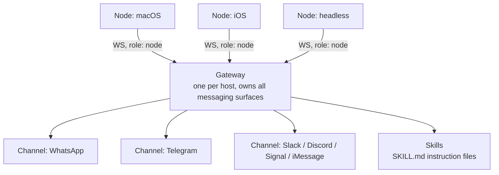

# Agent Communication Layers

A coding harness like [Claude Code or Cursor](./harnesses.md) solves a bounded problem: execute a task inside a codebase, then stop. A **communication-layer agent** solves a different problem: stay reachable across whatever channel a person actually uses, whether that's WhatsApp, Slack, or a text message, and keep working between conversations, not just during one. This is a fourth architectural category, distinct from [harness, framework, and orchestration](./harnesses.md#harness-vs-framework-vs-orchestration).

## OpenClaw

OpenClaw is the clearest example of this category, and by mid-2026 one of the fastest-growing open-source projects ever measured: the project's own GitHub repository (github.com/openclaw/openclaw, MIT license) shows 387,600+ stars as of this writing, having surpassed the Linux kernel's star count to become the 14th most-starred repository on GitHub, described by independent coverage as the fastest star growth in GitHub's history. It launched in November 2025 and is developed by the OpenClaw Foundation, a non-profit.

The project's own README describes it directly: "a personal AI assistant that runs on your devices and meets you in the channels you already use... connects models, tools, messaging channels, and optional companion apps through one Gateway."

### Architecture

Per OpenClaw's own documentation (docs.openclaw.ai):

#### Gateway

A single long-lived process that owns every messaging surface: WhatsApp, Telegram, Slack, Discord, Signal, iMessage, and a web chat interface. It maintains the provider connections, exposes a typed WebSocket API with request-response and server-push events, and validates every inbound message against a JSON Schema before it reaches the agent. The docs are explicit about the isolation this buys: "one Gateway per host; it is the only place that opens a WhatsApp session."

#### Node

A device connects to the same WebSocket server as a Node, identified by device rather than by user, with pairing done per-device. Nodes run on macOS, iOS, Android, or headless machines and expose device-specific commands the agent can call, camera, screen recording, location.

#### Channels

The messaging surfaces themselves sit under the Gateway's management: WhatsApp via the Baileys library, Telegram via grammY, plus Slack, Discord, Signal, iMessage, and web chat as additional integrations.

#### Skills

OpenClaw follows the AgentSkills spec: a skill is a directory containing a `SKILL.md` file with YAML frontmatter and instructions, teaching the agent how and when to use a given tool. Skills load from a bundled set plus optional local overrides, filtered at load time by environment, config, and whether the tool's own binary is even present on the machine.

### Heartbeat: staying proactive between conversations

Rather than only responding when spoken to, OpenClaw runs a **heartbeat**: a scheduled main-session turn, every 30 minutes by default (extended to an hour under Anthropic's OAuth or token authentication). Each heartbeat checks an optional "monitor scratch," a small, stable checklist stored in the shared state database and managed via `openclaw cron scratch <jobId> --set "..."`. If nothing needs attention, the model replies `HEARTBEAT_OK` and stays quiet; if something does, it alerts the configured owner through their chosen channel. Heartbeats skip automatically when automation is disabled or other work is already queued, so they don't compete with active tasks.

## The Variant Family

OpenClaw's architecture has already been extended into adjacent domains, with dedicated 2026 research behind each:

- **ClawMobile** rethinks the same communication-layer pattern for smartphone-native agentic systems, rather than a desktop or server Gateway.
- **ROSClaw** adapts the Gateway/Node model to ROS 2 (Robot Operating System), routing agentic control and interaction through the same channel-based architecture, applied to physical robots instead of messaging apps.

Its rapid growth has also drawn real security scrutiny, not just adoption: multiple 2026 papers examine OpenClaw's attack surface directly, including forensic-analysis methodology for agentic AI investigations and a zero-trust security architecture proposed specifically in response to autonomous agents like it operating in sensitive domains such as healthcare.

## Why This Is a Separate Category From a Harness

The distinction matters in practice, not just in naming. A harness like Claude Code is invoked, does bounded work, and exits, its entire job is finishing a task well. A communication-layer agent like OpenClaw is designed to persist: it holds a device identity, wakes on its own schedule, and reaches you wherever you already are, rather than waiting in one interface for you to show up. Building or evaluating either one against the other's design goals is a category error, even though both are, loosely, "AI agents."

## Related Pages

- [Agent Harnesses](./harnesses.md) - the bounded-execution counterpart to this always-on, multi-channel category
- [Agentic AI Orchestration Frameworks](./frameworks.md) - the development-time library layer, distinct from both
- [Real-Time Voice and Multimodal Agent APIs](./voice-realtime-apis.md) - a different kind of always-on channel: live voice rather than text messaging
