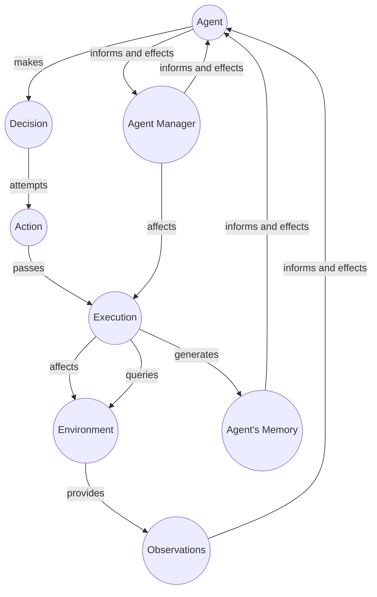

TODO: Sort and prioritize this. 

Agent types can be described by direct agentic ability to cause a change in the world.

## Text Agent

An agent that can output only language text. Even thought the language can be 'interpreted' into different things, as is done in the environment. 

## Text + Image Agent

An agent that can output 

## Robotic Agent

A robotic agent can control mechanism impacting the mechanical position or other activity of a device. 



### Langchain focused.
!!! tip "[GPT and PDFS](https://betterprogramming.pub/talking-to-pdfs-gpt-4-and-langchain-77f44f23505d)"


### Agent


??? tip "[ReAct](https://arxiv.org/abs/2210.03629)"
    - [Github](https://github.com/ysymyth/ReAct) 
    - Effectively Observe, Think, Act, Repeat.


??? tip "[Reflexion: an autonomous agent with dynamic memory and self-reflection](https://arxiv.org/abs/2303.11366) an agent with dynamic memory and self-reflection capabilities"
    
    - [Github](https://github.com/noahshinn024/reflexion)
    - [Inspired github](https://github.com/GammaTauAI/reflexion-human-eval) 


??? tip "[Learning to Reason and Memorize with Self-Notes](https://adapterhub.ml/) Allows model to deviate from input context at any time to reason and take notes"
    


??? tip "[Large language models as tool makers](https://arxiv.org/pdf/2305.17126.pdf) [Github](https://github.com/ctlllll/llm-toolmaker) Allows high-quality tools to be reused by more lightweight models."
    


??? tip "[CREATOR: Disentangling Abstract and Concrete Reasonings of Large Language Models through Tool Creation](https://arxiv.org/pdf/2305.14318.pdf)"
    
    


??? tip "[smolai](https://github.com/ThomasEwing04/SMOL_AI) https://www.youtube.com/watch?v=zsxyqz6SYp8&t=1s An interesting example"


??? code "[Agent-GPT](https://github.com/reworkd/AgentGPT)"
    [Website](https://agentgpt.reworkd.ai/) 


??? tip "[AssistGPT: A General Multi-modal Assistant that can Plan, Execute, Inspect, and Learn](https://arxiv.org/pdf/2306.08640.pdf)" 
    [Webpage](https://showlab.github.io/assistgpt/) Uses PEIL PLan execute inspect learn.


!!! tip "[GPT Engineer](https://github.com/AntonOsika/gpt-engineer)"


??? tip "[DevOpsGPT](https://github.com/kuafuai/DevOpsGPT)"
    ```
    Through the above introduction and Demo demonstration, you must be curious about how DevOpsGPT achieves the entire process of automated requirement development in an existing project. Below is a brief overview of the entire process:
    ```
    
    ```

    
        Clarify requirement documents: Interact with DevOpsGPT to clarify and confirm details in requirement documents.
        Generate interface documentation: DevOpsGPT can generate interface documentation based on the requirements, facilitating interface design and implementation for developers.
        Write pseudocode based on existing projects: Analyze existing projects to generate corresponding pseudocode, providing developers with references and starting points.
        Refine and optimize code functionality: Developers improve and optimize functionality based on the generated code.
        Continuous integration: Utilize DevOps tools for continuous integration to automate code integration and testing.
        Software version release: Deploy software versions to the target environment using DevOpsGPT and DevOps tools.
    ```


??? tip "[UniversalNER](https://arxiv.org/pdf/2308.03279.pdf) Used ChatGPT to distill much smaller model for a certain domain,"
    ```
    "Large language models (LLMs) have demonstrated remarkable generalizability, such as understanding arbitrary entities and relations. Instruction tuning has proven effective for distilling LLMs into more cost-efficient models such as Alpaca and Vicuna. Yet such student models still trail the original LLMs by large margins in downstream applications. In this paper, we explore targeted distillation with mission-focused instruction tuning to train student models that can excel in a broad application class such as open information extraction. Using named entity recognition (NER) for case study, we show how ChatGPT can be distilled into much smaller UniversalNER models for open NER. For evaluation, we assemble the largest NER benchmark to date, comprising 43 datasets across 9 diverse domains such as biomedicine, programming, social media, law, finance. Without using any direct supervision, UniversalNER attains remarkable NER accuracy across tens of thousands of entity types, outperforming general instruction-tuned models such as Alpaca and Vicuna by over 30 absolute F1 points in average. With a tiny fraction of parameters, UniversalNER not only acquires ChatGPT’s capability in recognizing arbitrary entity types, but also outperforms its NER accuracy by 7-9 absolute F1 points in average. Remarkably, UniversalNER even outperforms by a large margin state-of-the-art multi-task instruction-tuned systems such as InstructUIE, which uses supervised NER examples. We also conduct thorough ablation studies to assess the impact of various components in our distillation approach. We will release the distillation recipe, data, and UniversalNER models to facilitate future research on targeted distillation."
    ```
    https://arxiv.org/pdf/2308.03279.pdf
    https://github.com/universal-ner/universal-ner


## Libraries

!!! code "[Robo GPT](https://github.com/rokstrnisa/Robo-GPT)"

!!! code "[Chrome-GPT](https://github.com/richardyc/Chrome-GPT): an experimental AutoGPT agent that interacts with Chrome"
    


