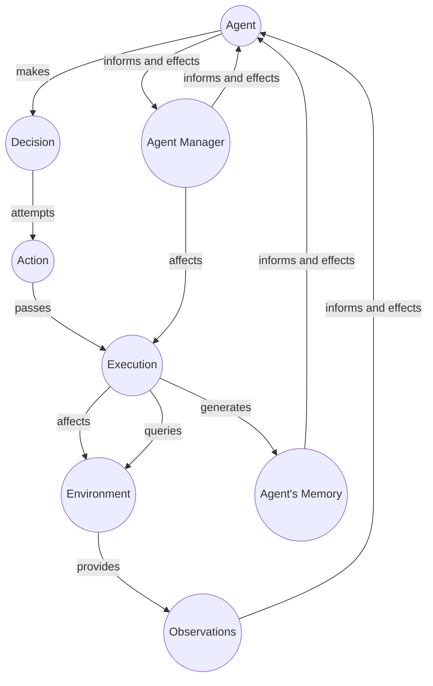

TODO: Sort and prioritize this. 

Agent types can be described by direct agentic ability to cause a change in the world.

## Text Agent

An agent that can output only language text. Even thought the language can be 'interpreted' into different things, as is done in the environment. 

## Text + Image Agent

An agent that can output 

## Robotic Agent

A robotic agent can control mechanism impacting the mechanical position or other activity of a device. 

### Agent

??? tip "[Learning to Reason and Memorize with Self-Notes](https://adapterhub.ml/) Allows model to deviate from input context at any time to reason and take notes"
    

??? tip "[Large language models as tool makers](https://arxiv.org/pdf/2305.17126.pdf) [Github](https://github.com/ctlllll/llm-toolmaker) Allows high-quality tools to be reused by more lightweight models."
    

??? tip "[CREATOR: Disentangling Abstract and Concrete Reasonings of Large Language Models through Tool Creation](https://arxiv.org/pdf/2305.14318.pdf)"
    
    

??? tip "[ReAct](https://arxiv.org/abs/2210.03629)"
    - [Github](https://github.com/ysymyth/ReAct) 
    - Effectively Observe, Think, Act, Repeat. Has limited action space 

??? tip "[Reflexion: an autonomous agent with dynamic memory and self-reflection](https://arxiv.org/abs/2303.11366): "Reflexion, an approach that endows an agent with dynamic memory and self-reflection capabilities to enhance its existing reasoning trace and task-specific action choice abilities"
    - [Github](https://github.com/noahshinn024/reflexion)
    - [Inspired github](https://github.com/GammaTauAI/reflexion-human-eval) 

??? tip "[Teaching Large Language Models to Self-Debug](https://arxiv.org/abs/2304.05128) `transcoder`"
    

??? tip "[Language Models can Solve Computer Tasks](https://arxiv.org/pdf/2303.17491.pdf) Uses Recursive Criticism and Improvement."
    [Website](https://posgnu.github.io/rci-web/), [GitHub](https://github.com/posgnu/rci-agent)  Combining with Chain of Thought it is even better. The method: Plan: Critique, Improve 
    - Explicit RCI: "Review your previous answer and find problems with your answer." --> "Based on the problems you found, improve your answer." Recursively Criticizes and Improves its output. This sort of prompting outperforms Chain of Thought, and combined it works even better.  

??? tip "[smolai](https://github.com/ThomasEwing04/SMOL_AI) https://www.youtube.com/watch?v=zsxyqz6SYp8&t=1s An interesting example"

??? tip "[Agent-GPT](https://github.com/reworkd/AgentGPT)"
    [Website](https://agentgpt.reworkd.ai/) --> Doesn't have agency/tools... So it is not good. A fancy wrapper for multi-task planning and execution. Limited at present. 

??? tip "[AssistGPT: A General Multi-modal Assistant that can Plan, Execute, Inspect, and Learn](https://arxiv.org/pdf/2306.08640.pdf)" 
    [Webpage](https://showlab.github.io/assistgpt/) Uses PEIL PLan execute inspect learn.

!!! tip "[GPT Engineer](https://github.com/AntonOsika/gpt-engineer)"

!!! tip ️"[Robo-GPT](https://github.com/rokstrnisa/Robo-GPT)"

