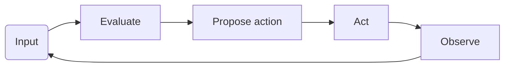

# Gen(erative) AI Agents
Agents in Gen()AI agents have access to 'tools' to provide them 'agency' beyond the ability to generate text or image based responses to the input data.

Similar to bots, or other computerized automata, they may have the ability to run discretely, separately from standard chat interfaces. Generally, they involve the possibility of Human-in-the-loop to help correct odd components. 

## Essential Concepts

* [Environments](environments.md) that can and do provide **inputs**.
* Language [prompts](../prompting/index.md) that orient's and agent's response.
* [Chains](./chains.md) which enable a continuous connection of information with various prompts.
* [Memory](./memory.md) to enable writing and reading information that may be of use.
* [Tools](./actions_and_tools.md) that enable more than text (or images) to be returned or otherwise acted upon. 
* [Cognition architectures](./cognitive_architecture.md) is the ability to understand through the use of computational [models](../architectures/models/index.md), [chains](chains.md) and [memory](./memory.md). 
* [Interpreters and Executors](./interpreters.md) that are used to process input or output.
* [Systems of Agents](systems.md) that can allow for multiple agents with different sets of the components above, to interact and create powerful solutions.

Agents can be quite different! Here are some [examples](./examples.md) of agents made both in academic and commercial settings. 

### Example Agent Diagram: 
At the very simplistic level, an embodiment of an agent would look like this. 



To enable that it may require more complicated relations between example components. Below is an example representation. 

???+ example "An Agent's components"
    ```mermaid
    graph TB
        Agent((Agent)) -->|makes| decision((Decision))
        decision -->|attempts| action((Action))
        action -->|passes| execution((Execution))
        execution -->|affects| environment((Environment))
        execution -->|generates| agentMemory((Agent's Memory))
        agentMemory -->|informs and effects| Agent
        environment -->|provides| observations((Observations))
        observations -->|informs and effects| Agent
        execution -->|queries| environment
        AgentManager((Agent Manager)) -->|affects| execution
        Agent --> |informs and effects| AgentManager
        AgentManager --> |informs and effects| Agent
    ```


## Background
Traditional RL agents.
LLM-enabled agents


## Useful references

Here are several reference so of merit with considering. 
??? note "[The Rise and Potential of Large Language Model Based Agents:A Survey](https://arxiv.org/pdf/2309.07864.pdf) Providess a comprehensive overview of thoughtful ways of considering LLMss. 

??? important "[Agents overview by Lilian Weng](https://lilianweng.github.io/posts/2023-06-23-agent)"
     As usual, a splendid post by Lilian Weng


- [Awesome Agents](https://github.com/e2b-dev/awesome-ai-agents) of a nicely curated list of systems using agents


## TO ORGANIZE