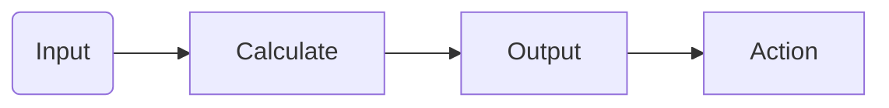

# Agents Gen(erative) AI
Agents in Gen()AI agents have access to 'tools' to provide them 'agency' beyond the ability to generate text or image based responses to the input data.

Similar to bots, or other computerized automata, they may have the ability to run discretely, separately from standard chat interfaces. Generally, they involve the possibility of Human-in-the-loop to help correct odd components. 

## Basic Concepts

* [Environments](environments.md) that can and do provide **inputs**.
* Language [prompts](../prompting/index.md) that orient's and agent's response.
* [Chains](./chains.md) which enable a continuous connection of information with various prompts.
* [Memory](./memory.md) to enable writing and reading information that may be of use.
* [Tools](./actions_and_tools.md) that enable more than text (or images) to be returned or otherwise acted upon. 
* [Cognition architectures](./cognition.md) is the ability to understand through the use of computational [models](../architecture/models/index.md), [chains](chains.md) and [memory](./memory.md). 
* [Interpreters and Executors](#interpreters) that are used to process input or output.
* [Systems of Agents](systems.md) that can allow for multiple agents with different sets of the components above, to interact and create powerful solutions.

Agents can be quite different! Here are some [examples](./examples.md) of agents made both in academic and commercial settings. 

## Background

### [Prompts](../prompting/index.md)

!!! warning "Garbage In --> Garbage Out"
    The common realization that bad input will lead to bad outputs becomes more nuanced when considering the degree to which small changes in input prompts can lead to wildly different outcome performances. Consequently, well-chosen prompts can functionally enable an agent, or not. 

Because of the importance and breadth of details involved with prompting, please visit [this section](../prompting/index.md). Note, that prompts will be model-specific, and if the model changes, either completely or with new architecture, the continued performance of a given prompt or prompt strategy is not certain. 

### [Memory](./memory.md)

Like people, agents can be better enabled when they have access to memory.  We discuss memory thoroughly [here](./memory.md).

### [Tools](./actions_and_tools.md)

### Interpreters 

Both the input and output into an LLM model may be interpreted, or otherwise parsed in a manner that makes the input or output more impactful. 

- [Native function calls](https://github.com/openai/openai-cookbook/blob/main/examples/How_to_call_functions_with_chat_models.ipynb) and [json support with OpenAI](https://yonom.substack.com/p/native-json-output-from-gpt-4) 

## Useful references

Before we go on, there are several references that are of high merit that you may wish to check out!!!

- [Agents overview by Lilian Weng](https://lilianweng.github.io/posts/2023-06-23-agent) As usual, a splendid post by Lilian Weng
- [Awesome Agents](https://github.com/e2b-dev/awesome-ai-agents) of a nicely curated list of systems using agents

## TO ORGANIZE

- [This](https://arxiv.org/pdf/2306.08640.pdf)

