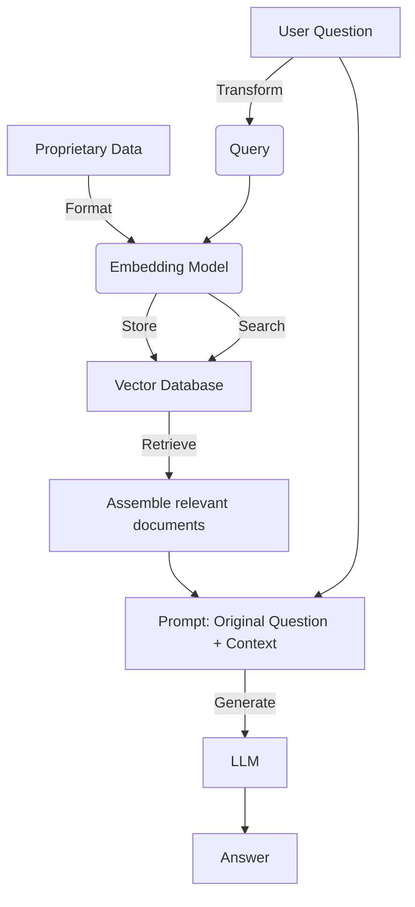

To be as useful as possible, LLMs may need to access a set of information for working that is relevant to the prompt at hand. 

Using both vector, SQL, and no-SQL  [memory](./memory.md) information can be extracted and fed into the LLM to achieve impressive results. 

Using retrieval to improve the generation of content is known as RAG and was [introduced in 2020](https://arxiv.org/abs/2005.11401). While very powerful, it is still an area of active development and research, with fully optimized solutions not always found. 

MANAGEN(Also include discussion on how this relates to knowledge graphs)

## Steps

**Preparation (offline):** 

1. Selection of the appropriate data to ingest.
1. Loading data in such a manner that can be consumed by the models.
1. Splitting the data into chunks in such a way they can be both consumed by the model, and retrieved with reasonable degree of data.
1. Embedding the data. 
1. Storing the embedding

**Retrieval and Generation (online):**

1. Retrieve the data based on input in such a way that relevant documents and chunks can be used in downstream chains.
1. Generate an output using a prompt that integrates the query and retrieved data. 

MANAGEN(make the above  into a mermaid diagram)

### Data Selection

Users will only need to access data that is appropriate for their application at hand, and consequently that data should be provided. However, it might be unnecessary or harmful to retrieval if too much information is included, and the [retrieval](#retrieval) cannot handle the volume or complexity of data. 
Of course, it is important to be very careful with data privacy when providing data that might not be appropriate (or legal) to access.

### Loading data
Different data will require different loaders. Raw text, PDFs, spreadsheets, and more proprietary formats will need to be processed in such a way that the information is of highest relevance to data. Text is easy. Some data, especially multimodal data like PDFS may need to be formatted with schema to allow for more effective searching.

### Splitting Data
Once data has been loaded in such a way that a model can process it, it must be split. There are several ways of splitting data. 
1. By the max size a model can handle
2. By some heuristic break, such as `\n` return characters or `\p` paragraphs or newlines.
3. In some manner that maximizes the topic coherence, (in this case, splitting and embedding may happen simultaneously).

### Embedding Data

Index Building - One of the most useful tricks I've been using is multi-representation indexing: decouple what you index for retrieval (e.g., table or image summary) from what you pass to the llm for answer synthesis (e.g., the raw image, a table). See blog: 
https://blog.langchain.dev/semi-structured-multi-modal-rag/…

### Storing


### Retrieving

The decision and act to retrieve the documents will depend on the additional contexts that the agents may need to be aware of. 

It might not always be necessary to retrieve documents. When it is necessary to retrieve the document, it is important to know 1. where to retrieve from [routing](#routing),  and 2. a then [matching](#matching) the query to the appropriately stored information. Both of these may involve [rewriting](#query-transformations) the prompt to be more effective in the manner the data is retrieved. 

#### Query transformations

**Rewrite-Retrieve-Read**
??? important "[Query Rewriting for Retrieval-Augmented Large Language Models](https://arxiv.org/pdf/2305.14283.pdf)"
    
    

For instance, [in this blog](https://blog.langchain.dev/query-transformations/) transformations 

**Step back prompting**

This method generates an intermediate context that helps to 'abstract' the information. Once generated the additional context can be used

???+ example "[Step back](https://smith.langchain.com/hub/langchain-ai/stepback-answer)"
    ```markdown
    You are an expert of world knowledge. I am going to ask you a question. Your response should be comprehensive and not contradicted with the following context if they are relevant. Otherwise, ignore them if they are not relevant.
    
    {normal_context}
    {step_back_context}
    
    Original Question: {question}
    Answer:
    ```

??? example "[Take a Step Back: Evoking Reasoning via Abstraction in Large Language Models](https://arxiv.org/pdf/2310.06117.pdf)"
    

**Question rephrasing**
Particularly chat settings, be sure to include all of the appropriate context to create an effective search query. 

???+ example "[Rephrase question](https://smith.langchain.com/hub/langchain-ai/weblangchain-search-query)"
    ```markdown
        Given the following conversation and a follow up question, rephrase the follow up \
question to be a standalone question.
        
        Chat History:
        {chat_history}
        Follow Up Input: {question}
        Standalone Question:
    ```
**Question partitioning**
Some questions may require individual pieces of information to be found to answer the question.  Consequently, that means breaking the question apart into multiple pieces. 
[Here](https://python.langchain.com/docs/modules/data_connection/retrievers/MultiQueryRetriever) is an example implementation in Langchain.

#### Routing
2. Routing - Queries may need to be routed to different data sources depending on what is being asked. Recent blog reviewing OpenAI's RAG strategies provides some guidance on question routing: https://blog.langchain.dev/applying-openai-rag/

#### Matching

TODO: RESEARCH ON THIS

### Generating

TODO: READ NAD PROCESS THIS
5. Post-processing - Given retrieved documents, there are various way to rank / filter them. Recent blog reviewing OpenAI's RAG strategies provides a few ideas on applying post-processing: https://blog.langchain.dev/applying-openai-rag/

## Other Topics

TODO: PROCESS THESE
4a. Multi-Modal -
This cookbook show how I used this approach for RAG on a substack (
@jaminball
's Clouded Judgement) that has many images of densely packed tables, graphs:
https://github.com/langchain-ai/langchain/blob/master/cookbook/Multi_modal_RAG.ipynb…

4b. Semi-Structured -
This cookbook show how I used this for RAG on a docs (papers) with tables, which can be split using naive RAG text-splitting (that does not explicitly preserve them):
https://github.com/langchain-ai/langchain/blob/master/cookbook/Semi_Structured_RAG.ipynb…


## Tutorials and Blogs

[Langchain Question Answering](https://python.langchain.com/docs/use_cases/question_answering/)

