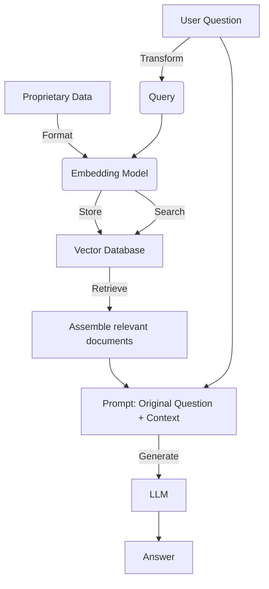

# Retrieval-Augmented Generation (RAG)

Large Language Models (LLMs) can be made more useful by enabling them to access a set of information relevant to the prompt at hand. This can be achieved by extracting information from vector, SQL, and no-SQL [memory](./memory.md) and feeding it into the LLM. This approach, known as Retrieval-Augmented Generation (RAG), was introduced in 2020 in [Retrieval-Augmented Generation for Knowledge-Intensive NLP Tasks](https://arxiv.org/pdf/2005.11401.pdf). It has shown impressive results in improving the generation of content. However, it is still an area of active development and research, and fully optimized solutions are not always available.

This document also discusses the relationship between RAG and knowledge graphs.

## RAG Process

The RAG process can be divided into two main stages: Preparation (offline) and Retrieval and Generation (online).



### Preparation (offline)

The preparation stage involves the following steps:

1. **Data Selection:** Choose the appropriate data to ingest.
2. **Loading Data:** Load the data in a manner that can be consumed by the models.
3. **Splitting Data:** Split the data into chunks that can be both consumed by the model and retrieved with a reasonable degree of data.
4. **Embedding Data:** Embed the data.
5. **Storing Data:** Store the embedding.

### Retrieval and Generation (online)

The retrieval and generation stage involves the following steps:

1. **Retrieving Data:** Retrieve the data based on input in such a way that relevant documents and chunks can be used in downstream chains.
2. **Generating Output:** Generate an output using a prompt that integrates the query and retrieved data.

## Detailed Steps

### Data Selection

Users should only access data that is appropriate for their application. However, including too much information might be unnecessary or harmful to retrieval if the [retrieval](#retrieval) cannot handle the volume or complexity of data. It is also crucial to ensure data privacy when providing data that might not be appropriate (or legal) to access.

### Loading Data

Different data types require different loaders. Raw text, PDFs, spreadsheets, and more proprietary formats need to be processed in a way that the information is of highest relevance to data. Text is easy to process, but some data, especially multimodal data like PDFs, may need to be formatted with a schema to allow for more effective searching.

### Splitting Data

Once data has been loaded in a way that a model can process it, it must be split. There are several ways of splitting data:

1. By the max size a model can handle.
2. By some heuristic break, such as `\n` return characters or `\p` paragraphs or newlines.
3. In a manner that maximizes the topic coherence. In this case, splitting and embedding may happen simultaneously.

### Embedding Data

Index Building - One of the most useful tricks is multi-representation indexing: decouple what you index for retrieval (e.g., table or image summary) from what you pass to the LLM for answer synthesis (e.g., the raw image, a table). See blog:
https://blog.langchain.dev/semi-structured-multi-modal-rag/…

### Storing Data

The embedded data is stored for future retrieval and use.

### Retrieving Data

The decision and act to retrieve the documents will depend on the additional contexts that the agents may need to be aware of.

It might not always be necessary to retrieve documents. When it is necessary to retrieve the document, it is important to know where to retrieve from [routing](#routing), and then [matching](#matching) the query to the appropriately stored information. Both of these may involve [rewriting](#query-transformations) the prompt to be more effective in the manner the data is retrieved.

#### Query Transformations

Query transformations can be done in several ways, including:

1. **Rewrite-Retrieve-Read:** This approach involves rewriting the query for better retrieval and reading of the relevant documents.

    ??? important "[Query Rewriting for Retrieval-Augmented Large Language Models](https://arxiv.org/pdf/2305.14283.pdf)"

        

2. **Step Back Prompting:** This method generates an intermediate context that helps to 'abstract' the information. Once generated, the additional context can be used.

    ???+ example "[Step back](https://smith.langchain.com/hub/langchain-ai/stepback-answer)"
        ```markdown
        You are an expert of world knowledge. I am going to ask you a question. Your response should be comprehensive and not contradicted with the following context if they are relevant. Otherwise, ignore them if they are not relevant.

        {normal_context}
        {step_back_context}

        Original Question: {question}
        Answer:
        ```

    ??? example "[Take a Step Back: Evoking Reasoning via Abstraction in Large Language Models](https://arxiv.org/pdf/2310.06117.pdf)"

        

4. **Question Rephrasing:** Particularly in chat settings, it's important to include all of the appropriate context to create an effective search query.

    ???+ example "[Rephrase question](https://smith.langchain.com/hub/langchain-ai/weblangchain-search-query)"

        ```markdown
            Given the following conversation and a follow up question, rephrase the follow up question to be a standalone question.

            Chat History:
            {chat_history}
            Follow Up Input: {question}
            Standalone Question:
        ```

5. **Question Partitioning:** Some questions may require individual pieces of information to be found to answer the question. This means breaking the question apart into multiple pieces.

#### Routing

Queries may need to be routed to different data sources depending on what is being asked. Recent blog reviewing OpenAI's RAG strategies provides some guidance on question routing: https://blog.langchain.dev/applying-openai-rag/

#### Matching

Matching involves aligning the query with the appropriately stored information.

### Generating

The final step is generating an output using a prompt that integrates the query and retrieved data.

## Other Topics

1. **Multi-Modal:** This approach is used for RAG on a substack that has many images of densely packed tables, graphs. [Here](https://github.com/langchain-ai/langchain/blob/master/cookbook/Multi_modal_RAG.ipynb) is an example implementation.

2. **Semi-Structured:** This approach is used for RAG on documents with tables, which can be split using naive RAG text-splitting that does not explicitly preserve them. [Here](https://github.com/langchain-ai/langchain/blob/master/cookbook/Semi_Structured_RAG.ipynb) is an example implementation.

## Tutorials and Blogs

- [Langchain Question Answering](https://python.langchain.com/docs/use_cases/question_answering/)
- [RAG demystified](https://github.com/pchunduri6/rag-demystified/blob/main/complex_qa.py)
