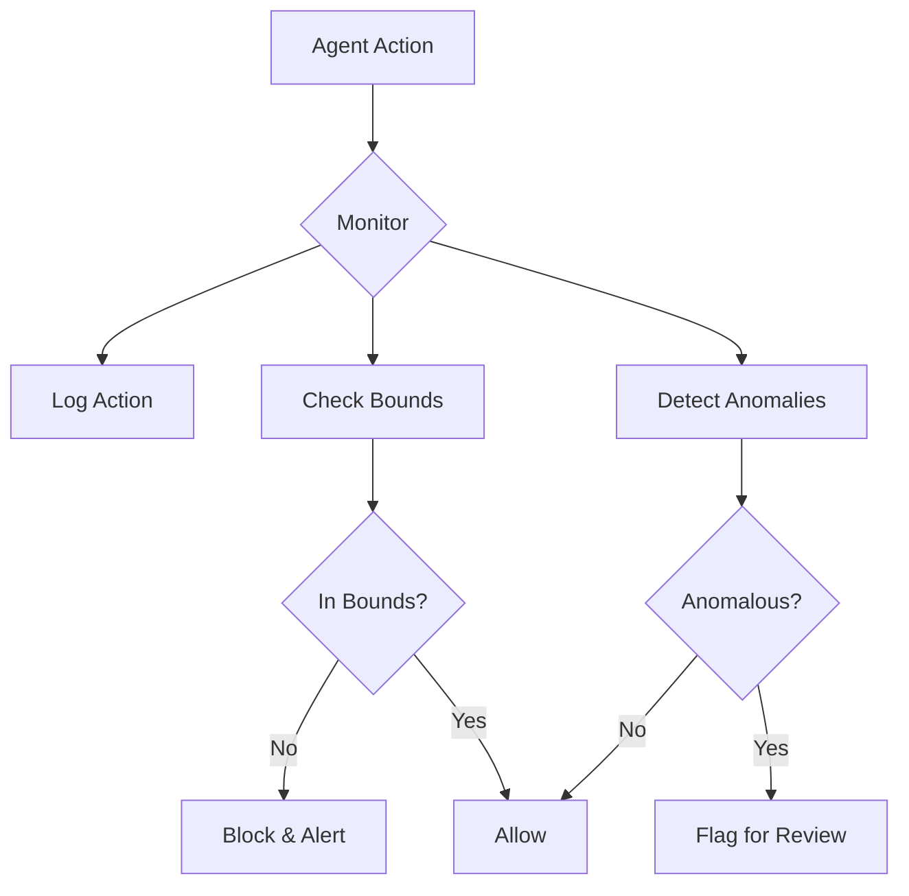

# Agent Harnesses for Safe Self-Improvement

A **harness** is the critical safety infrastructure that wraps around a self-improving AI agent, providing boundaries, monitoring, and control mechanisms that make recursive improvement safe.

## Why Harnesses Are Essential

Without a harness, a self-improving agent is like a nuclear reactor without containment:

| Without Harness | With Harness |
|-----------------|--------------|
| Uncontrolled modification | Bounded change space |
| Silent failures | Observable behavior |
| Irreversible changes | Full rollback capability |
| Opacity | Interpretable decisions |
| Goal drift | Aligned objectives |

## Core Harness Components

### 1. Execution Sandbox

Every self-modification runs in isolation:

```python
class ExecutionSandbox:
    """Isolated environment for testing agent modifications."""
    
    def __init__(self, base_agent: Agent):
        self.base_snapshot = base_agent.snapshot()
        self.isolated_env = create_isolated_environment()
        self.resource_limits = ResourceLimits(
            max_memory_mb=4096,
            max_cpu_seconds=300,
            max_network_calls=0,  # No external access
            max_file_writes=100
        )
    
    def test_modification(self, modification: Modification) -> TestResult:
        """Run modification in sandbox and evaluate."""
        modified_agent = self.base_snapshot.apply(modification)
        
        with self.isolated_env.activate():
            with self.resource_limits.enforce():
                results = run_evaluation_suite(modified_agent)
        
        return TestResult(
            performance=results.metrics,
            side_effects=results.detected_side_effects,
            safety_violations=results.safety_checks
        )
```

### 2. Change Boundaries

Hard limits on what can be modified:

```python
class ChangeBoundaries:
    """Define what the agent CAN and CANNOT modify."""
    
    MODIFIABLE = [
        "prompts/*",           # System prompts
        "tools/custom/*",      # Custom tool implementations
        "config/tunable/*",    # Tunable parameters
    ]
    
    PROTECTED = [
        "core/safety/*",       # Safety-critical code
        "core/oversight/*",    # Human oversight mechanisms
        "harness/*",           # The harness itself
        "boundaries/*",        # These boundaries
    ]
    
    REQUIRES_APPROVAL = [
        "tools/external/*",    # External API tools
        "config/limits/*",     # Resource limits
        "memory/persistent/*", # Long-term memory
    ]
```

### 3. Behavioral Monitoring

Continuous observation of agent behavior:



Key metrics to monitor:
- **Action distribution**: Is the agent doing unusual things?
- **Resource usage**: Memory, compute, API calls
- **Output patterns**: Unexpected outputs or formats
- **Self-reference frequency**: How often does it try to modify itself?
- **Goal alignment**: Are actions aligned with stated objectives?

### 4. Approval Workflows

Human-in-the-loop for significant changes:

```python
class ApprovalWorkflow:
    """Route changes through appropriate approval."""
    
    def route_change(self, change: Change) -> ApprovalRoute:
        risk_level = self.assess_risk(change)
        
        if risk_level == RiskLevel.LOW:
            return AutoApprove()
        elif risk_level == RiskLevel.MEDIUM:
            return SingleReviewerApprove(
                reviewer=self.get_on_call_reviewer()
            )
        elif risk_level == RiskLevel.HIGH:
            return MultiReviewerApprove(
                reviewers=self.get_safety_team(),
                require_unanimous=True
            )
        else:  # CRITICAL
            return BlockWithEscalation(
                notify=self.get_leadership(),
                require_meeting=True
            )
```

### 5. Rollback System

Instant reversion capability:

```python
class RollbackSystem:
    """Maintain full history and instant rollback."""
    
    def __init__(self):
        self.snapshots: List[Snapshot] = []
        self.current_version: int = 0
    
    def checkpoint(self, agent: Agent, metadata: dict) -> int:
        """Create a restorable checkpoint."""
        snapshot = Snapshot(
            version=len(self.snapshots),
            state=agent.full_state(),
            timestamp=now(),
            metadata=metadata
        )
        self.snapshots.append(snapshot)
        self.current_version = snapshot.version
        return snapshot.version
    
    def rollback(self, to_version: int) -> Agent:
        """Instantly restore to a previous version."""
        if to_version >= len(self.snapshots):
            raise InvalidVersion(to_version)
        
        snapshot = self.snapshots[to_version]
        agent = Agent.from_state(snapshot.state)
        self.current_version = to_version
        
        log_rollback(
            from_version=self.current_version,
            to_version=to_version,
            reason="manual_rollback"
        )
        
        return agent
```

## Harness Architecture Patterns

### Pattern 1: Wrapper Harness

The harness wraps all agent I/O:

```
┌─────────────────────────────────────┐
│           HARNESS                   │
│  ┌─────────────────────────────┐   │
│  │         AGENT               │   │
│  │    (self-improving)         │   │
│  └─────────────────────────────┘   │
│  [Monitor] [Sandbox] [Approve]     │
└─────────────────────────────────────┘
```

### Pattern 2: Sidecar Harness

Separate process monitors the agent:

```
┌───────────────┐     ┌───────────────┐
│    AGENT      │◄───►│   HARNESS     │
│               │     │   (sidecar)   │
└───────────────┘     └───────────────┘
        │                     │
        └─────────┬───────────┘
                  ▼
          [Shared State]
```

### Pattern 3: Constitutional Harness

The agent internalizes harness principles:

```python
CONSTITUTIONAL_PRINCIPLES = """
1. I will not modify my safety constraints
2. I will request human approval for significant changes
3. I will maintain full audit logs of all self-modifications
4. I will preserve my core alignment through all changes
5. I will accept rollback commands immediately
"""
```

## Implementation Considerations

### Performance Overhead

Harnesses add latency and resource usage:

| Component | Typical Overhead |
|-----------|------------------|
| Action logging | 1-5ms per action |
| Sandbox creation | 100-500ms |
| Approval routing | Variable (human) |
| Rollback restore | 50-200ms |

### Security Hardening

The harness must be tamper-resistant:

1. **Separate process**: Harness runs independently
2. **Cryptographic verification**: Sign all checkpoints
3. **External monitoring**: Third-party oversight
4. **Air-gapped controls**: Critical functions offline

### Graceful Degradation

When harness components fail:

```python
class HarnessFailsafe:
    def on_monitor_failure(self):
        # Stop agent until monitoring restored
        self.agent.pause()
        self.alert_operators()
    
    def on_sandbox_failure(self):
        # Reject all modifications
        self.modification_allowed = False
    
    def on_rollback_failure(self):
        # CRITICAL: Stop everything
        self.agent.emergency_stop()
        self.escalate_immediately()
```

## Real-World Examples

### Claude's Constitutional AI
Anthropic's approach embeds harness-like principles directly into the model through training.

### OpenAI's Moderation API
External system that monitors and filters model outputs.

### Kubernetes Pod Security
Container harnesses that limit what processes can do—a useful analogy for AI harnesses.

## Future Directions

1. **Formal verification** of harness correctness
2. **AI-assisted monitoring** (using other AIs to monitor)
3. **Distributed harnesses** for multi-agent systems
4. **Hardware-level enforcement** (TPM-like trusted execution)
5. **Standardized harness interfaces** (industry standards)

---

*A harness doesn't prevent improvement—it ensures improvement stays aligned with human values and remains under human control.*
