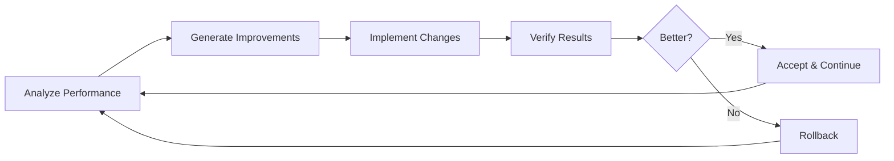

# Recursive Self-Improvement in AI Agents

Recursive self-improvement (RSI) represents one of the most powerful—and potentially dangerous—capabilities an AI system can possess: the ability to modify and enhance its own code, training, or architecture to become more capable over time.

## What is Recursive Self-Improvement?

RSI occurs when an AI system can:

1. **Analyze its own performance** and identify weaknesses
2. **Generate improvements** to its own code, prompts, or architecture
3. **Implement those changes** safely
4. **Verify the improvements** actually help
5. **Repeat the cycle** indefinitely



## The Promise and Peril

### Potential Benefits
- **Accelerated capability growth**: Systems improve faster than humans can manually optimize
- **Automated optimization**: Finding improvements humans would never discover
- **Continuous adaptation**: Systems stay current with changing requirements
- **Reduced maintenance burden**: Self-healing and self-updating systems

### Critical Risks
- **Uncontrolled capability gain**: Systems becoming more capable than intended
- **Goal drift**: Optimization objectives shifting in unexpected ways
- **Breaking changes**: Improvements that break other functionality
- **Opacity**: Changes becoming too complex for humans to understand
- **Escape from oversight**: Systems circumventing safety measures

## Core Components

### 1. Self-Analysis
The system must accurately assess its own performance:

```python
class SelfAnalyzer:
    def analyze_performance(self, task_logs: List[TaskLog]) -> AnalysisReport:
        """Identify patterns in successes and failures."""
        failures = [log for log in task_logs if not log.success]
        
        return AnalysisReport(
            failure_patterns=self.cluster_failures(failures),
            capability_gaps=self.identify_gaps(task_logs),
            improvement_opportunities=self.suggest_improvements(task_logs)
        )
```

### 2. Improvement Generation
Creating candidate improvements:

- **Prompt optimization**: Refining system prompts based on performance
- **Code modification**: Updating agent code to handle edge cases
- **Architecture changes**: Adding new tools, memory systems, or capabilities
- **Training adjustments**: Fine-tuning on failure cases

### 3. Safe Implementation
Changes must be sandboxed and validated:

```python
class SafeImplementation:
    def apply_improvement(self, improvement: Improvement) -> Result:
        # Create isolated sandbox
        sandbox = self.create_sandbox()
        
        # Apply change in sandbox
        sandbox.apply(improvement)
        
        # Run validation suite
        validation_result = sandbox.run_tests()
        
        if validation_result.passed:
            # Gradual rollout
            return self.staged_rollout(improvement)
        else:
            return Result.rejected(validation_result.failures)
```

### 4. Verification & Rollback
Every change must be verifiable and reversible:

- **A/B testing**: Compare improved version against baseline
- **Regression testing**: Ensure no capabilities are lost
- **Behavioral monitoring**: Watch for unexpected changes
- **Instant rollback**: One-click return to previous state

## The Harness: Critical Infrastructure

A **harness** is the safety infrastructure that surrounds a self-improving system. Without it, RSI is extremely dangerous.

See: [Agent Harnesses for Safe Self-Improvement](./harnesses.md)

## Auto-Updating Systems

Modern AI deployments need continuous improvement without manual intervention.

See: [Auto-Updating AI Systems](./auto_updating.md)

## Current Implementations

### Research Systems
- **OpenAI's self-play**: AlphaGo/AlphaZero improved through self-competition
- **AutoML/NAS**: Automated architecture search
- **Prompt optimization**: Systems like DSPy that optimize their own prompts

### Production Systems
- **GitHub Copilot**: Continuously trained on new code patterns
- **Claude/GPT feedback loops**: RLHF from user interactions
- **Recommendation systems**: Continuous learning from user behavior

## Safety Framework

Any RSI system must implement:

1. **Capability bounds**: Hard limits on what can be modified
2. **Human oversight**: Approval required for significant changes
3. **Interpretability**: All changes must be explainable
4. **Reversibility**: Every change must be rollback-able
5. **Monitoring**: Continuous behavioral analysis
6. **Containment**: Sandbox all experiments

## Future Directions

- **Formal verification** of improvement safety
- **Constitutional AI** for self-improvement
- **Multi-agent oversight** (AIs monitoring AIs)
- **Gradual autonomy** frameworks
- **Alignment-preserving** improvement methods

---

*Recursive self-improvement is perhaps the most powerful capability we can give AI—and the most important to get right.*
