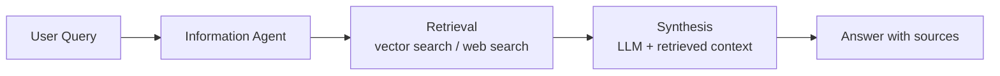

# Information Agents

Information agents retrieve, synthesise, and deliver knowledge from structured and unstructured sources. They form the backbone of enterprise knowledge management use cases.

## Key Patterns

- **RAG (Retrieval-Augmented Generation)** — the agent retrieves relevant documents before generating an answer, grounding responses in source material
- **Deep Research** — the agent autonomously searches multiple sources, cross-references results, and produces a synthesised report (NotebookLM Deep Research, launched November 2025)
- **Knowledge graph traversal** — the agent navigates entity relationships to answer complex structural questions

## How They Work

## 2025 Developments

**NotebookLM Deep Research** (November 2025) transformed NotebookLM from a RAG retrieval tool to an "Agentic Researcher" — actively seeking, synthesising, and cross-referencing information from external sources. NotebookLM Plus launched for enterprise via Google Workspace.

This demonstrated that consumer-facing agentic research tools had crossed a usability threshold, driving mainstream adoption outside developer circles.

!!! info "Source"
    [NotebookLM Deep Research launch](https://blog.google/technology/ai/notebooklm-deep-research/), November 2025

## Key Considerations

- Retrieval quality is the primary determinant of answer quality — invest in chunking, indexing, and re-ranking
- Cite sources explicitly; information agents with no source attribution erode trust rapidly
- For high-stakes knowledge work, always include a human review step before acting on synthesised information
