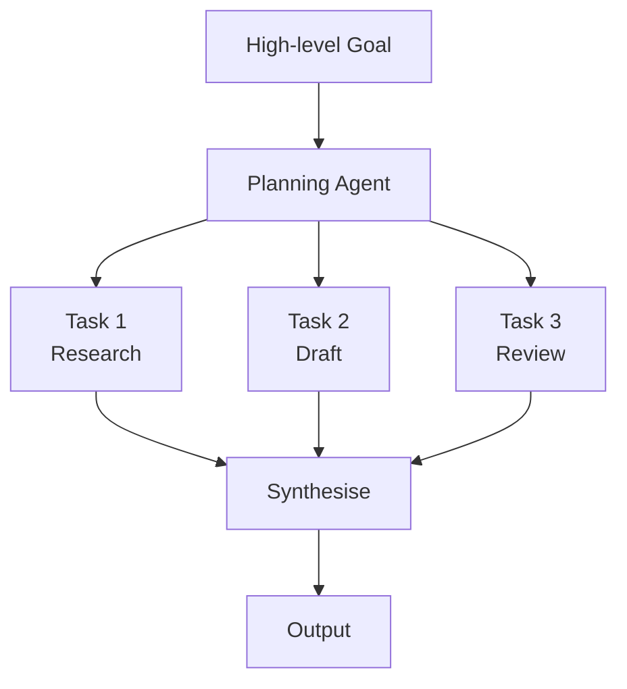

# Planning Agents

Planning agents transform high-level goals into executable task sequences. They are the "project manager" layer in multi-agent systems.

## Core Capabilities

- **Goal decomposition** — breaking a high-level objective into concrete, achievable sub-tasks
- **Dependency resolution** — identifying which tasks must complete before others can begin
- **Resource allocation** — assigning tasks to the most appropriate tool or sub-agent
- **Replanning** — adapting when a step fails or produces unexpected results

## Architecture Pattern

## Planning Approaches

| Approach | Description | Best for |
|----------|-------------|---------|
| **Chain-of-Thought (CoT)** | Agent generates one task at a time in response to context | Dynamic, unpredictable environments |
| **Tree-of-Thought (ToT)** | Agent explores multiple plan branches simultaneously | Complex problems requiring exploration |
| **ReAct** | Interleaves reasoning (thought) and action in alternating steps | Tool-using agents with feedback loops |
| **Handcrafted sequences** | Designer explicitly defines the task chain | Repeatable, well-understood workflows |

## 2025 Context

Reasoning models (o3, DeepSeek R1, Gemini Deep Think) substantially improved planning quality. Their ability to "think through" a complex goal before committing to a task sequence reduces mid-plan failures.

Framework support for planning has matured: LangGraph's explicit state machine model and Google ADK's hierarchical delegation both directly support planning architectures.

!!! info "Source"
    [LangGraph planning patterns](https://langchain-ai.github.io/langgraph/); [Google ADK architecture](https://google.github.io/adk-docs/)
