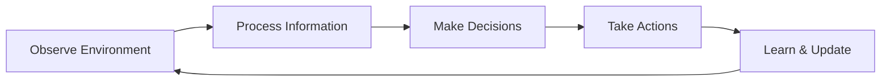

# How do Agents Work?

The Agent Loop:

```mermaid
graph LR;
    A[Observe Environment] --> B[Process Information];
    B --> C[Make Decisions];
    C --> D[Take Actions];
    D --> E[Learn & Update];
    E --> A;
```

