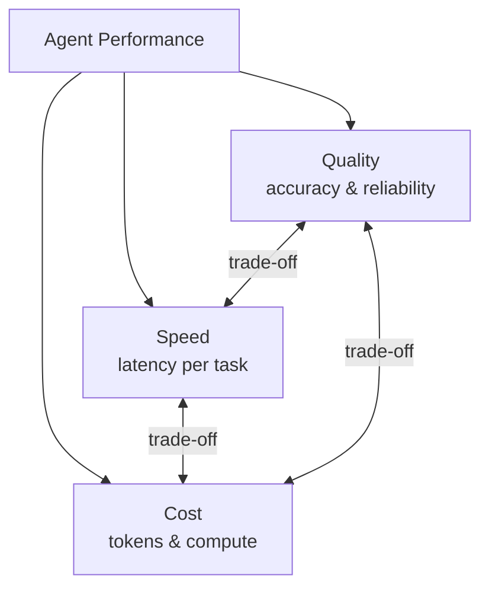

# Optimizing Agents

Once an agent is working correctly, the next challenge is making it reliable and cost-efficient at scale. This page covers the primary levers.

## The Agent Optimization Triad

Every optimization decision moves along these three axes. There is rarely a free lunch.

## Model Tier Routing

The single highest-impact optimization is **routing queries to the right model tier**:

| Task complexity | Appropriate tier | Example |
|-----------------|-----------------|---------|
| Simple, high-volume | Fast/cheap (Haiku, Flash-Lite, GPT-5-mini) | FAQ answers, format conversion |
| Standard reasoning | Mid-tier (Sonnet 4.6, Gemini 2.5 Flash) | Email drafting, summarisation |
| Complex multi-step | Reasoning model (o3, DeepSeek R1) | Code review, legal analysis |

## Prompt Caching

Frontier APIs (Anthropic, OpenAI, Google) support **prompt caching** for system prompts and repeated context. For agents with long system prompts or shared tool schemas, caching can reduce input token costs by 80–90%.

## Parallelisation

Multi-agent frameworks like LangGraph and the OpenAI Agents SDK support running independent sub-tasks in parallel. Identify the critical path in your agent workflow and parallelise everything off it.

## Evaluation-Driven Optimization

You cannot optimize what you do not measure:

1. Define success metrics for each agent task type (accuracy, latency, cost per task)
2. Build an evaluation dataset from production traces
3. Run A/B tests when changing prompts, models, or tool configurations
4. Monitor for quality regressions when deploying changes

!!! tip "OpenAI Agents SDK tracing"
    The OpenAI Agents SDK includes built-in end-to-end tracing across agent chains. LangSmith provides equivalent tracing for LangGraph. Use these before optimising — you cannot identify bottlenecks without visibility.
