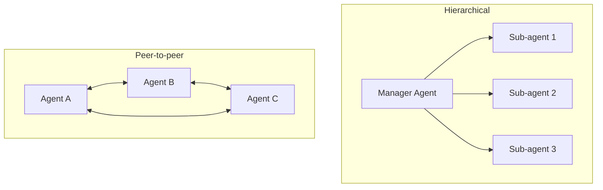

# Agent Teams (Multi-Agent Systems)

Single agents have context limits and capability ceilings. Agent teams — multiple agents collaborating under a coordination layer — can tackle tasks that exceed what any single agent could handle.

## Why Agent Teams?

- **Parallelism** — independent sub-tasks run simultaneously, reducing total wall-clock time
- **Specialisation** — each agent is optimised for a specific role (researcher, writer, reviewer, coder)
- **Scale** — teams can tackle tasks too long for a single context window by dividing work
- **Redundancy** — critical outputs can be reviewed by a second agent before acceptance

## Coordination Patterns

| Pattern | Framework | Best for |
|---------|-----------|---------|
| **Hierarchical** | Google ADK, LangGraph | Clear task decomposition with a known structure |
| **Role-based** | CrewAI | Collaborative workflows with defined agent personas |
| **Handoff** | OpenAI Agents SDK | Sequential pipelines with specialised agents |
| **Conversational** | AutoGen (Microsoft) | Exploratory problems with dynamic discussion |

## 2025 Production Landscape

By 2025, the six major production frameworks each embody one of these coordination philosophies. See the [agents index](../../index.md) for the full framework comparison table.

The **A2A protocol** (Google, April 2025) enables agent teams to span organisational and vendor boundaries — an agent built on LangGraph can delegate to an agent built on Google ADK, mediated by the A2A standard.

!!! info "Source"
    [Google A2A Protocol](https://cloud.google.com/blog/products/ai-machine-learning/agent2agent-protocol-launch), April 2025

## Key Considerations

- **Coordination overhead** — every inter-agent message adds latency and token cost; design for minimal necessary communication
- **Shared state** — teams need a reliable way to share intermediate results; use explicit state management (LangGraph's checkpointing, or a shared database)
- **Failure propagation** — if one agent fails, the team needs a recovery strategy; don't assume sub-agents always succeed
