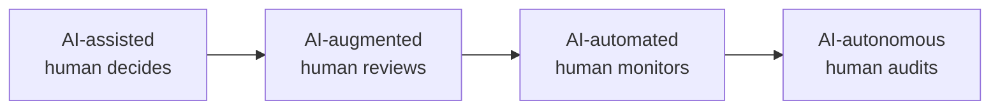

# Autonomous Companies and AI Workforces

The concept of "autonomous companies" — organisations where AI agents handle significant portions of operational work continuously — moved from speculative to partially real between 2024 and 2026.

## The Spectrum of Autonomy

Most organisations in 2025–2026 are in the **AI-augmented** to **AI-automated** range. Full autonomy (AI making consequential decisions without review) remains limited to low-risk, high-volume workflows.

## What's Actually Deployed (2026)

- **Customer support agents** — handling tier-1 queries, escalating complex cases to humans
- **Coding agents** — writing, reviewing, and deploying code with human sign-off on merges
- **Research and intelligence agents** — continuous monitoring of markets, competitors, and regulatory changes
- **Content operations agents** — drafting, scheduling, and publishing with editorial oversight
- **Financial operations agents** — invoice processing, reconciliation, and anomaly flagging

## The Anthropic Economic Index (2025)

Anthropic launched the Economic Index to empirically track AI's labour market impact. Key findings:

- AI use concentrated in specific countries and occupations; not yet broad-based
- More complex tasks were accelerated most — 12× speed-up for college-degree-level prompts
- Limited evidence of employment replacement to date
- Projected productivity growth: 1.0–1.2 percentage points annually

!!! info "Source"
    [Anthropic Economic Index](https://www.anthropic.com/economic-index), published 2025

## Key Design Principles for Agentic Organisations

1. **Start with audit trails** — every autonomous action should be logged with sufficient context to reconstruct the decision
2. **Escalation paths must exist** — every autonomous workflow needs a clear path to human review when confidence is low
3. **Reversibility first** — design agents to prefer reversible actions; flag irreversible ones for approval
4. **Gradual capability expansion** — start with read-only agents, expand write permissions incrementally as trust is established

!!! warning "The autonomy risk curve"
    As agent autonomy increases, so does the consequence of failure. A research agent hallucinating a fact is annoying. An autonomous agent sending 10,000 wrong emails, or executing an unintended database deletion, is a business crisis. Match autonomy level to consequence tolerance, not to technical capability.
