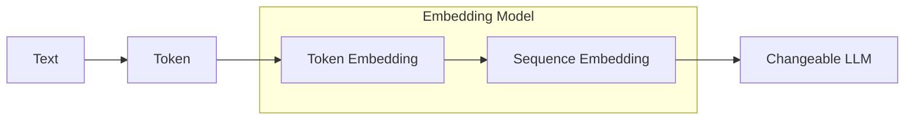

Embeddings compress a string of tokens into a high-dimensional representation. They are preferably contextually aware, meaning different strings of tokens will have a different embedding.

Embeddings are can be used used to generate the next-expected token, evaluating text similarities, and with the similarity identification a way to do search is necessary in [RAG](../agents/rag.md)

Embeddings are generally depend on the tokenization methods. 



In order to separate the representation, allowing greater freedom in evaluating downstream architectures and permitting enduring lookup ability with [RAG](../agents/rag.md), these models can be part of a larger and more complex models for sequence generation.

??? important "[Text and Code Embeddings by Contrastrive Pre-Training](https://cdn.openai.com/papers/Text_and_Code_Embeddings_by_Contrastive_Pre_Training.pdf)"
    The authors demonstrate using contrastive pre-training can yield high-quality vector representations of text and code. 

??? abstract "[Sentence-BERT: Sentence Embeddings using Siamese BERT-Networks](https://github.com/UKPLab/sentence-transformers/tree/master)"
    [Paper](https://arxiv.org/abs/1908.10084)


??? abstract "[Matryoshka Representation Learning](https://github.com/RAIVNLab/MRL)" matryoshka-representation-learning
    The authors demonstrate MLR, which can encode information at different granularities allowing a single embedding to be be used for different downstream tasks.
    


??? abstract "[ELE Embeddings](https://github.com/bio-ontology-research-group/el-embeddings?tab=readme-ov-file)"
    ELE Provides spherical embeddings based on descriptional logic. This allows for representation which works nicely with knoelged-graphs and ontologies.  
    
    


    [Paper](https://arxiv.org/abs/1902.10499)

??? abstract "[Fastembed with qdrant](https://github.com/qdrant/fastembed)"
    Light & Fast embedding model
    ```
    Quantized model weights
    ONNX Runtime, no PyTorch dependency
    CPU-first design
    Data-parallelism for encoding of large datasets
    Accuracy/Recall

    Better than OpenAI Ada-002
    Default is Flag Embedding, which is top of the MTEB leaderboard
    List of supported models - including multilingual models
    ```


### Evaluating

??? abstract "[Massive Text Embedding Benchmark](https://github.com/embeddings-benchmark/mteb)"
    [Paper](https://arxiv.org/pdf/2210.07316.pdf)

### Blogs and posts
- [Openai GPT-3 text embeddings](https://medium.com/@nils_reimers/openai-gpt-3-text-embeddings-really-a-new-state-of-the-art-in-dense-text-embeddings-6571fe3ec9d9)
