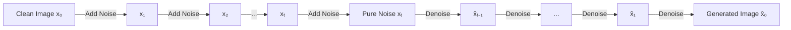

# Diffusion Models

Diffusion models have emerged as the dominant paradigm for high-quality image, video, and audio generation, powering systems like DALL-E 3, Stable Diffusion, Midjourney, and Sora.

## Core Principle

Diffusion models work by:
1. **Forward process**: Gradually add noise to data until it becomes pure noise
2. **Reverse process**: Learn to denoise step-by-step, recovering the original data



## Mathematical Foundation

### Forward Process (Noising)
$$q(x_t | x_{t-1}) = \mathcal{N}(x_t; \sqrt{1-\beta_t}x_{t-1}, \beta_t\mathbf{I})$$

### Reverse Process (Denoising)
$$p_\theta(x_{t-1} | x_t) = \mathcal{N}(x_{t-1}; \mu_\theta(x_t, t), \Sigma_\theta(x_t, t))$$

### Training Objective
$$L = \mathbb{E}_{t, x_0, \epsilon}\left[\|\epsilon - \epsilon_\theta(x_t, t)\|^2\right]$$

The model learns to predict the noise that was added, rather than predicting the clean image directly.

## Key Variants

### DDPM (Denoising Diffusion Probabilistic Models)
The foundational work (Ho et al., 2020):
- Gaussian noise schedule
- Simple MSE training objective
- High quality but slow (1000 steps)

### DDIM (Denoising Diffusion Implicit Models)
Faster sampling (Song et al., 2020):
- Deterministic sampling possible
- 10-50 steps sufficient
- Same trained model, different sampler

### Score-Based Models
Equivalent formulation via score matching:
$$\nabla_x \log p(x)$$
- Score SDE framework unifies approaches
- Enables continuous-time formulation

### Latent Diffusion Models (LDM)
The architecture behind Stable Diffusion:
```
Image → Encoder → Latent → Diffusion → Latent → Decoder → Image
        (VAE)              (U-Net)              (VAE)
```
Benefits:
- Operates in compressed latent space
- Much faster than pixel-space diffusion
- Enables high-resolution generation

## Guidance Techniques

### Classifier Guidance
Use a classifier to steer generation:
$$\tilde{\epsilon}_\theta(x_t, t, y) = \epsilon_\theta(x_t, t) - s \cdot \nabla_{x_t} \log p_\phi(y|x_t)$$

### Classifier-Free Guidance (CFG)
No separate classifier needed—the dominant approach:
$$\tilde{\epsilon}_\theta(x_t, t, c) = \epsilon_\theta(x_t, t, \emptyset) + s \cdot (\epsilon_\theta(x_t, t, c) - \epsilon_\theta(x_t, t, \emptyset))$$

Higher guidance scale → stronger adherence to prompt, lower diversity.

## Architecture: U-Net with Attention

```python
class DiffusionUNet(nn.Module):
    def __init__(self, channels, time_dim, context_dim):
        super().__init__()
        # Time embedding
        self.time_mlp = nn.Sequential(
            SinusoidalPosEmb(time_dim),
            nn.Linear(time_dim, time_dim * 4),
            nn.GELU(),
            nn.Linear(time_dim * 4, time_dim)
        )
        
        # Encoder (downsampling)
        self.down1 = ResBlock(channels, 64, time_dim)
        self.down2 = ResBlock(64, 128, time_dim)
        self.attn1 = CrossAttention(128, context_dim)  # Text conditioning
        self.down3 = ResBlock(128, 256, time_dim)
        
        # Middle
        self.mid = ResBlock(256, 256, time_dim)
        self.mid_attn = CrossAttention(256, context_dim)
        
        # Decoder (upsampling with skip connections)
        self.up1 = ResBlock(512, 128, time_dim)  # 256 + 256 skip
        self.up2 = ResBlock(256, 64, time_dim)   # 128 + 128 skip
        self.up3 = ResBlock(128, channels, time_dim)
        
    def forward(self, x, t, context):
        t_emb = self.time_mlp(t)
        
        # Encoder
        h1 = self.down1(x, t_emb)
        h2 = self.down2(h1, t_emb)
        h2 = self.attn1(h2, context)
        h3 = self.down3(h2, t_emb)
        
        # Middle
        h = self.mid(h3, t_emb)
        h = self.mid_attn(h, context)
        
        # Decoder with skip connections
        h = self.up1(torch.cat([h, h3], dim=1), t_emb)
        h = self.up2(torch.cat([h, h2], dim=1), t_emb)
        h = self.up3(torch.cat([h, h1], dim=1), t_emb)
        
        return h
```

## ControlNet & Adapters

Fine-grained control over generation:

| Method | Control Type | Training Required |
|--------|--------------|-------------------|
| ControlNet | Pose, depth, edges | Yes (adapter) |
| IP-Adapter | Image prompt | Yes (adapter) |
| T2I-Adapter | Multiple conditions | Yes (adapter) |
| InstructPix2Pix | Text instructions | Yes (full) |

## Modern Systems

### Stable Diffusion (Stability AI)
- Open source
- Latent diffusion architecture
- CLIP text encoder
- Extensive community ecosystem

### DALL-E 3 (OpenAI)
- Proprietary
- Improved text understanding
- Built-in safety filters
- ChatGPT integration

### Midjourney
- Proprietary
- Discord-based interface
- Strong aesthetic quality
- Community-driven prompting

### Sora (OpenAI)
- Video generation
- DiT (Diffusion Transformer) architecture
- Impressive temporal consistency

See [World Models and Video Generation](./world_models.md) for the full landscape: Sora 2, Veo, Kling, and the distinct, interactive category (Genie) that generates a navigable world rather than a fixed clip.

## Sampling Algorithms

| Sampler | Steps | Quality | Notes |
|---------|-------|---------|-------|
| DDPM | 1000 | High | Original, slow |
| DDIM | 50 | High | Deterministic option |
| Euler | 20-30 | Good | Simple, fast |
| DPM++ 2M | 20-30 | High | Popular choice |
| UniPC | 10-20 | Good | Very fast |

## Training Tips

1. **Noise schedule**: Cosine often better than linear
2. **EMA model**: Use exponential moving average for stable generation
3. **Min-SNR weighting**: Better loss weighting across timesteps
4. **v-prediction**: Alternative parameterization, better at high resolutions

## References

- [DDPM (Ho et al., 2020)](https://arxiv.org/abs/2006.11239)
- [DDIM (Song et al., 2020)](https://arxiv.org/abs/2010.02502)
- [Latent Diffusion / Stable Diffusion](https://arxiv.org/abs/2112.10752)
- [Classifier-Free Guidance](https://arxiv.org/abs/2207.12598)
- [ControlNet](https://arxiv.org/abs/2302.05543)
- [DiT (Diffusion Transformers)](https://arxiv.org/abs/2212.09748)

---

*Diffusion models prove that the path from noise to signal can be learned—and that patience (many denoising steps) produces remarkable results.*
