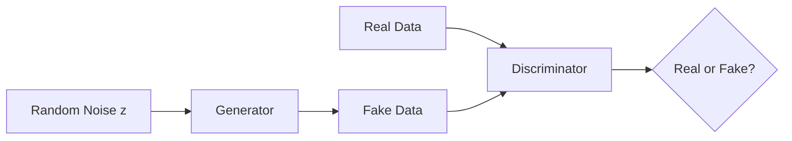

# Generative Adversarial Networks (GANs)

GANs revolutionized generative AI by introducing an adversarial training paradigm where two neural networks compete against each other, leading to remarkably realistic outputs.

## Core Concept

A GAN consists of two networks:

1. **Generator (G)**: Creates fake samples from random noise
2. **Discriminator (D)**: Distinguishes real samples from fake ones



The training is a minimax game:

$$\min_G \max_D V(D, G) = \mathbb{E}_{x \sim p_{data}}[\log D(x)] + \mathbb{E}_{z \sim p_z}[\log(1 - D(G(z)))]$$

## GAN Variants

### DCGAN (Deep Convolutional GAN)
The first stable architecture using convolutional layers:
- Batch normalization in both networks
- No fully connected layers
- Strided convolutions instead of pooling

### StyleGAN / StyleGAN2 / StyleGAN3
State-of-the-art for image generation:
- Style-based generator architecture
- Progressive growing (StyleGAN)
- Improved normalization (StyleGAN2)
- Alias-free generation (StyleGAN3)

### Conditional GANs (cGAN)
Control the generation with labels:
```python
# Generator takes noise AND condition
fake_image = generator(noise, condition="cat")
```

### Pix2Pix & CycleGAN
Image-to-image translation:
- **Pix2Pix**: Paired training data required
- **CycleGAN**: Unpaired translation via cycle consistency

### BigGAN
Scaling GANs to ImageNet:
- Class-conditional generation
- Larger batch sizes
- Truncation trick for quality/diversity trade-off

## Training Challenges

### Mode Collapse
Generator produces limited variety:
```
Solution: Minibatch discrimination, unrolled GANs
```

### Training Instability
Discriminator becomes too strong:
```
Solutions: 
- Spectral normalization
- Gradient penalty (WGAN-GP)
- Two-timescale updates
```

### Vanishing Gradients
When D is perfect, G gets no useful signal:
```
Solution: Wasserstein loss (WGAN)
```

## Modern Applications

| Application | GAN Type | Example |
|-------------|----------|---------|
| Face generation | StyleGAN3 | This Person Does Not Exist |
| Image editing | GAN inversion | Face attribute editing |
| Super-resolution | ESRGAN | Image upscaling |
| Art generation | StyleGAN + CLIP | Artbreeder |
| Video synthesis | StyleGAN-V | Talking head generation |

## GANs vs Diffusion Models

While diffusion models now dominate image generation:

| Aspect | GANs | Diffusion |
|--------|------|-----------|
| Speed | Fast (single pass) | Slow (many steps) |
| Quality | High | Higher |
| Diversity | Mode collapse risk | Better coverage |
| Training | Unstable | Stable |
| Control | Harder | Easier |

GANs remain relevant for:
- Real-time applications
- Video generation
- Adversarial training
- Discriminator-based evaluation (FID)

## Code Example

```python
import torch
import torch.nn as nn

class Generator(nn.Module):
    def __init__(self, latent_dim=100, img_channels=3):
        super().__init__()
        self.model = nn.Sequential(
            nn.ConvTranspose2d(latent_dim, 512, 4, 1, 0),
            nn.BatchNorm2d(512),
            nn.ReLU(True),
            nn.ConvTranspose2d(512, 256, 4, 2, 1),
            nn.BatchNorm2d(256),
            nn.ReLU(True),
            nn.ConvTranspose2d(256, 128, 4, 2, 1),
            nn.BatchNorm2d(128),
            nn.ReLU(True),
            nn.ConvTranspose2d(128, img_channels, 4, 2, 1),
            nn.Tanh()
        )
    
    def forward(self, z):
        return self.model(z.view(z.size(0), -1, 1, 1))

class Discriminator(nn.Module):
    def __init__(self, img_channels=3):
        super().__init__()
        self.model = nn.Sequential(
            nn.Conv2d(img_channels, 128, 4, 2, 1),
            nn.LeakyReLU(0.2, True),
            nn.Conv2d(128, 256, 4, 2, 1),
            nn.BatchNorm2d(256),
            nn.LeakyReLU(0.2, True),
            nn.Conv2d(256, 512, 4, 2, 1),
            nn.BatchNorm2d(512),
            nn.LeakyReLU(0.2, True),
            nn.Conv2d(512, 1, 4, 1, 0),
            nn.Sigmoid()
        )
    
    def forward(self, img):
        return self.model(img).view(-1, 1)
```

## References

- [Original GAN Paper (Goodfellow et al., 2014)](https://arxiv.org/abs/1406.2661)
- [DCGAN (Radford et al., 2015)](https://arxiv.org/abs/1511.06434)
- [StyleGAN3 (Karras et al., 2021)](https://arxiv.org/abs/2106.12423)
- [GAN Tutorial (NIPS 2016)](https://arxiv.org/abs/1701.00160)

---

*GANs taught us that competition can drive creation—a principle that extends far beyond image generation.*
