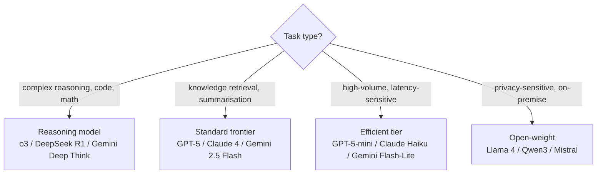

# Optimizing AI Models

> **Content updated May 2026.** This page provides orientation across the model optimization landscape. Detailed coverage of each technique lives in [methods.md](./methods.md) and [evaluating_and_comparing.md](./evaluating_and_comparing.md).

Model optimization in GenAI addresses two distinct but related goals:

1. **Quality optimization** — making outputs more accurate, reliable, and appropriate for your use case
2. **Efficiency optimization** — reducing inference cost, latency, and memory footprint without sacrificing acceptable quality

## Key Optimization Levers

| Lever | What it does | When to use |
|-------|-------------|-------------|
| **Quantization** (INT8, INT4, FP8) | Reduces numeric precision of weights | Production deployment; can shrink model 75%+ with minimal accuracy loss |
| **Knowledge distillation** | Trains a smaller student model to mimic a larger teacher | When you need a custom small model with specific behaviour |
| **Pruning** | Removes weights that have low impact on outputs | Reducing model size for edge/on-device deployment |
| **LoRA / QLoRA** | Low-rank adapter fine-tuning | Domain adaptation without full retraining |
| **Mixture of Experts (MoE)** | Activates only a subset of parameters per forward pass | Architecture-level efficiency at training time |
| **Test-time compute scaling** | Spends more inference compute for harder queries | When accuracy matters more than speed/cost on complex tasks |

## 2025 Context: Inference Cost Collapse

API pricing for frontier-class intelligence fell dramatically through 2025. Open-weight models via SGLang or vLLM on commodity hardware now deliver GPT-4-class output at costs 10–100× lower than 2023 API pricing. Key drivers:

- **Quantization** (INT8/FP8) became standard practice — shipping in vLLM, SGLang, and llama.cpp
- **MoE architectures** — all frontier models now use sparse activation (DeepSeek V3: 671B total / 37B active; Qwen3: 235B total / 22B active), making inference far cheaper than parameter counts suggest
- **SGLang** achieved 16,215 tok/s on H100s versus vLLM's 12,553 tok/s — a 29% throughput advantage at scale

!!! info "Source"
    [SGLang performance benchmarks](https://github.com/sgl-project/sglang); [vLLM V1 refactor](https://blog.vllm.ai/2024/12/10/vllm-v1.html)

## Choosing Between Model Tiers

With the 2025 inference cost landscape, the decision framework has changed:

See [methods.md](./methods.md) for detailed implementation guidance on each optimization technique.
