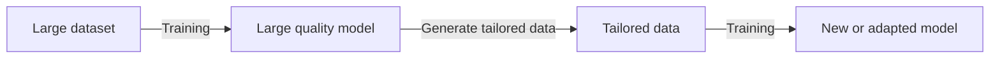

TODO: THorough research and add /change with optimization/index.md

Fine-tuning adapt's  foundation model to improve its domain performance by using training with high-quality data. The adapted model may be architecturally equivalent, or a variation of the original model. The [data](#data-for-fine-tuning) that is used to update the model may be natural or [synthetically-created](#using-simulated-data) and it is often domain-specific or intentionally constructed.

Because of the computational requirements needed to train the original foundation models, fine-tuning is preferably done in way that does not update the entire model.
One manner of doing this is through the use of [adapter layers](#adaptermodel-changes-for-fine-tuning).


???+ tip "[Why you probably don't need to fine tune an LLM](https://www.tidepool.so/2023/08/17/why-you-probably-dont-need-to-fine-tune-an-llm)"

    Summary (with links internal to this project):
    **Why you shouldn't**

    1. Few Shot examples and better [prompts](../../prompting/index.md) (and [chains](../../agents/cognitive_architecture.md) helps a great deal.
    2. [Retrieval Augmented Generation](../../agents/rag.md) will get you all the way there.


    **Why you should**
    
    1. High accuracy requirements
    2. Don't care about speed
    3. Methods above don't work


## Data for fine-tuning

Higher-quality data that may be proprietary or otherwise not-included in the training data for foundation-models can be used to improve a model's performance. Fine-tuning is generally done in a supervised fashion, where the specific responses desired for a given model input are trained on the output. Unsupervised fine-tuning is [also possible](https://arxiv.org/pdf/2110.09510.pdf) though not as commonly described.

### Using Simulated Data
Utilizing synthetic or simulated data is an effective method for training Large Language Models (LLMs). The process can be visualized in the following sequence:



In this sequence, a large and vague model is initially trained. This model then generates highly specific data. This specific data is subsequently used to train a smaller, more specific model. The end result is a high-quality, fine-tuned model.

## Model changes for fine-tuning

The simplest manner of fine-tuning a model involves updating all of the original weights based on the fine-tuning dataset. This is less preferred because of the additional computational requirements. To minimize the compute, some number of layers can be 'frozen'. While helpful, the computational savings given the performance gains may not be considerable. (TODO FIND CITATIONS FOR THIS)

### Adapter layers

If all of the layers are frozen, it is possible to adapt the model using relatively simple models that rescale or adapt outputs.
!!! abstract "[AdapterHub: A Framework for Adapting Transformers](https://arxiv.org/pdf/2007.07779.pdf) [Website](https://adapterhub.ml/)"

### Low Rank Adaption (LoRA)

Instead of interleaving a trainable layer in between various layers, [Low-Rank Adaption](https://arxiv.org/pdf/2106.09685.pdf) (LoRA) uses the notion that changes to outputs of a given layer $W$ will likely be small $\Delta W$. Instead of computing all those weights a low-rank vector matrix decomposition where $\Delta W = A B$ for two LoRA matrices $A$ and $B$. With a common inner-dimension variable _rank_, $r$, is the matrix parameter counts can be appropriately minimized to have a small fraction of the original model $W$.


### Practical Tips
These are tips mostly from [Practical Tips for Finetuning LLMS](https://magazine.sebastianraschka.com/p/practical-tips-for-finetuning-llms).

#### Data Quality and Size

It is essential that fine-tuning data is of high-quality/aligned with the end use-case of the model. Depending on the modality, anywhere between 5-10 (generally for Image-based models), and many thousands of examples (text-language) may be considered for LoRA. In terms of the number of passes over the data, _be careful_ if going beyond one-epoch, lest overfitting occur.

#### Choice of optimizers

When Adam and SGD are common optimizers. There are indications that with larger $r$, the memory requirements become >20% larger.

#### Where do you use LoRA?

Enabling the LoRA for all layers appears may be valuable, though it hasn't been thoroughly explored.

#### Choice of parameters

The [original paper](https://arxiv.org/pdf/2106.09685.pdf) has both the rank and a scaling factor $\alpha$.

```markdown
scaling = alpha / r
weight += (lora_B @ lora_A) * scaling
```
Both of these will need to be explored, but it may be beneficial to set $\alpha \approx r$

Selecting the rank to be _too large_ may result in overfitting, but too small may not provide enough additional model capacity to capture the characteristics of the data.

#### Combining LoRA weights
It appears that it is possible to add multiple LoRA weights, either beforehand as such:
$$
weight += (L_B \times L_A) * scale
$$
or

$$
weight += (L1_B \times L1_A) * scale1 \\
weight += (L2_B \times L2_A) * scale2 \\
\cdots
$$

## Results

Fine-tuning can lead to significant improvements in both instruction following and helpfulness of models. This is demonstrated in the research paper [An Emulator for Fine-Tuning Large Language Models using Small Language Models](https://arxiv.org/pdf/2310.12962.pdf). The paper also suggests that combining fine-tuning with speculative decoding can speed up larger models by a factor of 2.5.

??? note "Research Paper: An Emulator for Fine-Tuning Large Language Models using Small Language Models"
    
    
    

There are also several tools available that can assist in the fine-tuning process.

??? abstract " [Open Pipe]([Open Pipe](https://github.com/OpenPipe/OpenPipe)) allows you to use powerful but expensive LLMs to fine-tune smaller and cheaper models"
    You can evaluate the model and prompt combinations in the playground, query your past requests, and export optimized training data.
    


- [Full Parameter Fine-Tuning for Large Language Models with Limited Resources.](https://github.com/openlmlab/lomo) Introduces LOMO: LOw-Memory Optimization to fuse


Another tool, [Slow Llama](https://github.com/okuvshynov/slowllama), is particularly useful for fine-tuning on M1/M2 Macs.

### Fine Tuning

Using examples to fine-tune a model can reduce the number of tokens needed to achieve a sufficiently reasonable response. Can be expensive to retrain though.


??? tip "[Symbol Tuning Improves in-context learning in Language Models](https://arxiv.org/pdf/2305.08298.pdf)"
    

## Useful Libraries
!!! abstract " [Slow Llama]([Slow Llama](https://github.com/okuvshynov/slowllama)) for finetuning on a M1/M2 mac"


!!! abstract "[Finetune Mistral, Gemma, Llama 2-5x faster with 70% less memory!](https://github.com/unslothai/unsloth)

!!! abstract" [Adapters for Hugging Face](https://adapterhub.ml/): This is a tool for finetuning Hugging Face models."
