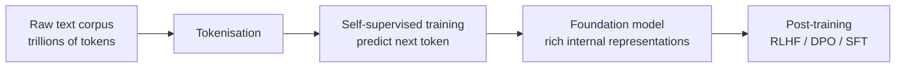

# Pre-Training

> **Content updated May 2026.** This page covers pre-training as the first phase of building modern foundation models, including self-supervised objectives, data requirements, and the relationship between pre-training scale and capability.

## What is Pre-Training?

Pre-training is the initial, large-scale training phase where a foundation model learns general representations of language, code, and knowledge by predicting patterns in a massive corpus of text (and increasingly, multimodal data).

The dominant pre-training objective for modern LLMs is **next-token prediction** (also called causal language modelling): given a sequence of tokens, predict the next one. This simple self-supervised objective, applied at scale, produces models with surprisingly broad capabilities.

## Why Pre-Training Scale Matters

The [scaling laws](https://arxiv.org/abs/2001.08361) literature established that model performance on downstream tasks improves predictably with:

1. **Model size** (number of parameters)
2. **Training data volume** (number of tokens)
3. **Compute budget** (FLOP-hours)

The Chinchilla scaling laws (Hoffmann et al., 2022) further showed that most pre-2022 models were under-trained relative to their parameter count: a 70B model trained on 1.4T tokens outperforms a 280B model trained on the same compute budget.

## 2025 Context: Pre-Training vs Test-Time Compute

A key development of 2025 is that **test-time compute scaling** has emerged as a complementary (not replacement) scaling axis. The research community now recognises two distinct scaling regimes:

| Scaling regime | When it helps | Examples |
|----------------|---------------|----------|
| **Pre-training scaling** | Broader knowledge, better pattern recognition | GPT-4.5 (emphasised pre-training scale) |
| **Test-time compute scaling** | Deeper reasoning, complex multi-step problems | o3, DeepSeek R1, Gemini Deep Think |

Both tracks remain active. Teams should understand which regime is relevant to their use case. See [reasoning models](./reasoning_models.md) for test-time compute coverage.

## Synthetic Data in Pre-Training

By 2025, **synthetic data generation** became a first-class pre-training technique. Microsoft's Phi-4 (14B parameters) outperforms 70B+ models trained on raw internet data on reasoning benchmarks — entirely because of high-quality synthetic training data.

This changes the data moat dynamics: organisations that can generate high-quality synthetic training data can fine-tune models that outperform models trained on vastly larger natural datasets.

!!! info "Source"
    [Phi-4 technical report](https://arxiv.org/abs/2412.08905); [DeepSeek-V3 technical report](https://arxiv.org/abs/2412.19437)

## Key Resources

??? tip "[Scaling Laws for Neural Language Models (Kaplan et al. 2020)](https://arxiv.org/abs/2001.08361)"
    The foundational scaling laws paper establishing the relationship between parameters, data, and compute.

??? tip "[Training Compute-Optimal LLMs (Hoffmann et al. 2022 — Chinchilla)](https://arxiv.org/abs/2203.15556)"
    Revised scaling laws showing that most large models were under-trained; introduced the tokens-per-parameter optimum.

??? note "[A Cookbook of Self-Supervised Learning](https://arxiv.org/pdf/2304.12210.pdf)"
    Comprehensive overview of self-supervised pre-training objectives beyond next-token prediction.
