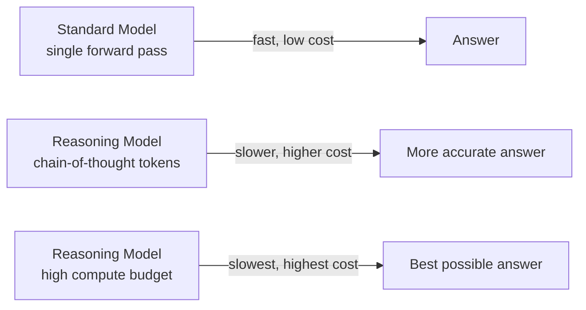
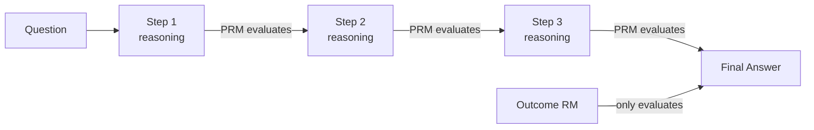

# Reasoning Models and Test-Time Compute

> **Content updated May 2026.** This page covers the reasoning model paradigm that emerged through 2025, including test-time compute scaling, the o3/o4-mini generation, DeepSeek R1, Process Reward Models, and practical guidance for choosing when to use reasoning models.

## The New Scaling Paradigm

For most of AI's history, capability scaling meant training bigger models on more data — "pre-training scaling." By late 2024, researchers had identified a complementary approach: **test-time compute scaling**, where a model reasons more carefully at inference time, trading compute for accuracy on a per-query basis.

This is a qualitative shift. Instead of asking "which model is best?", the question becomes "how much inference compute am I willing to spend on this query?"

!!! tip "When to use a reasoning model"
    - **Use reasoning models** for: complex multi-step math, code generation, logical deduction, tasks where errors are costly
    - **Use standard models** for: fast creative text, summarization, retrieval, tasks where speed and cost dominate

!!! info "Source"
    [Inference Scaling Laws — ongoing research formalised 2025](https://arxiv.org/abs/2501.19393); [Sebastian Raschka's guide to reasoning LLMs](https://sebastianraschka.com/blog/2025/understanding-reasoning-llms.html)

---

## Key Reasoning Models (2025)

### OpenAI o3 and o4-mini (April 2025)

OpenAI released o3 and o4-mini on April 16, 2025. These are the most significant reasoning model releases of the period:

- **o3** scored 88% on ARC-AGI (versus o1's 32%) — a benchmark designed to resist pure memorisation
- **o4-mini** delivers comparable reasoning performance at significantly lower cost
- Both models are the **first in the o-series to support multimodal reasoning** — they can "think with images," analysing diagrams, whiteboard sketches, and charts within the chain-of-thought phase

!!! important "Multimodal reasoning is qualitatively new"
    Before o3/o4-mini, reasoning was purely linguistic. With these models, the chain-of-thought can incorporate visual analysis. This reshapes assumptions about which tasks require reasoning models — engineering diagrams, medical imaging, and data visualisations all become candidates.

!!! info "Source"
    [OpenAI o3 and o4-mini release](https://openai.com/blog/openai-o3-and-o4-mini), April 16, 2025

### DeepSeek R1 (January 2025)

DeepSeek released R1 on January 20, 2025 under the MIT License. It was a watershed moment for open-source AI:

- 671B parameter Mixture-of-Experts model (37B active parameters per forward pass)
- Directly competitive with OpenAI o1 on math and coding benchmarks
- **Trained for under $6 million** — versus $100M+ for comparable closed models
- MIT License: fully open, commercially usable

**Why it matters for reasoning:** DeepSeek's technical report (section 8.2 below) revealed that strong reasoning can emerge from reinforcement learning alone, without supervised chain-of-thought data as scaffolding. The R1-Zero variant, trained with pure RL, developed reasoning behaviours spontaneously.

!!! info "Source"
    [DeepSeek-R1 technical report](https://arxiv.org/abs/2501.12948), January 20, 2025

### Chain-of-Thought at Inference vs During Training

A common confusion: there are two distinct uses of chain-of-thought (CoT).

| Approach | When it happens | What it does |
|----------|-----------------|--------------|
| **CoT prompting** | Inference | You instruct the model to reason step-by-step in the prompt; no training required |
| **CoT training / RL reasoning** | Training | The model learns reasoning patterns through reinforcement; results in a fundamentally different model (o3, R1, etc.) |

Reasoning models like o3 and DeepSeek R1 use the second approach — reasoning is baked into the model via training, not prompted at inference. This produces significantly more reliable and deeper reasoning than prompting a standard model to "think step by step."

---

## Process Reward Models (PRMs)

Standard training rewards models for getting the **right final answer**. Process Reward Models (PRMs) reward models for getting **each intermediate reasoning step correct**.

By 2025, step-level supervision using datasets like PRM800K (800,000 step-level labels) became mainstream. Benefits:

- Reduces "correct conclusion, wrong reasoning" hallucinations
- Improves interpretability — you can audit each reasoning step
- Particularly valuable for agentic deployments where intermediate decisions have real-world consequences

!!! info "Source"
    [PRM800K dataset and process supervision research](https://openai.com/research/improving-mathematical-reasoning-with-process-supervision); formalised in NeurIPS 2025 best papers

---

## Test-Time Compute Scaling Laws

Research throughout 2025 established that test-time compute follows its own scaling laws, distinct from pre-training:

1. Models can trade inference FLOPs for accuracy on most task types
2. This approach is **not yet effective for knowledge-intensive tasks** requiring high factual accuracy — you cannot reason your way to facts you don't have
3. There is a compute budget vs. accuracy curve: spending 10× more inference compute does not yield 10× better results

!!! important "Practical implication"
    Budget compute by query type. A reasoning model at high compute is warranted for a complex code review. A standard model is appropriate for a summarisation task. Routing queries intelligently between model tiers is now an architecture decision, not just a cost choice.

!!! info "Source"
    [s1: Simple Test-Time Scaling](https://arxiv.org/pdf/2501.19393); [inference scaling laws survey 2025](https://arxiv.org/pdf/2502.05171)

---

## Reasoning via Reinforcement Learning

DeepSeek's R1 technical report (January 2025) demonstrated that reasoning capabilities can be induced via **Group Relative Policy Optimisation (GRPO)** applied to base models — without requiring supervised chain-of-thought data as scaffolding.

This was a paradigm shift: reasoning is not solely a function of training data curation. It emerges from well-designed reinforcement signals. The field now understands that alignment and capability development are more tightly coupled than previously thought.

The Qwen3 family (April 2025) extended this further with a **unified thinking/non-thinking mode** — developers can switch between deep reasoning and rapid response within the same deployment, with configurable thinking-token budgets up to 38K tokens.

!!! info "Source"
    [DeepSeek-R1 technical report §GRPO](https://arxiv.org/abs/2501.12948); [Qwen3 technical report](https://qwenlm.github.io/blog/qwen3/), April 29, 2025

---

## Useful Resources

!!! note "[Sebastian Raschka: Understanding Reasoning LLMs](https://sebastianraschka.com/blog/2025/understanding-reasoning-llms.html)"
    Clear overview of the reasoning model landscape with architecture comparisons.

??? note "[s1: Simple Test-Time Scaling](https://github.com/simplescaling/s1)"
    [Paper](https://arxiv.org/pdf/2501.19393) — the authors use budgeted forcing to control thinking-token allocation. Good dataset curation notes.

??? note "[DeepSeek-R1 Technical Report](https://arxiv.org/abs/2501.12948)"
    The foundational paper on RL-induced reasoning without supervised CoT scaffolding.

??? note "[OpenAI Process Supervision research](https://openai.com/research/improving-mathematical-reasoning-with-process-supervision)"
    The research behind PRM800K and step-level reward models.
