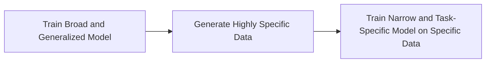

MANAGEN(Provide intro and give a general description of recurrent training: where models are used to generate data that use models)
refer to [data simulation](../../data/simulation.md)

The process of data simulation for AI typically involves two main steps:

1. **Training a Broad and Generalized Model:** The first step involves training a broad and generalized model. This model is trained on a wide-ranging dataset and is capable of generating highly specific synthetic data.

2. **Training a Narrow and Task-Specific Model:** The second step involves training a narrower, task-specific model on the synthetic data generated by the broad model. This task-specific model is tailored to the task at hand and can perform it with high accuracy.

Train on model trains a new model on the output of a new model.
- [Alpaca ](https://github.com/tatsu-lab/stanford_alpaca)

??? tip "[Shepherd: A Critic for Language Model Generation](https://arxiv.org/pdf/2308.04592.pdf) A 7B model trained to critique outputs"

    **Example chat response**
    

??? tip "[Textbooks are all you need](https://arxiv.org/pdf/2306.11644.pdf)"
    This study utilized a large volume of generated data and transformer-classifiers to filter the data and create a high-quality coding-focused model. The model was trained over four days on eight A-100s and achieved outperforming results.

??? tip "[Self-Alignment with Instruction Backtranslation](https://arxiv.org/pdf/2308.06259.pdf)"
    

    The seed model is used to construct training examples by generating instruction prompts
    for web documents (self-augmentation), and then selecting high quality examples
    from among these candidates (self-curation). This data is then used to finetune
    a stronger model. F

??? code "[WizardMath: Empowering Mathematical Reasoning for Large Language Models via _Reinforced Evol-Instruct_](https://github.com/nlpxucan/WizardLM/tree/main/WizardMath)"
    Llama-2 based reinforcement enables substantial improvement over other models.
    
    [Paper](https://github.com/nlpxucan/WizardLM/blob/main/WizardMath/WizardMath_Paper.pdf)

??? code "[Fabic](https://github.com/sd-fabric/fabric) is a technique to incorporate iterative feedback into the generative process of diffusion models based on StableDiffusion."
    [Paper](https://arxiv.org/pdf/2307.10159.pdf)
