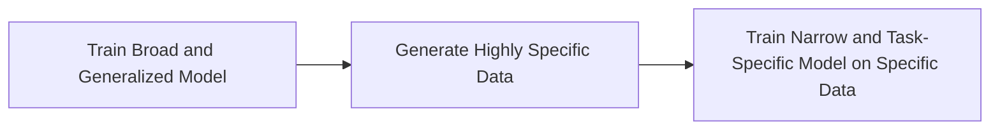

Recurrent training involves the use of an LLM so improve the selection or variety of data for that LLM. This is well describe in [data augmentation](../../data/preparation/augmentation.md)

The process of data simulation for AI typically involves two main steps:

1. **Training a Broad and Generalized Model:** The first step involves training a broad and generalized model. This model is trained on a wide-ranging dataset and is capable of generating highly specific synthetic data.

2. **Training a Narrow and Task-Specific Model:** The second step involves training a narrower, task-specific model on the synthetic data generated by the broad model. This task-specific model is tailored to the task at hand and can perform it with high accuracy.

## Example 

Train on model trains a new model on the output of a new model.

??? code "[LLM2LLM: Boosting LLMs with Novel Iterative Data Enhancement](https://github.com/SqueezeAILab/LLM2LLM)"
    **Developments** The authors reveal in their [paper](https://arxiv.org/pdf/2403.15042.pdf) a solution an iterative training and generation approach that enable effective fine tuning on low-data regimes. 
    

??? code "[Alpaca ](https://github.com/tatsu-lab/stanford_alpaca)"

??? tip "[Shepherd: A Critic for Language Model Generation](https://arxiv.org/pdf/2308.04592.pdf) A 7B model trained to critique outputs"

    **Example chat response**
    

??? tip "[Shepherd: A Critic for Language Model Generation](https://arxiv.org/pdf/2308.04592.pdf) A 7B model trained to critique outputs"
    **Example chat response**
    

??? tip "[Baize: An Open-Source Chat Model with Parameter-Efficient Tuning on Self-Chat Data](https://arxiv.org/pdf/2304.01196.pdf) Parameter efficient LLama Tuning and risk minimization"
    with a new 'Self Distillation' with Feedback to improve itself even more. RESEARCH ONLY
    

??? tip "[Self-Alignment with Instruction Backtranslation](https://arxiv.org/pdf/2308.06259.pdf)"
    

    The seed model is used to construct training examples by generating instruction prompts
    for web documents (self-augmentation), and then selecting high quality examples
    from among these candidates (self-curation). This data is then used to finetune
    a stronger model. F

??? code "[WizardMath: Empowering Mathematical Reasoning for Large Language Models via _Reinforced Evol-Instruct_](https://github.com/nlpxucan/WizardLM/tree/main/WizardMath)"
    Llama-2 based reinforcement enables substantial improvement over other models.
    
    [Paper](https://github.com/nlpxucan/WizardLM/blob/main/WizardMath/WizardMath_Paper.pdf)

??? code "[Fabic](https://github.com/sd-fabric/fabric) is a technique to incorporate iterative feedback into the generative process of diffusion models based on StableDiffusion."
    [Paper](https://arxiv.org/pdf/2307.10159.pdf)

## Error modes
It has been found that when models are trained on output generated by those models, they can lead collapse. This collapse occurs because patterns that are generated may not fully embody non-synthetic data, leading progressively worse patterns that are generated. With enough time, the results can be sufficiently ungrounded that they become gibberish. While there are manners of helping to prevent this from happening, including tightly controlling the formats and content of the inputs (and outputs) of the data, it is not guaranteed that the synthetic data will be as syntatically, semantically, or epistmelogically valid. 

!!! important "[The Curse of Recursion: Training on Generated Data Makes Models Forget](https://arxiv.org/abs/2305.17493)"

!!! important "[Model Collapse Explained](https://www.techtarget.com/whatis/feature/"Model-collapse-explained-How-synthetic-training-data-breaks-AI)"

