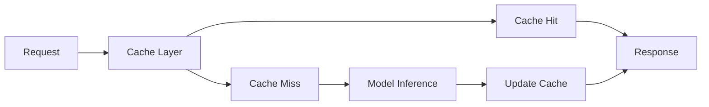

# LLM Caching Strategies

Effective caching is crucial for optimizing LLM operations, reducing costs, and improving response times. This guide covers advanced caching patterns and optimization techniques that can significantly improve the performance and efficiency of LLM deployments.

## Caching Architecture

### Request Flow
The typical flow of a cached LLM request involves multiple decision points and potential paths:

This architecture enables efficient handling of repeated queries while ensuring fresh responses for new requests.

## Implementation Patterns

### Caching Strategies
Different caching strategies serve different optimization goals:

- **Result Caching**: Store complete model responses for identical requests
  - Fastest response time for exact matches
  - Optimal for frequently repeated queries
  - Requires careful invalidation strategies
  - May need semantic matching for similar queries

- **Embedding Caching**: Cache computed embeddings for efficient similarity search
  - Reduces computational overhead for vector operations
  - Enables fast semantic similarity checks
  - Useful for retrieval-augmented generation
  - Can significantly reduce API costs

- **Prompt Caching**: Store intermediate results for common prompt patterns
  - Optimizes repeated prompt components
  - Useful for template-based systems
  - Reduces token usage
  - Enables prompt composition

- **Token Caching**: Cache partial generations for efficiency
  - Speeds up common response patterns
  - Reduces redundant computations
  - Particularly useful for streaming responses
  - Can improve response consistency

### Request Optimization
Efficient request handling requires multiple optimization techniques:

- **Dynamic Batching**: Combine requests based on runtime conditions
  - Balances latency and throughput
  - Adapts to varying load patterns
  - Optimizes resource utilization
  - Reduces per-request overhead

- **Smart Batching**: Group similar requests for efficient processing
  - Leverages model parallelism
  - Improves GPU utilization
  - Reduces memory fragmentation
  - Enables efficient prompt processing

- **Priority Queuing**: Handle requests based on importance
  - Ensures critical requests are processed first
  - Manages resource allocation effectively
  - Supports different service levels
  - Enables graceful degradation

- **Batch Size Optimization**: Balance throughput and latency
  - Adapts to hardware capabilities
  - Considers memory constraints
  - Optimizes for different model sizes
  - Handles varying request patterns

### Resilience Patterns
A robust caching system must handle various failure scenarios:

- **Model Degradation Handling**: Detect and respond to performance issues
  - Monitors model health metrics
  - Implements fallback strategies
  - Manages degraded operations
  - Ensures service continuity

- **Error Recovery**: Implement retry logic and fallback options
  - Handles transient failures
  - Provides graceful degradation
  - Maintains system stability
  - Logs issues for analysis

- **Circuit Breaking**: Prevent cascade failures
  - Isolates system components
  - Manages resource exhaustion
  - Enables partial availability
  - Protects critical services

- **Graceful Degradation**: Maintain service with reduced functionality
  - Prioritizes essential features
  - Manages resource constraints
  - Communicates status clearly
  - Ensures basic service availability

### Input Caching

Input caching is a sophisticated technique that leverages memory to improve response time and efficiency. Instead of generating tokens based on the next input, it uses caching to identify responses that may have already been generated for similar prompts. This approach offers several benefits:

- Significantly enhances the efficiency of repeated queries
- Reduces computational load on the model
- Improves response consistency
- Optimizes token usage and costs

However, it requires careful consideration of:
- Cache invalidation strategies
- Response freshness requirements
- Memory usage optimization
- Query similarity thresholds

!!! important "[PROMPT CACHE: MODULAR ATTENTION REUSE FOR LOW-LATENCY INFERENCE](https://arxiv.org/pdf/2311.04934.pdf)"
    This stores partial Query, Key, Value pairs to minimize prompt-reuse. The technique enables efficient reuse of attention computations, significantly reducing inference latency for similar prompts.

!!! abstract " [GPTCache](https://github.com/zilliztech/GPTCache)"
    A powerful tool for implementing semantic caching in LLM applications. It provides:
    - Efficient storage and retrieval of responses
    - Similarity-based cache matching
    - Multiple storage backend options
    - Customizable caching strategies