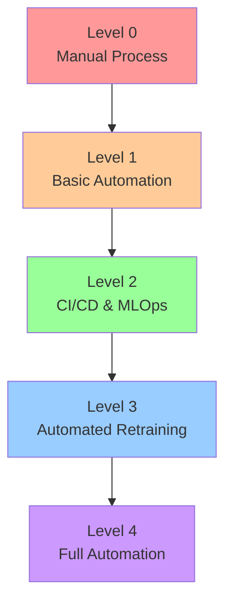
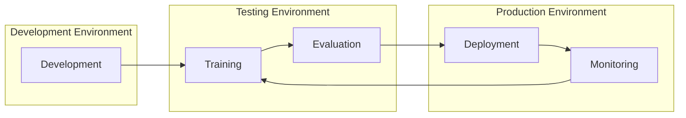

# LLM Operations

LLM Ops encompasses the entire lifecycle of deploying and managing Large Language Models in production environments. This guide covers operational aspects from deployment to monitoring.

## [LLM Ops Maturity Model](https://learn.microsoft.com/en-us/azure/architecture/ai-ml/guide/mlops-maturity-model)

Organizations typically evolve through several stages of LLM operations maturity, each bringing increased automation and reliability.

### Level 0: Manual Process
At this initial stage, teams operate with minimal automation. Model deployments are handled manually, monitoring is limited, and there are no standardized processes in place. This approach is suitable for early experimentation but becomes challenging as operations scale.

### Level 1: Basic Automation
Teams introduce basic CI/CD pipelines and begin automating routine tasks. While model validation remains largely manual, monitoring systems are established to track basic metrics. This level represents the first step toward systematic operations.

### Level 2: CI/CD & MLOps
A significant evolution where teams implement comprehensive automation for testing and deployment. Version control extends beyond code to include models and configurations. Monitoring becomes more sophisticated, enabling better operational visibility.

### Level 3: Automated Retraining
Advanced automation enables automatic model retraining based on performance metrics. A/B testing infrastructure allows for controlled rollouts of new models. Monitoring and alerting systems become proactive rather than reactive.

### Level 4: Full Automation
The highest maturity level features a fully automated lifecycle with self-healing capabilities. Systems can automatically detect and respond to issues, while continuous optimization ensures peak performance. This level requires significant investment but offers the highest operational efficiency.

## LLM Ops Architecture

The LLM operations architecture connects development, testing, and production environments in a continuous feedback loop.

## Development Best Practices

### Version Control and CI/CD
!!! abstract "[GitOps for ML](https://www.gitops.tech/)"
    Modern ML systems require robust version control for code, models, and configurations. GitOps practices provide a framework for managing these assets and automating deployments.

For detailed implementation guidance, see our [training section](../../../architectures/training/index.md).

### Deployment Strategies
Modern LLM deployments use several proven patterns to minimize risk and maintain availability:

!!! abstract "[Blue-Green Deployment](https://martinfowler.com/bliki/BlueGreenDeployment.html)"
    Maintains two identical environments for zero-downtime deployments.

!!! abstract "[Canary Releases](https://martinfowler.com/bliki/CanaryRelease.html)"
    Gradually rolls out changes to a subset of users to minimize risk.

!!! abstract "[Shadow Testing](https://microsoft.github.io/code-with-engineering-playbook/automated-testing/shadow-testing/)"
    Tests new versions with production traffic without impacting users.

For evaluation approaches, see our [evaluation section](../../../architectures/optimizing/evaluating_and_comparing.md).

## Operational Excellence

### Performance Management
Performance optimization in LLM operations requires attention to multiple aspects:

!!! abstract "[Token Usage Tracking](https://platform.openai.com/docs/guides/production-best-practices)"
    Monitor and optimize token usage to control costs and improve efficiency.

!!! abstract "[Latency Monitoring](https://cloud.google.com/trace/docs/monitoring)"
    Track and optimize inference latency for better user experience.

For detailed technical considerations, see our [computation guide](../computation.md).

### Infrastructure Scaling
Effective scaling strategies ensure reliable performance under varying loads:

!!! abstract "[Load Balancing](https://aws.amazon.com/blogs/machine-learning/load-balance-your-machine-learning-inference-workload/)"
    Distribute workloads across multiple model servers for optimal performance.

!!! abstract "[Auto-scaling](https://cloud.google.com/blog/products/ai-machine-learning/serve-deep-learning-models-using-tensorflow-serving)"
    Automatically adjust resources based on demand.

For orchestration details, see our [orchestration guide](../orchestrating.md).

## Quality and Security

### Model Quality Assurance
Quality assurance for LLMs focuses on several key aspects:
- Maintaining consistent response quality
- Detecting and preventing hallucinations
- Monitoring for bias and drift
- Regular evaluation against ground truth
- Systematic A/B testing

For comprehensive evaluation methods, see our [evaluation metrics section](../../../architectures/optimizing/evaluating_and_comparing.md).

### Security Implementation
!!! abstract "[AI Security](https://www.microsoft.com/en-us/security/business/security-101/what-is-ai-security)"
    Implement robust security measures to protect models and data.

For detailed security guidance, see our [security and compliance guide](../../security_compliance_and_governance/index.md).

## Infrastructure and Monitoring

### Container Orchestration
Modern LLM deployments rely heavily on containerization:

!!! abstract "[Docker for ML](https://docs.docker.com/config/containers/resource_constraints/)"
    Containerize ML workloads for consistent deployment and scaling.

!!! abstract "[Kubernetes for ML](https://kubernetes.io/docs/tasks/manage-gpus/scheduling-gpus/)"
    Orchestrate GPU-enabled containers for ML workloads.

For infrastructure details, see our [computation architecture guide](../computation.md).

### Observability Tools
Comprehensive monitoring requires multiple tools:

!!! abstract "[Prometheus](https://prometheus.io/docs/introduction/overview/)"
    Collect and store metrics for system and model performance.

!!! abstract "[OpenTelemetry](https://opentelemetry.io/docs/concepts/signals/traces/)"
    Implement distributed tracing for request flow analysis.

