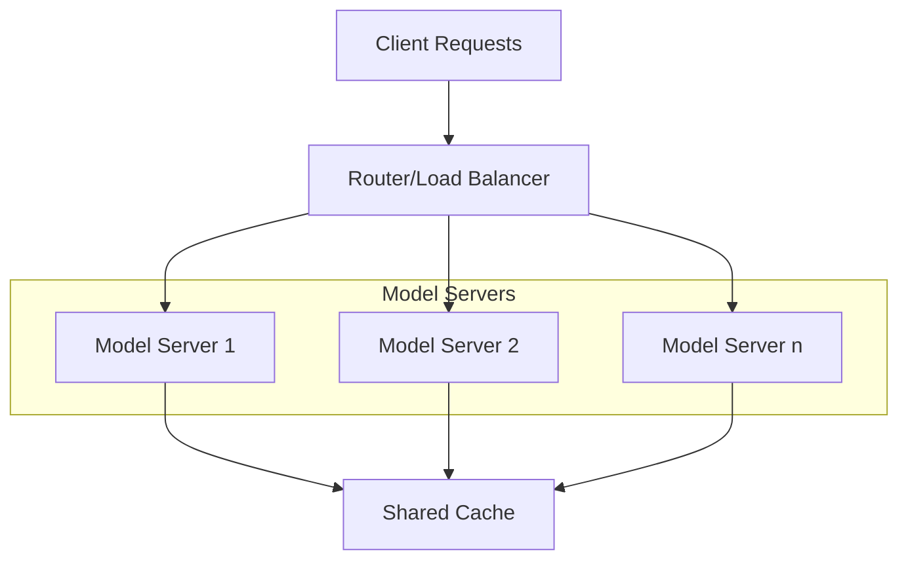

# Model Serving Architecture

This guide covers the technical aspects of serving LLMs in production, focusing on architectural patterns and implementation strategies. The choice of serving architecture significantly impacts performance, cost, and operational complexity.

## Serving Patterns

### Basic Architectures

A typical model serving architecture consists of multiple components working together to handle client requests efficiently and reliably:

### Implementation Approaches

#### Single-Model Serving
The simplest approach to model serving involves deploying a single model per service. This pattern offers:
- Direct model-to-service mapping for clear resource allocation
- Dedicated resources per model, preventing resource contention
- Simplified monitoring and scaling through isolated metrics
- Best for specialized use cases requiring consistent performance

This approach works well for applications with stable workloads and specific model requirements, though it may lead to resource underutilization.

#### Multi-Model Serving
A more sophisticated approach that hosts multiple models on shared infrastructure:
- Multiple models share computational resources efficiently
- Dynamic resource allocation based on demand patterns
- Complex orchestration requirements for model lifecycle
- Efficient resource utilization through sharing

This pattern is ideal for organizations serving multiple models with varying usage patterns, enabling better resource utilization and cost optimization.

#### Hybrid Serving
Combines aspects of both approaches for maximum flexibility:
- Balances dedicated and shared resources based on requirements
- Enables flexible deployment options for different model types
- Optimizes mixed workloads through intelligent routing
- Provides advanced routing capabilities for complex scenarios

Hybrid serving is particularly useful when dealing with a mix of critical and non-critical models, or when different models have varying performance requirements.

## Scaling Strategies

### Horizontal Scaling
Horizontal scaling involves adding more model serving instances to handle increased load:
- Load balancer configuration ensures even request distribution
- Instance management handles server lifecycle
- State synchronization maintains consistency across instances
- Cache consistency prevents stale responses

This approach is particularly effective for stateless serving patterns and can provide linear scaling capabilities.

### Vertical Scaling
Vertical scaling optimizes individual server resources:
- Resource allocation maximizes server utilization
- GPU utilization strategies for optimal throughput
- Memory management techniques prevent bottlenecks
- Performance optimization through hardware acceleration

This strategy is crucial for maximizing the performance of GPU-accelerated model serving.

### Auto-scaling
Intelligent scaling based on demand:
- Metrics-based scaling responds to real-time requirements
- Predictive scaling anticipates load patterns
- Cost optimization balances performance and expense
- Resource limits prevent runaway scaling

Auto-scaling combines the benefits of both horizontal and vertical scaling, automatically adjusting resources based on demand patterns.

## Production Considerations

### Performance Monitoring
Comprehensive monitoring ensures reliable operation:
- Latency tracking across the serving pipeline
- Throughput metrics for capacity planning
- Resource utilization for optimization
- Error rates for quality assurance

### High Availability
Robust availability requires multiple layers of redundancy:
- Redundancy patterns prevent single points of failure
- Failover strategies maintain service continuity
- Health checks detect issues early
- Recovery procedures minimize downtime

### Cost Optimization
Efficient resource usage controls operational costs:
- Resource scheduling maximizes utilization
- Batch processing improves throughput
- Caching strategies reduce computation
- Load prediction enables proactive scaling

## Model Serving and Management Tools

### Core Management Tools
!!! abstract "[LLM Ops](https://github.com/microsoft/lmops)"
    Microsoft's comprehensive tool for managing large language models in production.

!!! abstract "[Open LLM](https://github.com/bentoml/OpenLLM)"
    Run inference with open-source large-language models, deploy to cloud or on-premises, and build powerful AI apps.

### Deployment Solutions
!!! abstract "[vLLM](https://vllm.ai)"
    High-throughput and memory-efficient inference engine with PagedAttention.

!!! abstract "[Text Generation Inference](https://github.com/huggingface/text-generation-inference)"
    Optimized inference solution from Hugging Face with advanced features like continuous batching.

!!! abstract "[FastAPI Template](https://github.com/microsoft/fastapi-model-serving)"
    Production-ready template for serving ML models with FastAPI.

## Deployment Patterns

### Model Serving Architectures

### Architectural Patterns

#### Single-Model Serving
!!! abstract "[Single Model Pattern](https://www.tensorflow.org/tfx/serving/architecture)"
    Basic pattern for serving a single model version.

- Direct model-to-service mapping
- Simplest deployment strategy
- Suitable for small-scale applications
- Limited scaling capabilities

#### Multi-Model Serving
!!! abstract "[Multi-Model Pattern](https://www.nvidia.com/en-us/on-demand/session/gtcspring21-s31327/)"
    Advanced pattern for serving multiple models efficiently.

- Shared resource utilization
- Dynamic model loading/unloading
- Memory optimization
- Resource pooling

#### Model Ensemble
!!! abstract "[Model Ensemble](https://aws.amazon.com/blogs/machine-learning/create-an-ensemble-model-using-amazon-sagemaker-inference-pipelines/)"
    Pattern for combining multiple models for inference.

- Improved accuracy through combination
- Fault tolerance
- Specialized model routing
- Weighted predictions

### Serving Patterns

#### Synchronous Serving
- Real-time inference
- Request-response pattern
- Direct client communication
- Latency-sensitive applications

#### Asynchronous Serving
- Batch processing
- Queue-based processing
- Background jobs
- High-throughput applications

#### Hybrid Serving
- Combined sync/async processing
- Priority-based routing
- Flexible scaling
- Optimized resource usage

### Scaling Patterns

#### Horizontal Scaling
- Instance replication
- Load balancing
- Session affinity
- Geographic distribution

#### Vertical Scaling
- Resource optimization
- GPU utilization
- Memory management
- Compute optimization

#### Dynamic Scaling
- Auto-scaling policies
- Load-based scaling
- Cost optimization
- Resource efficiency
