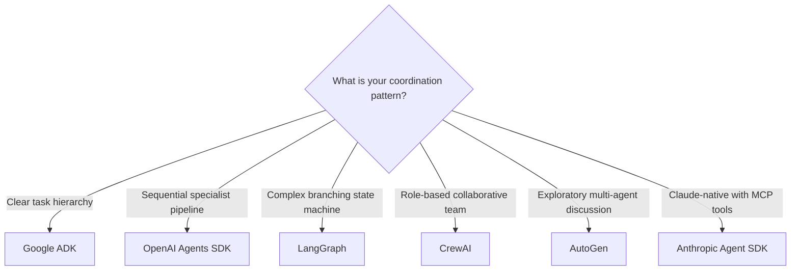

# Agent Libraries and Tools

> **Content updated May 2026.** The agentic framework landscape consolidated significantly through 2025. This page covers the six production-grade options and supporting development tools.

## The Six Production Frameworks

By 2025, the multi-agent framework landscape settled around six options. Each reflects a fundamentally different philosophy on how agents should coordinate. Choosing the wrong one for your coordination model is expensive to fix.

### LangGraph

**Paradigm:** Graph/stateful — explicit control flow with checkpointing

LangGraph (from the LangChain team) models agent workflows as directed graphs with explicit state management. Each node in the graph is a function; edges define transitions. Supports cycles (agent loops), checkpointing for long-running tasks, and streaming.

Best for: Complex multi-step workflows with dynamic decision branches; systems where you need fine-grained control over state and need to audit intermediate states.

- [LangGraph documentation](https://langchain-ai.github.io/langgraph/)
- [LangSmith](https://smith.langchain.com/) for tracing and evaluation

### CrewAI

**Paradigm:** Role-based — agents with defined personas collaborate

CrewAI lets you define agents with specific roles, goals, and backstories. Agents work together as a "crew" toward a shared objective. The framework handles delegation and communication.

Best for: Workflows that naturally map to a team of specialists (researcher, analyst, writer, reviewer).

- [CrewAI documentation](https://docs.crewai.com/)

### OpenAI Agents SDK (March 2025)

**Paradigm:** Handoff-based — agents pass tasks between themselves

Released March 2025, replacing the experimental Swarm framework. Three built-in primitives:

1. **Handoffs** — agent-to-agent task transfer with full context
2. **Guardrails** — input and output validation at boundaries
3. **Tracing** — end-to-end observability across agent chains

Python-first. Best for: Sequential pipelines where specialised agents handle distinct phases.

!!! info "Source"
    [OpenAI Agents SDK release](https://openai.com/blog/new-tools-for-building-agents), March 2025

- [OpenAI Agents SDK documentation](https://platform.openai.com/docs/guides/agents)

### Google Agent Development Kit (ADK)

**Paradigm:** Hierarchical tree — root agent delegates to sub-agents

Google released ADK alongside the A2A protocol in April 2025. A root agent decomposes goals and delegates to sub-agents; the hierarchy can be as deep as needed. Native integration with the A2A protocol for cross-vendor agent communication.

Best for: Enterprise orchestration scenarios with clear task hierarchies; systems that need to interoperate with other vendors' agents via A2A.

!!! info "Source"
    [Google ADK documentation](https://google.github.io/adk-docs/)

### AutoGen (Microsoft)

**Paradigm:** Conversational — agents coordinate through structured dialogue

AutoGen models agents as conversational actors that discuss and coordinate through structured message exchanges. Supports both single-agent and multi-agent scenarios with flexible conversation patterns.

Best for: Exploratory problem-solving where the solution path is not predetermined; research and analysis workflows.

- [AutoGen documentation](https://microsoft.github.io/autogen/)

### Anthropic Agent SDK

**Paradigm:** Pipeline-native — built around Claude models and MCP

Anthropic's Agent SDK is designed for building multi-agent pipelines natively on Claude models. Tight integration with MCP (Model Context Protocol) for tool access. Pairs with Claude Computer Use for desktop automation.

Best for: Claude-centric deployments; systems that need native MCP tool integration.

---

## Supporting Tools

### agent-service-toolkit

A production-ready template for deploying LangGraph agents as a service, with FastAPI, streaming, and auth baked in.

- [agent-service-toolkit on GitHub](https://github.com/JoshuaC215/agent-service-toolkit)

### OmniParser v2 (Microsoft)

Turns any LLM into a computer-use agent by parsing screen content into structured, interactable elements. Enables computer-use without requiring a natively trained computer-use model.

??? abstract "[OmniParser v2](https://github.com/microsoft/OmniParser/tree/master)"
    [Blog](https://www.microsoft.com/en-us/research/articles/omniparser-v2-turning-any-llm-into-a-computer-use-agent/) — Microsoft Research, 2025.

---

## Framework Selection Guide

!!! tip "Framework is not model"
    All six frameworks can work with multiple LLM providers. Your framework choice is an architectural decision about coordination patterns, not a model commitment.
