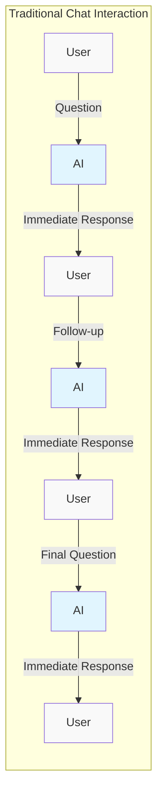
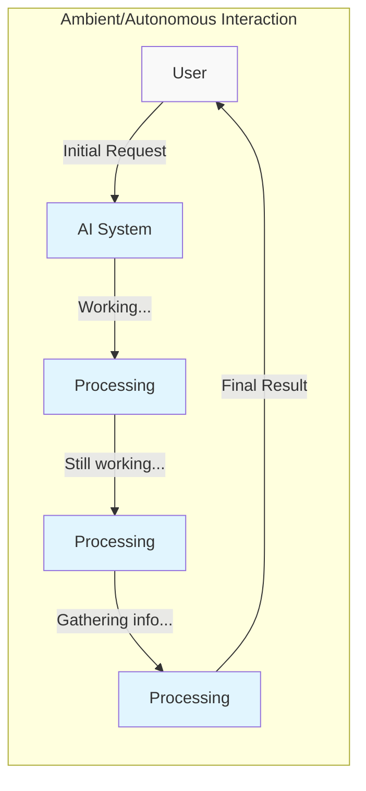

# Front End
Deploying AI technologies involves a variety of steps, one of which is understanding your visualization needs and implementing effective front ends. This is a crucial aspect as it enables users to interact with the technology in a user-friendly and intuitive manner.

## AIX overview

Like UX, AIX is a way to interact with AI technologies. It is a way to interact with the technology in a user-friendly and intuitive manner. It must be designed to minimize frustration and ensure that the user is able to achieve their goals. It is important, too, to ensure the user is able to understand the technology and its capabilities, including the fact that it is an AI.

### Parallel and Serial Interaction Paradigms

There are two general paradigms for building GenAI enabled applications.

1. **Serial or Linear Interactions**: Where the user interacts with the application in a linear manner, with a single input and output, interactive manner -- how we interact with chatbots.

2. **Parallel / asynchronous / autonomous interactions**: Where the user interacts with the application in a manner that allows for parallel or asynchronous interactions -- much more like interacting with a person, and how [AI agents](../../agents/index.md) would best be interacted with.

These two paradigms are not mutually exclusive, and can be used together to create a more user-friendly and intuitive application. [Ambient Agents](#ambient-agents) provide a good example of how to implement a parallel interaction paradigm.

#### Ambient Agents

???+ "[Ambient Agents](https://blog.langchain.dev/introducing-ambient-agents/)"
z
    LangChain's ambient agents represent a shift away from traditional chat-based interactions. Unlike conventional chatbots that require user initiation, ambient agents:

    - Listen to event streams and act on them accordingly
    - Can handle multiple events simultaneously
    - Operate in the background without constant user prompting
    - Integrate human-in-the-loop patterns thoughtfully

### Human-in-the-Loop Patterns

Ambient agents typically implement three main patterns for human interaction:

1. **Notify**: Agents flag important events for user attention without taking action themselves
2. **Question**: Agents ask users for clarification when needed rather than making assumptions
3. **Review**: Agents request human approval before taking potentially impactful actions

These patterns offer several benefits:
- Lower stakes for production deployment through controlled actions
- Natural communication that builds user trust
- Enable long-term learning through user feedback

### The interface

This is how information from the user is presented to the AI, and how the AI's response is presented to the user. Often times this is a chat interface. It can be used to augment presently established software tools and services, or it can be a standalone application. This chat interface can be a sidebar or floating bar, or focus on a full screen. 

###

## Understanding Visualization Needs

The first step towards creating an effective front end is understanding your visualization needs. This process involves identifying the key data points and processes that need to be visualized and determining the most effective way to present this information to the user.

In addition, it's important to identify the simplest possible result for your end users. This means understanding your audience and presenting the information in a logical format that is easy for them to comprehend.

## Implementing the Front End

Once you have a clear understanding of your visualization needs, the next step is to implement the front end. For AI technologies such as GPT, it's essential to have well-designed access points. These access points, or user interfaces, allow users to interact with the technology.

## Popular Repositories for Front End Implementation

There are several popular repositories that can serve as a starting point for your product. These include:

### Prominant and supported 

#### Streamlit
[Streamlit](https://blog.streamlit.io/langchain-streamlit/): This platform allows you to build machine learning and data science apps.

[Streamlit agent](https://github.com/langchain-ai/streamlit-agent)

#### Others
Vercel https://sdk.vercel.ai/docs/introduction
- [Fly.io](https://www.fly.io)
- [Modal.com](https://www.modal.com)
- [Render.com](https://www.render.com)
- [Gradio.app](https://www.gradio.app)

- [Hugging Face](https://www.huggingface.co)
- [EmbedChain.ai](https://www.embedchain.ai)

### Demo Examples

- [OobaBooga Text generation WebUI](https://github.com/oobabooga/text-generation-webui): This is a user-friendly interface for text generation.
- [DemoGPT](https://github.com/melih-unsal/DemoGPT): This tool connects Langchain and Streamlit to create dynamic apps that can be used repeatedly for interacting with Chat-GPTs.
- [GPT Graph](https://github.com/m-elbably/gpt-graph): This tool allows for a graphical network representation of chat interactions.

-[pyRobBot](https://github.com/paulovcmedeiros/pyRobBot)

By understanding your visualization needs and implementing an effective front end, you can ensure that your users have a smooth and intuitive experience when interacting with your AI technology.
