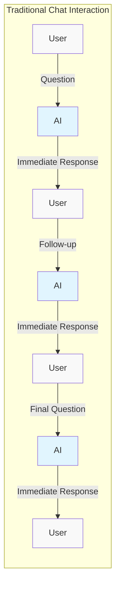
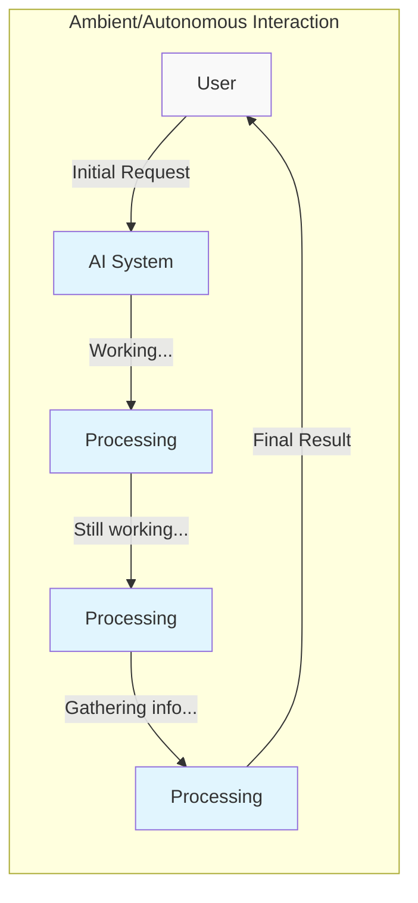

# Front-End Development for AI Applications

Deploying AI technologies involves a variety of steps, one of which is understanding your visualization needs and implementing effective front ends. This is a crucial aspect as it enables users to interact with the technology in a user-friendly and intuitive manner.

## AIX Design Principles

Like UX, AIX is a way to interact with AI technologies. It must be designed to minimize frustration and ensure that the user is able to achieve their goals. It is important to ensure the user understands the technology and its capabilities, including the fact that it is an AI.

### Interaction Paradigms

There are two general paradigms for building GenAI enabled applications:

1. **Serial or Linear Interactions**: Where the user interacts with the application in a linear manner, with a single input and output, interactive manner -- how we interact with chatbots.

2. **Parallel / Asynchronous / Autonomous Interactions**: Where the user interacts with the application in a manner that allows for parallel or asynchronous interactions -- much more like interacting with a person, and how [AI agents](../../agents/index.md) would best be interacted with.

These paradigms are not mutually exclusive and can be combined to create more intuitive applications.

### Ambient Agents

??? tip "[Ambient Agents](https://blog.langchain.dev/introducing-ambient-agents/)"
    LangChain's ambient agents represent a shift away from traditional chat-based interactions. Unlike conventional chatbots that require user initiation, ambient agents:
    - Listen to event streams and act on them accordingly
    - Can handle multiple events simultaneously
    - Operate in the background without constant user prompting
    - Integrate human-in-the-loop patterns thoughtfully

### Human-in-the-Loop Patterns

Ambient agents typically implement three main patterns for human interaction:

1. **Notify**: Agents flag important events for user attention without taking action themselves
2. **Question**: Agents ask users for clarification when needed rather than making assumptions
3. **Review**: Agents request human approval before taking potentially impactful actions

Benefits include:
- Lower stakes for production deployment through controlled actions
- Natural communication that builds user trust
- Enable long-term learning through user feedback

## Interface Design

The interface is how information flows between the user and the AI. Common patterns include:
- Chat interfaces (standalone or integrated)
- Sidebars or floating bars
- Full-screen applications
- Tool augmentation within existing software

### Visualization Requirements

When designing AI interfaces, consider:
- Key data points and processes that need visualization
- Most effective presentation methods
- Target audience needs and comprehension levels
- Simplest possible result format

## Development Tools and Frameworks

### Production-Ready Frameworks

??? abstract "Streamlit"
    Popular platform for building ML and data science apps:
    - [Streamlit Blog](https://blog.streamlit.io/langchain-streamlit/)
    - [Streamlit Agent](https://github.com/langchain-ai/streamlit-agent)

??? abstract "Deployment Platforms"
    - [Vercel AI SDK](https://sdk.vercel.ai/docs/introduction)
    - [Fly.io](https://www.fly.io)
    - [Modal.com](https://www.modal.com)
    - [Render.com](https://www.render.com)
    - [Gradio.app](https://www.gradio.app)

??? abstract "AI Development Platforms"
    - [Hugging Face](https://www.huggingface.co)
    - [EmbedChain.ai](https://www.embedchain.ai)

### Demo Examples

??? tip "Open Source UIs"
    - [OobaBooga Text Generation WebUI](https://github.com/oobabooga/text-generation-webui): User-friendly interface for text generation
    - [DemoGPT](https://github.com/melih-unsal/DemoGPT): Connects Langchain and Streamlit for dynamic Chat-GPT apps
    - [GPT Graph](https://github.com/m-elbably/gpt-graph): Graphical network representation of chat interactions
    - [pyRobBot](https://github.com/paulovcmedeiros/pyRobBot): Python-based chatbot interface
