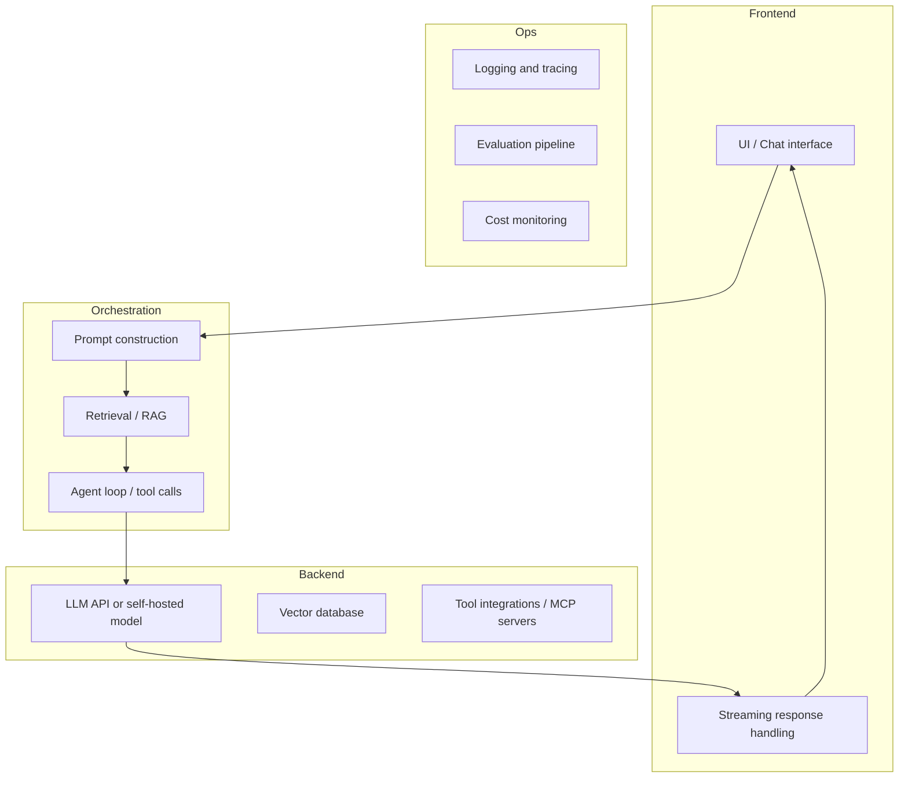

# Full-Stack GenAI Applications

A production GenAI application is not just a model call. It is an end-to-end system spanning prompt engineering, retrieval infrastructure, backend orchestration, and a user-facing interface. This page provides orientation across the full stack.

## The GenAI Application Stack

## Key Architecture Decisions

| Decision | Options | Key trade-off |
|----------|---------|--------------|
| **Model hosting** | Hosted API vs self-hosted open-weight | Cost/latency vs data sovereignty/control |
| **Knowledge integration** | RAG vs long context vs fine-tuning | Freshness vs cost vs specialisation |
| **Agentic vs non-agentic** | Single-shot vs agent loop | Simplicity vs capability for complex tasks |
| **Streaming** | Streaming vs batch | UX responsiveness vs implementation complexity |

## 2025 Defaults

By 2025, the defaults for most production GenAI applications have settled:

- **RAG** as the standard knowledge integration pattern (see [data augmentation](../../data/augmentation/index.md))
- **MCP** as the standard tool integration protocol
- **Streaming responses** as the default UX pattern
- **Prompt caching** for long, repeated system prompts (80–90% input token cost reduction)
- **LangGraph or OpenAI Agents SDK** as the orchestration layer for agentic workflows

## Where to Go Next

- [Back-end infrastructure](../back_end/index.md) — model serving, LLMOps, database choices
- [Agents](../../agents/index.md) — agentic patterns, frameworks, and MCP/A2A protocols
- [Data augmentation](../../data/augmentation/index.md) — RAG, fine-tuning, and long-context patterns
- [Security and governance](../security_compliance_and_governance/index.md) — compliance, safety, and access control
