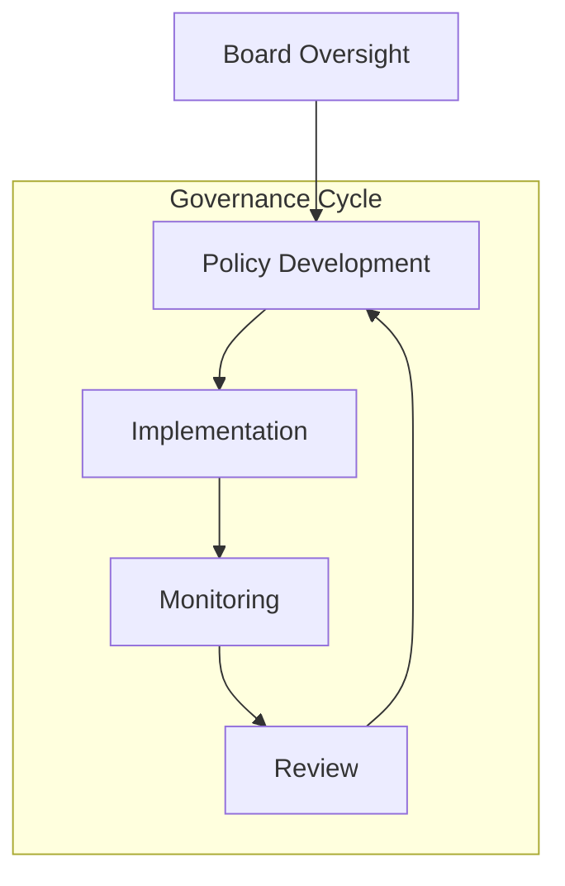
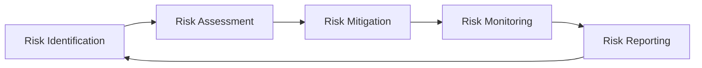

# AI Governance

Effective governance of AI systems requires clear organizational structures, policies, and processes to ensure responsible development and deployment.

## Governance Framework

## Organizational Structure

### Oversight Bodies
- **Board Oversight**
  - Strategic direction
  - Risk appetite definition
  - Resource allocation
  - Performance review

- **AI Ethics Committee**
  - Ethical guidelines
  - Impact assessments
  - Policy recommendations
  - Incident review

- **Technical Leadership**
  - Implementation oversight
  - Technical standards
  - Quality assurance
  - Innovation guidance

### Roles and Responsibilities
- Risk management teams
- Technical leads
- Ethics officers
- Compliance officers
- Security teams

## Policy Framework

### Core Policies
- **AI Ethics Guidelines**
  - Ethical principles
  - Decision frameworks
  - Impact assessment
  - Bias prevention

- **Risk Management**
  - Risk assessment
  - Mitigation strategies
  - Monitoring procedures
  - Incident response

- **Model Governance**
  - Development standards
  - Deployment procedures
  - Monitoring requirements
  - Retirement protocols

### Implementation Guidelines
- Policy enforcement
- Training requirements
- Documentation standards
- Review procedures

## Risk Management

### Risk Categories
- **Technical Risks**
  - Model performance
  - System reliability
  - Infrastructure stability
  - Security vulnerabilities

- **Ethical Risks**
  - Bias and fairness
  - Transparency
  - Privacy concerns
  - Social impact

- **Operational Risks**
  - Resource allocation
  - Process efficiency
  - Quality control
  - Change management

### Assessment Process

## Ethical Framework

### Core Principles
- **Fairness**
  - Non-discrimination
  - Equal access
  - Bias prevention
  - Fair outcomes

- **Transparency**
  - Explainability
  - Documentation
  - Communication
  - Accountability

- **Privacy**
  - Data protection
  - User consent
  - Access control
  - Data minimization

### Implementation
- Ethics by design
- Regular assessments
- Monitoring systems
- Feedback loops

## Decision-Making Processes

### Strategic Decisions
- Technology selection
- Resource allocation
- Risk tolerance
- Policy changes

### Operational Decisions
- Deployment approvals
- Incident response
- Change management
- Performance optimization

## Continuous Improvement

### Monitoring and Review
- Performance metrics
- Risk indicators
- Compliance status
- Incident reports

### Framework Evolution
- Policy updates
- Process refinement
- Control enhancement
- Standard evolution

## Tools and Resources

!!! abstract "[AI Governance Framework](https://www.iso.org/standard/81230.html)"
    ISO/IEC 42001 standard for AI Management Systems provides a comprehensive framework for governance.

!!! tip "[Ethics Guidelines](https://digital-strategy.ec.europa.eu/en/library/ethics-guidelines-trustworthy-ai)"
    EU guidelines for trustworthy AI, offering practical guidance for ethical AI development. 