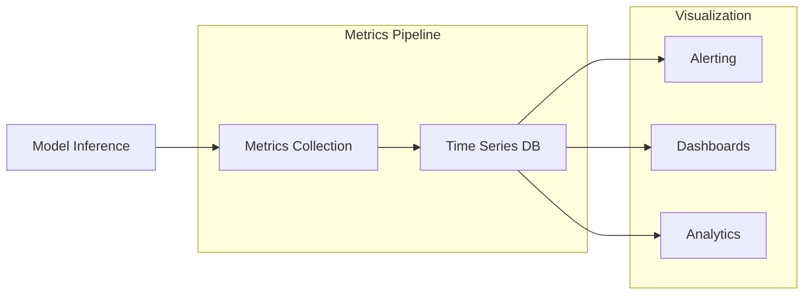
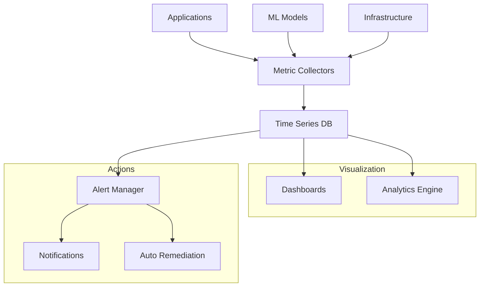
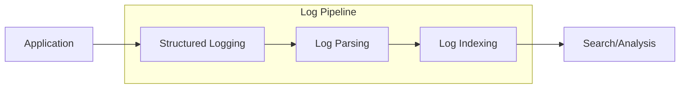

## Monitoring and Observability

### Key Metrics
- **System Metrics**:
    - Resource utilization
    - Response times
    - Error rates
    - Queue lengths
- **Model Metrics**:
    - Inference quality
    - Token usage
    - Cache hit rates
    - Model drift indicators
- **Business Metrics**:
    - Cost per request
    - User satisfaction
    - Feature usage
    - Business impact

### Monitoring Tools
!!! abstract "[Prometheus](https://prometheus.io)"
    Industry-standard metrics collection and alerting.

!!! abstract "[Grafana](https://grafana.com)"
    Visualization and dashboarding for operational metrics.

!!! abstract "[Weights & Biases](https://wandb.ai)"
    ML-specific monitoring and experiment tracking.

### Logging and Tracing
- **Structured Logging**:
    - Request/response logging
    - Error tracking
    - Performance logging
    - Audit trails
- **Distributed Tracing**:
    - Request flow tracking
    - Bottleneck identification
    - Service dependencies
    - Performance profiling

# Monitoring and Observability

## Monitoring Architecture

## Key Metrics Categories

### Infrastructure Metrics
- Resource utilization (CPU, Memory, GPU)
- Network throughput and latency
- Storage performance
- Container health
- Cluster metrics

### Application Metrics
- Request rates and patterns
- Response times (p50, p90, p99)
- Error rates and types
- Queue lengths
- Cache hit rates

### Model Metrics
- Inference latency
- Token usage
- Model accuracy
- Prediction confidence
- Feature distribution
- Model drift indicators

### Business Metrics
- Cost per request
- User satisfaction scores
- Feature usage patterns
- Business impact metrics
- SLA compliance

## Monitoring Tools

### Metrics Collection
!!! abstract "[Prometheus](https://prometheus.io/docs/introduction/overview/)"
    Industry-standard metrics collection system.

!!! abstract "[OpenTelemetry](https://opentelemetry.io/)"
    Open-source observability framework.

### Visualization
!!! abstract "[Grafana](https://grafana.com/)"
    Advanced visualization and dashboarding.

!!! abstract "[Kibana](https://www.elastic.co/kibana/)"
    Analytics and visualization platform.

### ML-Specific Monitoring
!!! abstract "[Weights & Biases](https://wandb.ai/)"
    ML experiment tracking and monitoring.

!!! abstract "[MLflow](https://mlflow.org/)"
    End-to-end ML lifecycle platform.

## Observability Practices

### Logging Strategy

#### Log Levels
- ERROR: System failures
- WARN: Potential issues
- INFO: Normal operations
- DEBUG: Detailed debugging
- TRACE: Fine-grained details

#### Log Components
- Timestamp
- Request ID
- User context
- Operation details
- Performance metrics
- Error details

### Tracing Implementation
!!! abstract "[Jaeger](https://www.jaegertracing.io/)"
    End-to-end distributed tracing.

- Request flow tracking
- Service dependencies
- Performance bottlenecks
- Error propagation
- Resource attribution

### Alerting Strategy

#### Alert Categories
- Critical: Immediate action required
- Warning: Investigation needed
- Info: Awareness only

#### Alert Components
- Alert condition
- Severity level
- Resolution steps
- Contact information
- Escalation path

## Best Practices

### Data Collection
- Use structured logging
- Implement distributed tracing
- Collect business metrics
- Monitor user experience
- Track resource usage

### Data Storage
- Time series optimization
- Data retention policies
- Storage scaling
- Backup strategies
- Access controls

### Visualization
- Real-time dashboards
- Historical trends
- Correlation analysis
- Custom views
- Export capabilities

### Alert Management
- Clear severity levels
- Actionable alerts
- Proper routing
- Escalation procedures
- Alert fatigue prevention

## Advanced Topics

### Automated Analysis
- Anomaly detection
- Pattern recognition
- Predictive analytics
- Root cause analysis
- Capacity planning

### Integration Points
- CI/CD pipelines
- Incident management
- Change management
- Resource provisioning
- Cost optimization

### Security Monitoring
- Access patterns
- Authentication events
- Authorization checks
- Data access logs
- Security incidents

## Troubleshooting Guide

### Common Issues
- High latency
- Error spikes
- Resource exhaustion
- Model degradation
- System failures

### Resolution Steps
1. Identify symptoms
2. Collect relevant metrics
3. Analyze patterns
4. Determine root cause
5. Implement fix
6. Verify resolution
7. Document findings

### Prevention Strategies
- Proactive monitoring
- Regular health checks
- Capacity planning
- Performance testing
- Disaster recovery
