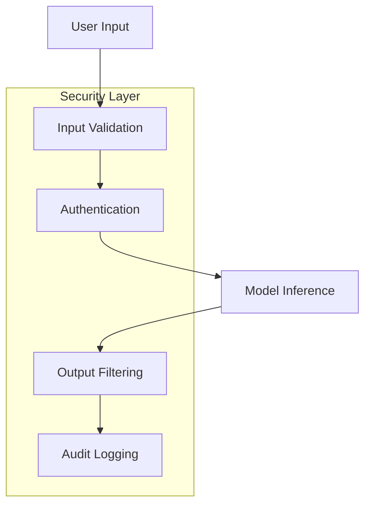

# AI Application Security

Security in AI applications requires a comprehensive approach that addresses multiple layers of the system. This guide outlines essential security measures and implementation patterns.

## Security Architecture

The security architecture of an AI application involves multiple layers working together to ensure system integrity:

## Core Security Measures

### Model Security
Protection at the model level ensures safe and reliable inference:
- **Input Validation**
  - Sanitize and validate all user inputs
  - Check for prompt injection attempts
  - Enforce input length limits
  - Validate input formats

- **Output Filtering**
  - Screen for sensitive information
  - Apply content safety filters
  - Implement output sanitization
  - Monitor response quality

- **Rate Limiting**
  - Implement per-user quotas
  - Control API request rates
  - Monitor usage patterns
  - Prevent abuse

- **Authentication/Authorization**
  - Enforce user authentication
  - Implement role-based access
  - Manage API keys securely
  - Track usage attribution

### Data Security
Protecting sensitive data throughout its lifecycle:
- **Encryption at Rest**
  - Secure data storage
  - Key management
  - Database encryption
  - Backup protection

- **Encryption in Transit**
  - TLS/SSL implementation
  - Secure API endpoints
  - Network encryption
  - Certificate management

- **Access Controls**
  - Role-based permissions
  - Data access logging
  - User authentication
  - Session management

- **Audit Logging**
  - Track data access
  - Monitor usage patterns
  - Record system changes
  - Maintain audit trails

### Infrastructure Security
Securing the underlying deployment infrastructure:
- **Network Isolation**
  - Segment network traffic
  - Implement firewalls
  - Control access points
  - Monitor network activity

- **Vulnerability Scanning**
  - Regular security scans
  - Dependency checking
  - Code analysis
  - Penetration testing

- **Security Updates**
  - System patching
  - Package updates
  - Security fixes
  - Version control

- **Incident Response**
  - Response procedures
  - Alert systems
  - Recovery plans
  - Post-incident analysis

## Implementation Guidelines

### Security Best Practices
- Use secure development practices
- Implement defense in depth
- Follow the principle of least privilege
- Maintain security documentation

### Monitoring and Detection
- Implement real-time monitoring
- Set up alerting systems
- Track security metrics
- Conduct regular audits

### Incident Management
- Define response procedures
- Train response teams
- Document incidents
- Review and improve processes

## Tools and Resources

!!! abstract "[AI Security Tools](https://github.com/microsoft/security-ai-tools)"
    Microsoft's collection of tools for securing AI systems, including model security testing and monitoring capabilities.

!!! tip "[OWASP AI Security](https://owasp.org/www-project-ai-security-and-privacy-guide/)"
    Comprehensive guide to AI security risks and mitigation strategies from the Open Web Application Security Project.

### Compliance Requirements
- **Data Privacy**:
    - GDPR compliance
    - Data residency
    - User consent
    - Data retention
- **Model Governance**:
    - Model documentation
    - Version control
    - Bias monitoring
    - Ethical guidelines
- **Operational Compliance**:
    - Access logging
    - Change management
    - Disaster recovery
    - Business continuity