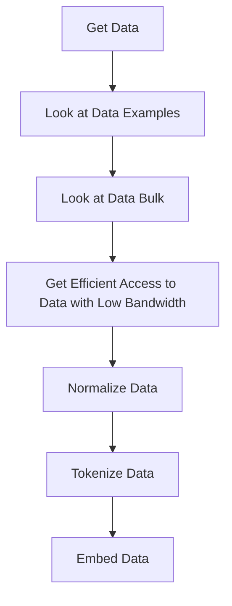

# Understanding Data in AI

Data is the lifeblood of any AI model. This section explores the fundamental aspects of data throughout its lifecycle, from gathering to training.

## Data Lifecycle Overview

1. **Data Gathering**
    - See [Data Gathering](gathering/index.md) for comprehensive coverage of collection methods, legal considerations, and best practices
    - Includes web scraping, APIs, databases, and public datasets

2. **Data Processing**
    - Normalization and standardization
    - Cleaning and validation
    - Format conversion
    - Quality assurance

3. **Data Training Preparation**
    - Tokenization
    - Embedding
    - Batch processing
    - Dataset splitting (train/test/validation)

## Data Processing Flow

## Training Considerations

### Data Volume Requirements

The amount of data needed for training depends on the size of the model. As a general rule, the number of tokens should be approximately 10 times the number of parameters used by the model.

??? tip "[Training Compute-Optimal Large Language Models](https://arxiv.org/pdf/2203.15556.pdf)"
    The 'Chinchilla' paper of 2022 identifies scaling laws that help to understand the volume of data needed to obtain 'optimal' performance for a given LLM model's size.
    - Primary takeaway: **"All three approaches suggest that as compute budget increases, model size and the amount of training data should be increased in approximately equal proportions."**
    

### Batch Processing

- Batch size optimization
- Memory constraints
- Training efficiency
- Computational resource management

### Simulated Data Usage

In some cases, it may be beneficial to train models with simulated data. This can be data generated by other models or through simulations of real-world scenarios. However, caution must be exercised as training with simulated data can sometimes lead to worse results. If done consistently, it can even lead to complete degradation of model performance. For more information, refer to [simulated data](augmentation/index.md).

For more information, refer to [simulated data](augmentation/index.md).

## Data Infrastructure

### Data Loaders
Common frameworks like Keras and PyTorch provide efficient data loaders that:
- Enable parallel processing
- Optimize memory usage
- Support distributed training
- Handle various data formats

### Storage and Access
- Efficient data access patterns
- Caching strategies
- Distributed storage solutions
- Version control for datasets
