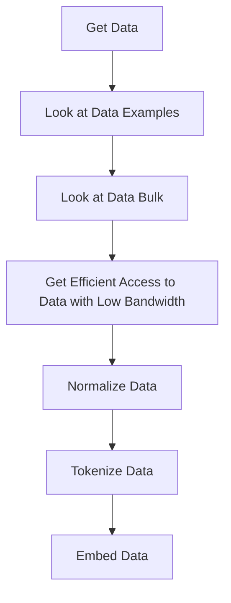

# Understanding Data in AI

Data is the lifeblood of any AI model. It is the raw material that fuels the learning process and shapes the model's understanding of the world. This section will delve into the various aspects of data, from its collection and access to its normalization and use in training AI models.

## Data Collection and Access

The first step in the data lifecycle is its collection. This involves gathering relevant data from various sources, which could range from databases and APIs to web scraping and user-generated content. The collected data must then be stored and organized in a way that allows easy access for further processing and analysis.

## Data Normalization

Once the data is collected and stored, it needs to be normalized. Data normalization is a process that transforms the data into a standard format, making it easier to work with. This could involve scaling numerical data, encoding categorical data, or handling missing values. Normalized data ensures consistency and improves the accuracy of the model.

## Data Training

The final step in the data lifecycle is using the data to train an AI model. This involves two key processes: tokenization and embedding.

### Tokenization

Tokenization is the process of breaking down the data into smaller units, or tokens. In the context of natural language processing (NLP), for example, a text document might be tokenized into individual words or sentences. This makes the data easier for the model to process and learn from.

### Embedding

Embedding is the process of representing these tokens in a numerical format that the model can understand. For instance, word embeddings might represent each word as a vector in a high-dimensional space. These embeddings capture the semantic relationships between words, allowing the model to learn from the underlying patterns in the data.

## Important Considerations

### Data Volume

The amount of data needed for training depends on the size of the model. As a general rule, the number of tokens should be approximately 10 times the number of parameters used by the model.

??? tip "[Training Compute-Optimal Large Language Models](https://arxiv.org/pdf/2203.15556.pdf)"
    The 'Chinchilla' paper of 2022 identifies scaling laws that help to understand the volume of data needed to obtain 'optimal' performance for a given LLM model's size. Use of it in other areas, such as for Llama, reveals that the models may have been under-trained.
    - Primary takeaway: **"All three approaches suggest that as compute budget increases, model size and the amount of training data should be increased in approximately equal proportions."**
    

### Batch Sizes of Data

The batch size refers to the number of data points that the model processes at once during training. Larger batch sizes can lead to faster training times, but they may also require more computational resources and can sometimes result in less accurate models. It's important to find a balance that suits your specific needs and constraints.

### Training with Simulated Data

In some cases, it may be beneficial to train models with simulated data. This can be data generated by other models or through simulations of real-world scenarios. However, caution must be exercised as training with simulated data can sometimes lead to worse results. If done consistently, it can even lead to complete degradation of model performance. For more information, refer to [simulated data](preparation/simulation.md).

## Data Processing Flow

The general flow of data processing can be represented as follows:

1. Get data
2. Look at data examples
3. Look at data bulk
4. Get efficient access to data with low bandwidth
5. Normalize data
6. Tokenize data
7. Embed data

## Common Data Formats

Often, it is useful to have data loaders that are common in Keras and Pytorch. These wrap iterators that allow the data to be processed in a parallel manner across different nodes. This parallel processing enhances the efficiency of data handling, especially when dealing with large datasets.

In conclusion, data is a crucial component in AI model training. Its collection, normalization, and processing significantly influence the performance of the model. Therefore, it's essential to understand and implement best practices in data handling for optimal results.
