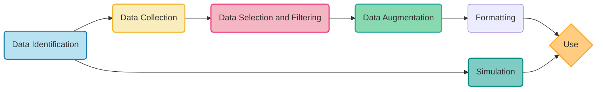

Data preparation is essential for all aspects of GenAI. It spans from [pre-training](../../architectures/training/pre-training.md) to [fine-tuning](../../architectures/training/finetuning.md) to [retrieval-augmented generation](../../agents/components/memory.md), embodying a multifaceted process that ensures the data is optimized for AI training and application. The journey of data preparation involves several critical steps, each tailored to enhance the quality and effectiveness of the data used.

Below is a clickable overview of the data preparation process: 

### Data Preparation Steps:

1. **Data Identification**: The initial stage involves identifying the relevant data sources and types that are essential for training the AI model. This step is foundational, setting the stage for subsequent processes. [Learn more](../sources.md).

2. **Data Collection**: Once the necessary data sources are identified, the next step is to collect data from these sources. This phase ensures a robust dataset that reflects the diversity and complexity of real-world scenarios. [Learn more](collection.md).

3. **Data Selection and Filtering**: After collecting a substantial dataset, the selection and filtering process begins. This step involves refining the dataset, removing irrelevant, redundant, or low-quality data to ensure the efficiency and effectiveness of the training process. [Learn more](selection.md).

4. **Data Augmentation**: To further enhance the dataset, data augmentation techniques are applied. This involves generating new data points from existing ones through various transformations, thereby increasing the quality, diversity and volume of the training data. [Learn more](../augmentation/index.md).

5. **Formatting**: Rewrites the data in a manner that is reduces token-usage or enables better results. [Learn more](formatting.md)

Following the links provided in the diagram, you can explore each component of the data preparation process in greater detail.
