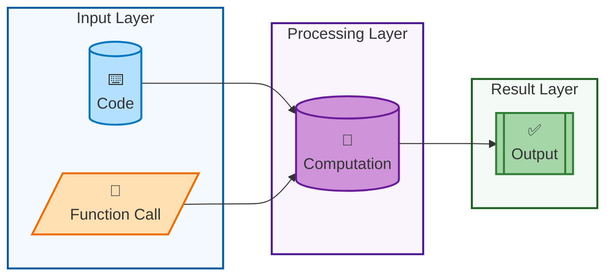
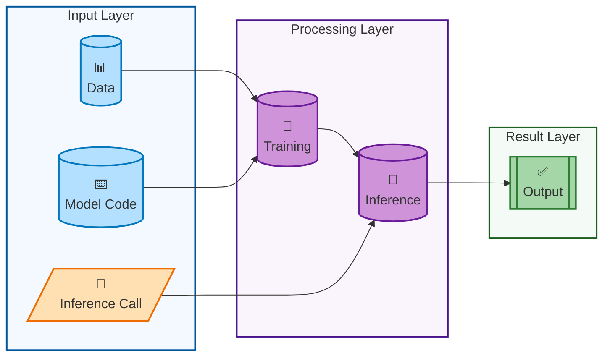

# Overview

The ability of computers and algorithms to generate art, literature, and other forms of content has been around for several decades. However, it is only recently that such content has begun to exhibit _human-like_ quality. This is largely due to the use of Artificial Intelligence (AI), particularly Machine Learning (ML), which leverages _data_ to produce high-quality output. 

This document provides a high-level overview of how Gen()AI achieves this feat. 

Before delving into the details, let's first understand what Gen()AI is.

## Defining Gen()AI

Gen()AI is a term that encapsulates both **Generative** and **General** AI. Each of these technologies has the capability to generate new information. Generative AI uses data, such as text, images, and videos, to create new content. On the other hand, General AI, also known as Artificial General Intelligence (AGI), is often viewed as a goal. It aims to generate information across almost all domains in a manner that is indistinguishable from, or even superior to, human-created content. 

Recent advancements in Generative AI have positioned it as a potential stepping stone towards AGI. Given the [profound implications](../../Using/ethically/index.md) of Gen()AI on individuals and society, it is crucial to understand these technologies. 

Generative AI is a subset of [AI in general](ai_and_ml_basics/index.md), as illustrated in the diagram below.

???+ important "Heirarchy of GenAI" heirarchy-of-genai
    

Traditionally, predictive AI has been widely used in virtually every domain where data exists. But how does predictive AI differ from generative AI?

### Predictive AI vs Generative AI

Understanding the similarities and differences between predictive and generative AI is crucial. While there is a significant overlap, with Generative AI inheriting many tools and methods from predictive AI, they serve different purposes. 

The distinction is visually represented below.

!!! important "Predictive AI vs Generative AI" predictive-vs-gen-ai

    * **Predictive AI** generates predictive data based on existing data
    * **Generative AI** creates new data based on existing data and generation criteria. 
    

### AI vs Traditional programming

Another way of thinking about the difference between AI and traditional programming is to consider the difference between a function call and a program. 

<h3>Traditional Programming</h3>

<h3>AI/ML Programming</h3>

## Creating Gen()AI

Several techniques exist for creating Gen()AI, including rule-based, data-based, and fusion methods. This section provides a brief overview of these techniques, with more detailed discussions to follow.

### Data-based Approaches

The data-based approach to creating Gen()AI involves the following steps:

1. Collect data.
2. Train the model on the collected data.
3. Evaluate the model based on any new data.
4. Iterate the process to improve the model.

### Rule-based Approaches

The rule-based approach to creating Gen()AI involves defining a set of rules that the AI follows to generate new data. This approach is often used in scenarios where the data is scarce or when the generation process needs to adhere to specific guidelines or standards. 

The steps involved in the rule-based approach are:

1. Define the rules for data generation.
2. Implement the rules in the AI model.
3. Evaluate new data based on the rules.
4. Iterate the process to refine the rules and improve the model.

However, this approach can be less effective on larger volumes of data due to unnecessary or inaccurate rules, especially if the rules are not continually re-evaluated for their impact. 

### Fusion Approaches

Fusion approaches combine the strengths of both data-based and rule-based methods. Fine-tuned models, even those that are smaller in size/cost, may outperform larger models, likely due to the no free lunch theorem. As such, using both hard-coded and ML-generated rules to select between models provides the basis for fusion techniques. For instance, combining traditional algorithms, like a calculator for math processing or regular expressions for text processing, with ML can result in a system that is more explainable, accurate, and designable compared to systems that are predominantly AI-driven.

---

## The 2025–2026 Model Landscape

> **Updated May 2026.** The frontier model landscape has changed dramatically since early 2025. This section provides a current orientation to the models that matter for enterprise GenAI decisions.

### Standard Frontier Models

| Model family | Provider | Notable capabilities |
|-------------|---------|---------------------|
| **GPT-5 / GPT-5.5** | OpenAI | Unified fast + deep-think routing; 94.6% AIME 2025; current API flagship (April 2026) |
| **Claude 4 / 4.6** | Anthropic | Professional coding, 1M token context GA, strong agent workflows |
| **Gemini 2.5 Pro / Flash** | Google | 2M token context, Deep Think reasoning mode, best multimodal benchmarks |
| **Llama 4 Scout / Maverick** | Meta | Open-weight, native multimodal, 10M token context (Scout), free to self-host |
| **DeepSeek V3 / R1** | DeepSeek | Open-source reasoning model, MIT license, <$6M training cost vs $100M+ for closed equivalents |

### Reasoning / "Thinking" Models

A new category of model emerged through 2025: **reasoning models** that allocate additional inference compute to work through problems step by step before answering. Key examples:

- **OpenAI o3 / o4-mini** — first multimodal reasoning models; o3 scored 88% on ARC-AGI (April 2025)
- **DeepSeek R1** — open-source reasoning milestone; competitive with o1 at a fraction of the cost (January 2025)
- **Gemini 2.5 Pro Deep Think** — Google's thinking mode, 84.0% MMMU (May 2025)
- **Qwen3** — hybrid thinking/non-thinking modes in a single model deployment (April 2025)

See [reasoning models](../architectures/training/reasoning_models.md) for full coverage.

!!! important "Which model should I use?"
    The honest answer in 2026 is: it depends on your task, context-window needs, data sovereignty requirements, and cost tolerance. For a practical decision framework, see [model optimization](../architectures/optimizing/index.md). The key new variable is reasoning model vs. standard model — a dimension that did not exist before 2024.

!!! info "Sources"
    [GPT-5 release](https://openai.com/blog/gpt-5), August 7, 2025; [Claude 4 family](https://www.anthropic.com/claude), May 2025; [Gemini 2.5 at Google I/O](https://blog.google/technology/google-deepmind/google-gemini-updates-io-2025/); [Llama 4 release](https://llama.meta.com/), April 2025; [DeepSeek R1](https://arxiv.org/abs/2501.12948), January 2025