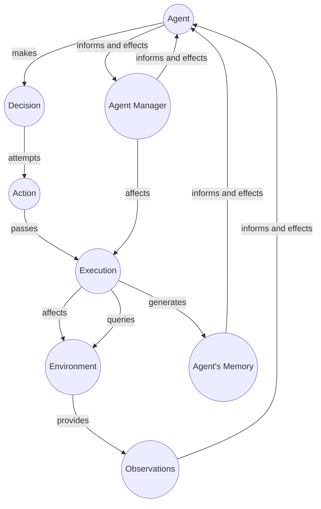

Agent types can be described by direct agentic ability to cause a change in the world.

## Text Agent

An agent that can output only language text. Even thought the language can be 'interpreted' into different things, as is done in the environment. 

## Text + Image Agent

An agent that can output 

## Robotic Agent

A robotic agent can control mechanism impacting the mechanical position or other activity of a device. 

