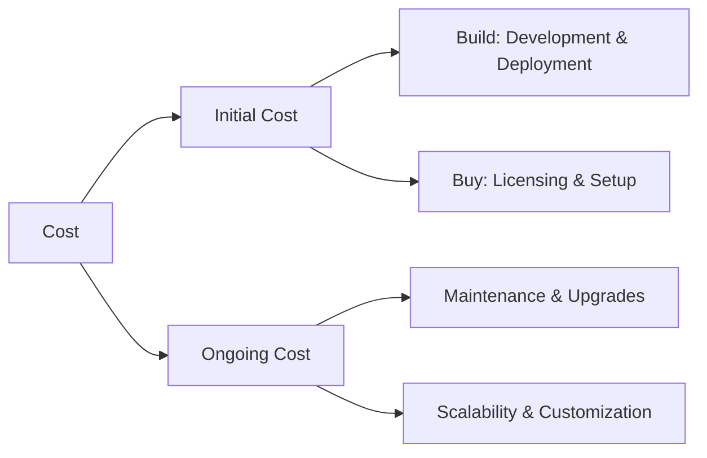
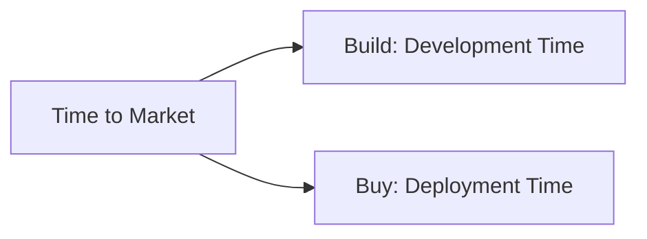
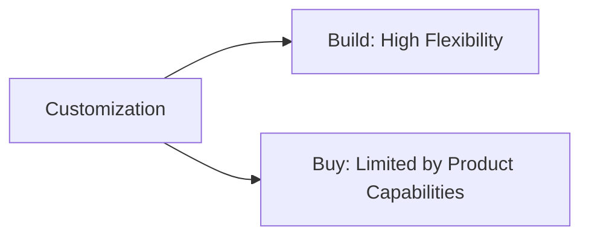
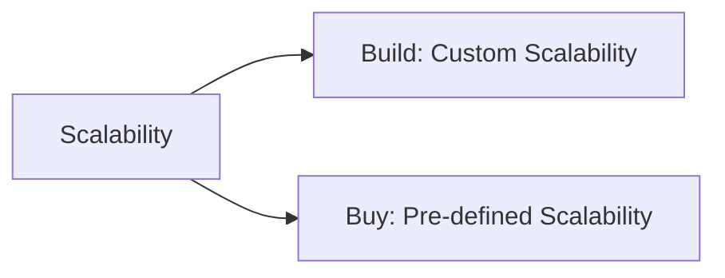
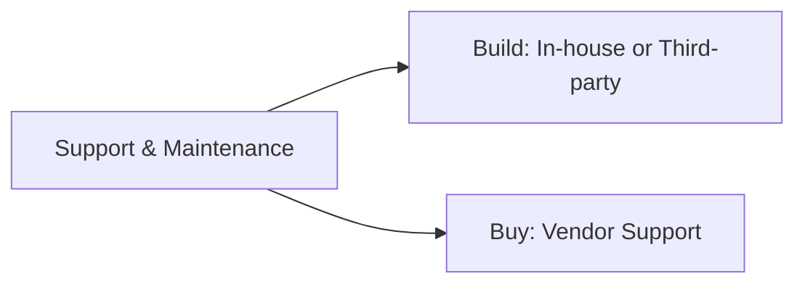
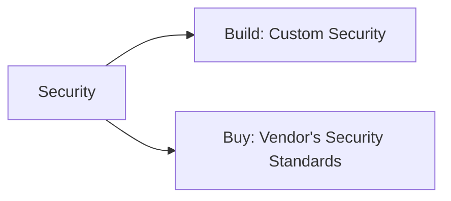
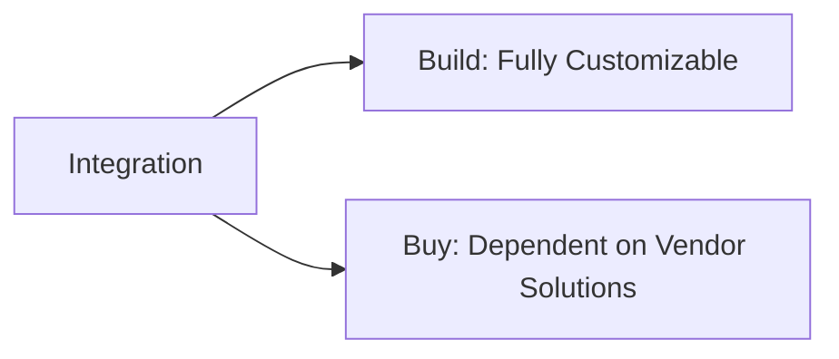
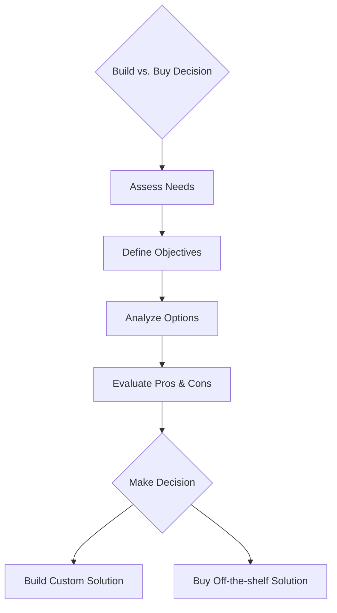

Creating an effective strategy for implementing technology solutions often comes down to the critical decision between building a custom solution in-house (build) or purchasing off-the-shelf software (buy). This markdown article aims to provide a comprehensive breakdown of the key factors to consider when faced with the "build vs. buy" dilemma, leveraging mermaid diagrams to illustrate these concepts visually.

# Build vs. Buy: Navigating the Decision Landscape

When your organization is considering new technology, the decision to build a custom solution or buy a pre-existing platform is pivotal. This choice affects not just the immediate project timeline and budget, but also long-term agility, operational efficiency, and the ability to meet specific business needs.

## Key Considerations

### 1. Cost

Cost considerations encompass not just the initial outlay but also long-term expenses associated with maintenance, updates, and scalability.

### 2. Time to Market

The urgency of deployment can significantly influence the build vs. buy decision. Building typically takes longer than buying off-the-shelf solutions that can be deployed rapidly.

### 3. Customization and Flexibility

Customization is crucial for matching specific business processes and needs. Building provides the highest level of customization, while buying may limit the flexibility but offers faster deployment.

### 4. Scalability

Consider the solution's ability to grow with your business. Custom-built solutions can be designed for scalability, but at a cost. Off-the-shelf software may offer scalability but with less control over performance parameters.

### 5. Support and Maintenance

Ongoing support and maintenance are critical for the long-term success of any technology solution. Evaluate the costs and availability of support for both options.

### 6. Security

Security needs vary greatly among organizations. Building allows for tailored security measures, while buying often means relying on the vendor's security protocols.

### 7. Integration with Existing Systems

Integration capabilities can be a deciding factor, especially for organizations with a complex tech stack.

## Making the Decision

The choice between building and buying should be informed by a strategic evaluation of your organization's priorities, resources, and long-term goals. Consider conducting a thorough cost-benefit analysis, taking into account not only the financial outlay but also factors like time to market, customization needs, scalability, support and maintenance requirements, security concerns, and integration capabilities.

### Decision Framework

In conclusion, whether to build or buy is a multifaceted decision that requires careful consideration of various factors. By thoroughly evaluating each aspect in relation to your organization's unique needs and strategic direction, you can make an informed choice that aligns with your business objectives, budget, and timeline.