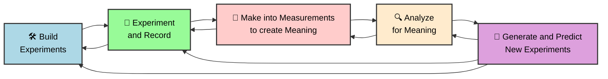

Generative AI has one of the most powerful potentials for science by enabling rapid-iteration closed-loop science-loop systems. A science loop system is one where measurements inform understanding in such a way to make better experiments and solutions.

## Research

!!! code "[GPT researcher](https://github.com/assafelovic/gpt-researcher) is an autonomous agent designed for comprehensive online research on a variety of tasks."
    LOOK INTO THIS

??? tip "[Emergent autonomous scientific research](https://arxiv.org/pdf/2304.05332.pdf)"
    
