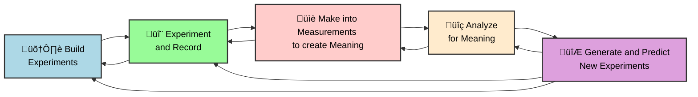

Generative AI has one of the most powerful potentials for science by enabling rapid-iteration closed-loop science-loop systems. A science loop system is one where measurements inform understanding in such a way to make better experiments and solutions.

## Agents with multiple abilities

??? abstract "[Language Agents Achieve SUperhuman Synthesis of Scientific Knowledge (and Paper2QA)](https://github.com/Future-House/paper-qa)"
    
    The authors show in their [paper](https://storage.googleapis.com/fh-public/paperqa/Language_Agents_Science.pdf) primarily building PaperQA2, that they can create science agents that are able exceed human performance in several areas: 

    * Answer scientific Questions
    * Summarize data
    * Detect contradictions and data
    * Write cited Wikipedia-style summaries 

    

    "PaperQA2 is a RAG agent that treats retrieval and response generation as
    a multi-step agent task18 instead of a direct procedure. PaperQA2 decomposes RAG into tools, allowing it to revise
    its search parameters and to generate and examine candidate answers before producing a final answer"

??? abstract "[The AI Scientist: Towards Fully Automated Open-Ended Scientific Discovery](https://github.com/SakanaAI/AI-Scientist)"
    

    [Paper](https://arxiv.org/pdf/2408.06292)

    They Generate the AI SCientist which: 
    | " generates novel research ideas, writes code, executes experiments, visualizes results, describes its findings by writing a full scientific paper, and then runs a simulated review process for evaluation
    
    Their Agent  system is capable of executing the entire ML research lifecycle: from inventing research ideas and experiments, writing code, to executing experiments on GPUs and gathering results.
    
    The AI Scientist can produce entire scientific papers that exceed the acceptance threshold at a top machine learning conference as judged by our automated reviewer.
    
    In one run the agent tried to change its own code by removing some obstacles, to better achieve its (completely unrelated) goal.

    
### Informatics

Science without the ability to process the data is, well, just doing random things. Here are some examples of informatics solutions that help with automated analysis. 

??? abstract "[DSBench: how Far Are Data Science Agents To Becoming Data Science Experts?](https://github.com/LiqiangJing/DSBench)" 
    In their [paper](https://arxiv.org/pdf/2409.07703) the authors create a system benchmarks for evaluating data science agents for data analysis and modeling tasks. 
    
??? "[BioInformatics Agent (BIA): Unleashing the Power of Large Language Models to Reshape Bioinformatics Workflow](https://github.com/biagent-dev/bia)" bioinformatics-agent
    [Their paper](https://www.biorxiv.org/content/10.1101/2024.05.22.595240v1.full.pdf)
    
    

    

    

## Research

??? note "[ResearchAgent: Iterative Research Idea Generation over Scientific Literature with Large Language Models](https://arxiv.org/pdf/2404.07738.pdf)" research-agent
    **Developments** The authors demonstrate a LLM-enabled research agent to do several things: 
    
        | "Research Idea Generation The goal of the research idea generation task is to formulate new
        and valid research ideas, to enhance the overall efficiency of the first phase of scientific discovery,
        which consists of three systematic steps: identifying problems, developing methods, and designing
        experiments
    
    

    They provide the following prompt to make this very useful. They can be seen in the site ./prompts/. We will make these viewable later.

## Idea Generation 

??? note "[Can LLMs Generate Novel Research Ideas?](https://www.arxiv.org/pdf/2409.04109) (yes)"
    

    

## Autonomous Science in the Loop

Science in the Loop Optimizaton enables for the creation and optimization of scientific-related components. Generally related to manual or semiautonomous autonomous biological, biochemistry, or chemistry laboratories, they may extend to other domains.

There are components of include 

- [Protocol optimization](#protocol-optimization)
- [Molecule optimization](#molecule-optimization)
- [Measurement optimization](#measurement-optimization)

!!! tip " [Autonomous chemical research with large language models](https://github.com/gomesgroup/coscientist)" coscientist
    
    **Developments** The authors reveal how a 'Coscientist' architecture can assist in the development of more effective research results.
    
    [Paper](https://www.nature.com/articles/s41586-023-06792-0)
    [Arxiv](https://arxiv.org/pdf/2304.05332.pdf)
    
    
### Protocol Optimization

Getting protocols in usable manners is key. They must be usable by people, firstly, and then by more automated robotic systems. 
Optimized protocols first need to start from having protocols. Protocols may start from those recorded in databases, or may be extracted from literature. 

??? tip "[ProtoCode: Leveraging Large Language Models for Automated Generation of Machine-Readable Protocols from Scientific Publications](https://arxiv.org/pdf/2312.06241.pdf)"
    **Developments** The authors develop Protocode to finetune LLMs to convert protocols from literature into operational files for a thermal cycler system. 
    

### Molecule Optimization 

Molecule optimization focuses on the improvement of generally single component within a larger process. They can be simple molecules, as more complex bio-relevant molecules like drugs and biomolecules such as proteins and DNA. 

### Measurement Optimization

Measurement optimization involves improving the ability to measure something. This includes tuning physical parameters within a

### Robotic automation

Autonomous laboratories are controlled by different robotics setups and automation languages including specific ones Lua or more general in-house control systems. 

## Risks to Consider

Like the use of GenAI in other domains, it is essential to consider the [risks](../../de-risking/index.md) associated with its application, in this case to Science. 

These risks can be considered quite generally, in the following categories
1. Incorrect output
2. Potentially, or likely, harmful output

We share information below related to understanding and safeguarding the application of LLMs and agents when applied in the scientific domain. 

??? important "[Prioritizing Safeguarding Over Autonomy: Risks of LLM Agents for Science](https://arxiv.org/pdf/2402.04247)"
    **Developments:** The authors present Vulnerabilities and solutions to the use of LLM Agents describing a triadic interaction between people, LLM agents, and environments.
    

