Generative AI has one of the most powerful potentials for science by enabling rapid-iteration closed-loop science-loop systems. A science loop system is one where measurements inform understanding in such a way to make better experiments and solutions.

```mermaid
    graph LR
    A[🛠️ Build<br>Experiments]:::blue --> B[🔬 Experiment<br>and Record]:::green
    B --> A
    B --> C[📏 Make into Measurements <br>to create Meaning]:::red
    C --> D[🔍 Analyze<br>for Meaning]:::yellow
    C --> B
    D --> C
    D --> E[🔮 Generate and Predict<br>New Experiments]:::purple
    E --> D
    E --> B
    E --> A

    classDef blue fill:#add8e6,stroke:#333,stroke-width:2px,color:black;
    classDef green fill:#98fb98,stroke:#333,stroke-width:2px,color:black;
    classDef red fill:#ffcccb,stroke:#333,stroke-width:2px,color:black;
    classDef yellow fill:#ffebcd,stroke:#333,stroke-width:2px,color:black;
    classDef purple fill:#dda0dd,stroke:#333,stroke-width:2px,color:black;
```

### Autonomous Science in the Loop

Science in the Loop Optimizaton enables for the creation and optimization of scientific-related components. Generally related to manual or semiautonomous autonomous biological, biochemistry, or chemistry laboratories, they may extend to other domains.

!!! tip "[Autonomous chemical research with large language models](https://github.com/gomesgroup/coscientist)" coscientist
    
    **Developments** The authors reveal how a 'Coscientist' architecture can assist in the development of more effective research results.
    
    [Paper](https://www.nature.com/articles/s41586-023-06792-0)
    [Arxiv](https://arxiv.org/pdf/2304.05332.pdf)
    
