Generative AI has one of the most powerful potentials for science by enabling rapid-iteration closed-loop science-loop systems. A science loop system is one where measurements inform understanding in such a way to make better experiments and solutions.

```mermaid
    graph LR
    A[🛠️ Build<br>Experiments]:::blue --> B[🔬 Experiment<br>and Record]:::green
    B --> A
    B --> C[📏 Make into Measurements <br>to create Meaning]:::red
    C --> D[🔍 Analyze<br>for Meaning]:::yellow
    C --> B
    D --> C
    D --> E[🔮 Generate and Predict<br>New Experiments]:::purple
    E --> D
    E --> B
    E --> A

    classDef blue fill:#add8e6,stroke:#333,stroke-width:2px,color:black;
    classDef green fill:#98fb98,stroke:#333,stroke-width:2px,color:black;
    classDef red fill:#ffcccb,stroke:#333,stroke-width:2px,color:black;
    classDef yellow fill:#ffebcd,stroke:#333,stroke-width:2px,color:black;
    classDef purple fill:#dda0dd,stroke:#333,stroke-width:2px,color:black;
```

## Research

