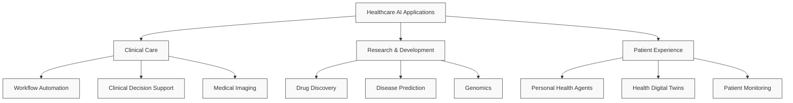

## Healthcare

Healthcare is experiencing a profound transformation through the integration of generative AI and intelligent agent systems. This section explores how AI technologies are revolutionizing various aspects of healthcare delivery, from clinical practice to drug discovery.

### LLM-based Agentic Systems in Healthcare

LLM-based agentic systems are transforming healthcare by combining the language capabilities of LLMs with the ability to process information, plan, decide, recall, reflect, interact, and leverage various tools. These systems represent a new paradigm in healthcare automation and decision support.

#### Key Capabilities
- Natural language understanding and generation
- Multi-modal data processing (text, images, signals)
- Tool and API integration
- Memory and context management
- Collaborative decision-making
- Continuous learning and adaptation

#### Clinical Workflow Automation
- Automated clinical note drafting from doctor-patient conversations
- Automated investigation order placement for clinician review
- Compliance with standard operating procedures and guidelines
- Estimated to automate up to 47% of labor tasks when equipped with tool use
- Integration with real-time clinical workflows for note-writing and electronic ordering
- Prediction capabilities for readmission rates and other clinical outcomes

#### Trustworthy Medical AI
- Retrieval-augmented generation to reduce hallucinations
- Integration with authorized hospital databases and clinical guidelines
- Autonomous verify-rectify-verify processes for output validation
- Enhanced reliability in clinical calculations
- Framework for model auditing using expert insights and counterfactual images
- Understanding AI reasoning processes in medical image classification

#### Ethical Considerations and Governance
!!! note "[Generative Artificial Intelligence in Healthcare: Ethical Considerations and Assessment Checklist](https://arxiv.org/pdf/2311.02107.pdf)"
    Provides a comprehensive framework for evaluating GenAI in healthcare applications:
    - [TREGAI Github](https://github.com/nliulab/GenAI-Ethical-Checklist)
    - [DocX checklist](https://drive.google.com/file/d/1ro_-GqITKHfNpHYTegUQdE-xm5t0Rvm6/view)
    
    Key considerations:
    - Patient privacy and data security
    - Model transparency and interpretability
    - Fairness and bias mitigation
    - Clinical validation and safety
    - Regulatory compliance

### Clinical Applications

#### Multi-Agent-Aided Diagnosis
- Collaboration between specialist agents for complex cases
- Mirrors multidisciplinary approaches in clinical practice
- Particularly valuable for rare conditions or resource-limited settings
- Automated identification of relevant specialist agents for case discussion

#### Medical Imaging and Diagnostics
!!! note "[Understanding the reasoning process of complex medical decisions](https://www.nature.com/articles/s41551-023-01160-9)"
    Uses counterfactual images and expert clinicians to understand AI reasoning in medical image classification, going beyond traditional saliency maps. The framework reveals that classifiers rely on both human-like features (lesional pigmentation patterns) and potentially undesirable features (background skin texture).

!!! important "[Foundation models for Retinas](https://www.nature.com/articles/s41586-023-06555-x)"
    Advanced models for retinal image analysis and diagnosis.

#### Patient Care Systems
!!! abstract "[Doctor GPT](https://github.com/FeatureBaseDB/DoctorGPT)"
    Implements advanced LLM prompting for organizing, indexing and discussing medical PDFs without opinionated prompt processing frameworks.

!!! tip "[Generative AI Pharmacist](https://github.com/kennethleungty/Generative-AI-Pharmacist)"
    A comprehensive system for processing and analyzing prescriptions through images and videos.

### Research and Development

#### Disease Prediction and Genomics
??? tip "[Genome-wide prediction of disease variant effects](https://www.nature.com/articles/s41588-023-01465-0)"
    A workflow using ESM1b to predict ~450 million possible missense variant effects across 42,336 protein isoforms in the human genome.

??? tip "[The Nucleotide Transformer](https://www.biorxiv.org/content/10.1101/2023.01.11.523679v2.full.pdf)"
    JAX-enabled transformer models for genomics:
    - 6mer tokenization and embeddings
    - Non-commercial license
    - [Github](https://www.biorxiv.org/content/10.1101/2023.01.11.523679v2.full.pdf)

#### Drug Discovery and Synthesis
!!! tip "[SyntheMol: AI for Antibiotic Design](https://github.com/swansonk14/SyntheMol)"
    Novel approach to designing synthesizable antibiotics:
    - Uses Monte Carlo Tree Search with GNN guidance
    - 10% hit rate for potent compounds
    - Validated through wet lab experiments
    - [Paper](https://www.nature.com/articles/s42256-024-00809-7)

??? tip "[ChemCrow](https://arxiv.org/pdf/2304.05376.pdf)"
    Advanced system for chemical synthesis planning:
    - [Github](https://github.com/ur-whitelab/chemcrow-public)

### Future Healthcare Systems

#### Health Digital Twin
- Virtual replicas representing real-time health status
- Coordination of multimodal health data acquisition and processing
- Comprehensive analysis and health outcome prediction
- Integration with specialized models for physiological data interpretation

#### Movement Analysis
!!! tip "[Motion GPT](https://github.com/openmotionlab/motiongpt)"
    Advanced AI system for understanding and analyzing human motion, with applications in:
    - Physical therapy
    - Sports medicine
    - Rehabilitation
    - Movement disorders

#### Challenges and Future Outlook
- Safety and security concerns regarding malicious attacks
- Need for robust privacy protection and data access controls
- Potential biases in agent decision-making
- Regulatory frameworks for increasing AI autonomy
- Risk of over-reliance and healthcare worker deskilling
- Public acceptability and workforce impact
- Need for interpretable AI in medical decision-making

##### Future Developments
- Integration with medical robotics and diagnostic imaging as embodied agents
- Democratization of health decision-making through personal AI agents
- Patient-owned health data management and interpretation
- Enhanced patient understanding and adherence to medical advice
- Potential for direct researcher-patient data sharing
- Need for regulatory approval and data infrastructure
- Evolution towards AI as a healthcare colleague rather than just an assistant
